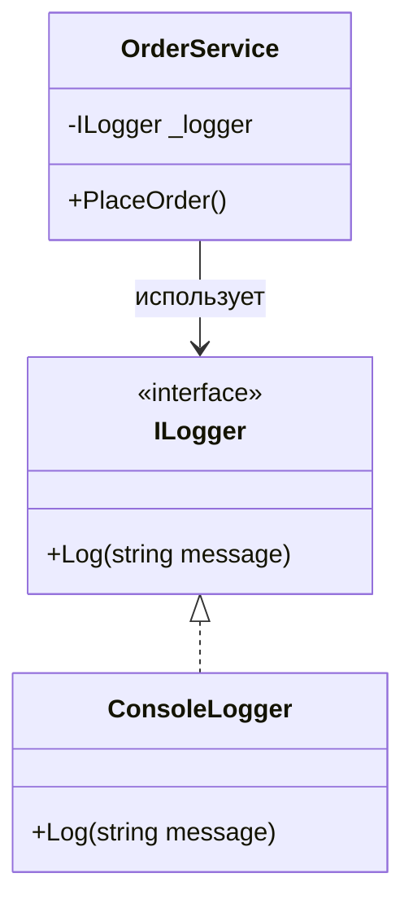
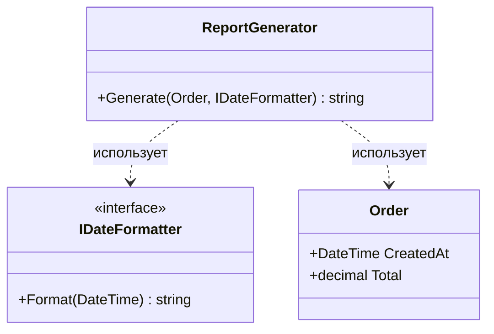
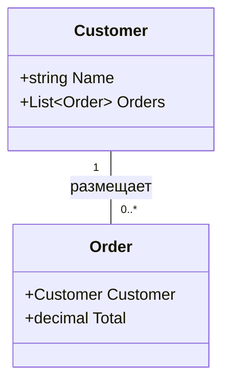
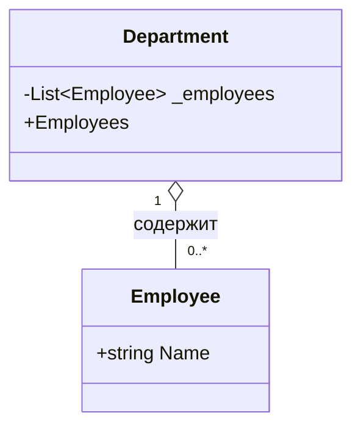
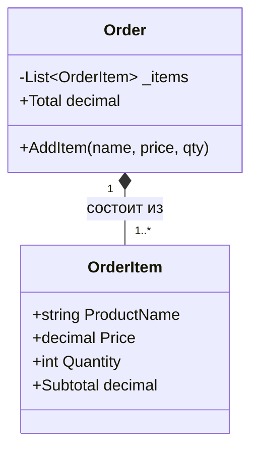
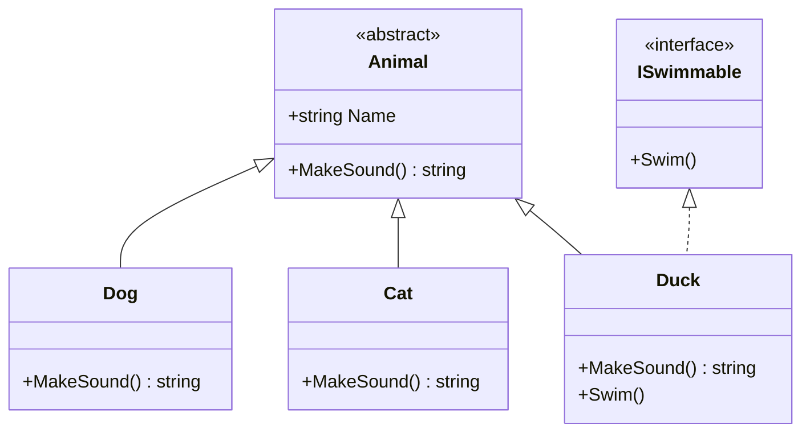
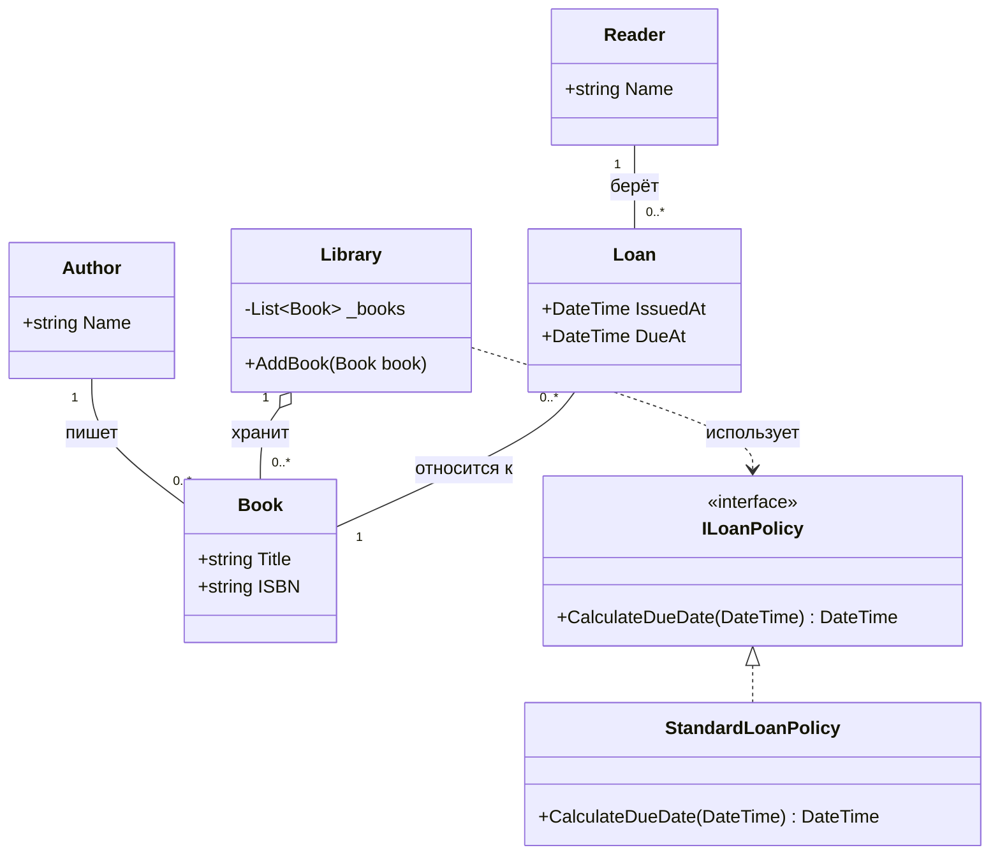
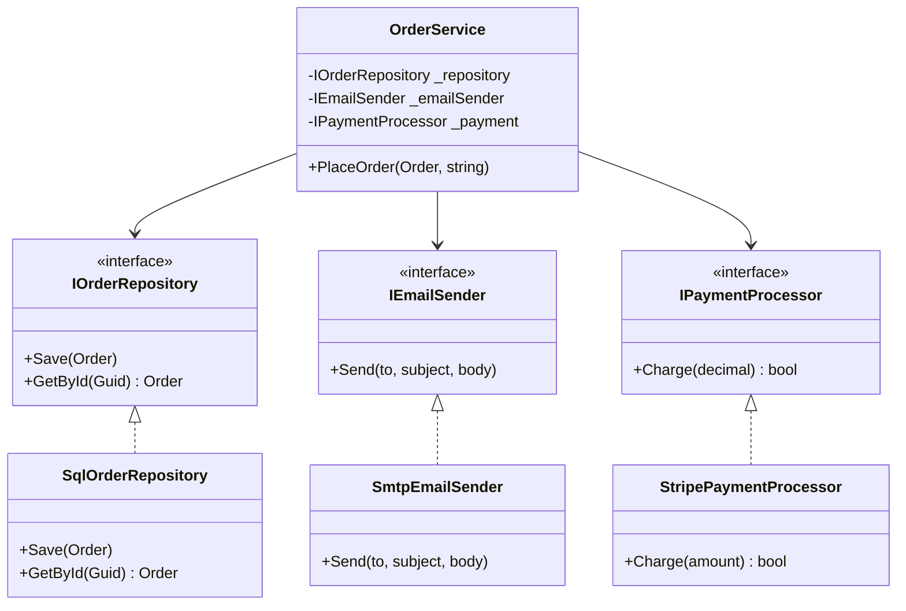

## Слайд 1. 

**Лекция 5**

# Наследование, интерфейсы, связи классов и слабая связанность

Дисциплина: Технологии программирования (C#)

---

## Слайд 2. План лекции

1. Наследование и интерфейсы: повторение и критерии выбора
2. Операторы `is` и `as`
3. Связи между классами: зависимость, ассоциация, агрегация, композиция
4. UML-диаграммы классов
5. Слабая связанность и внедрение зависимостей (DI)
6. Итоги

---

## Слайд 3. Наследование — что это

Наследование выражает отношение **is-a** («является»).

```csharp
public abstract class Animal
{
    public string Name { get; }
    protected Animal(string name) => Name = name;
    public virtual string MakeSound() => "...";
    public override string ToString() => $"{GetType().Name}: {Name}";
}

public class Dog : Animal
{
    public Dog(string name) : base(name) { }
    public override string MakeSound() => "Гав!";
}

public class Cat : Animal
{
    public Cat(string name) : base(name) { }
    public override string MakeSound() => "Мяу!";
}
```

---

## Слайд 4. Наследование — использование

```csharp
Animal[] animals = { new Dog("Рекс"), new Cat("Барсик") };

foreach (var animal in animals)
{
    Console.WriteLine($"{animal.Name} говорит: {animal.MakeSound()}");
}
// Рекс говорит: Гав!
// Барсик говорит: Мяу!
```

Ключевые слова:
- `virtual` — метод можно переопределить
- `override` — переопределяем поведение
- `base` — обращение к базовому классу
- `abstract` — нельзя создать напрямую
- `sealed` — запрет дальнейшего наследования

**Ограничение C#:** только один базовый класс.

---

## Слайд 5. Интерфейсы — что это

Интерфейс — это **контракт**. Он описывает, **что умеет** объект, а не **чем он является**.

```csharp
public interface IShape
{
    double Area();
    double Perimeter();
}

public interface IDrawable
{
    void Draw();
}

public class Circle : IShape, IDrawable
{
    public double Radius { get; }
    public Circle(double radius) => Radius = radius;

    public double Area() => Math.PI * Radius * Radius;
    public double Perimeter() => 2 * Math.PI * Radius;
    public void Draw() => Console.WriteLine($"Рисуем круг {Radius}");
}
```

Класс может реализовать **сколько угодно интерфейсов**.

---

## Слайд 6. Интерфейсы — использование

```csharp
public class Rectangle : IShape, IDrawable
{
    public double Width { get; }
    public double Height { get; }

    public Rectangle(double w, double h)
    {
        Width = w;
        Height = h;
    }

    public double Area() => Width * Height;
    public double Perimeter() => 2 * (Width + Height);
    public void Draw() => Console.WriteLine($"Рисуем {Width}x{Height}");
}

IShape[] shapes = { new Circle(5), new Rectangle(3, 4) };

foreach (var shape in shapes)
{
    Console.WriteLine($"Площадь: {shape.Area():F2}");
}
```

---

## Слайд 7. Когда наследование, а когда интерфейс

| Критерий | Наследование | Интерфейс |
|---|---|---|
| Отношение | is-a | can-do / роль |
| Сколько можно | один базовый класс | много интерфейсов |
| Состояние (поля) | есть | обычно нет |
| Общий код | да, через базовый класс | только контракт |
| Связанность | сильнее | слабее |
| Тестируемость | хуже | лучше |
| Когда выбирать | иерархия сущностей | контракт, роль, DI |

**Правило:** если сомневаетесь — предпочитайте интерфейсы и композицию.

---

## Слайд 8. Антипаттерн: наследование ради переиспользования

Плохо:

```csharp
public class Logger
{
    public void Log(string message) => Console.WriteLine(message);
}

// Наследуемся, чтобы получить Log()
public class OrderService : Logger
{
    public void PlaceOrder() => Log("Заказ оформлен");
}
```

`OrderService` **не является** логгером. Нарушение is-a.

Дальше появится `UserService : Logger`, `EmailService : Logger` — иерархия превратится в кашу.

---

## Слайд 9. Правильно: интерфейс + композиция

```csharp
public interface ILogger
{
    void Log(string message);
}

public class ConsoleLogger : ILogger
{
    public void Log(string message) => Console.WriteLine(message);
}

public class OrderService
{
    private readonly ILogger _logger;

    public OrderService(ILogger logger) => _logger = logger;

    public void PlaceOrder() => _logger.Log("Заказ оформлен");
}
```



---

## Слайд 10. Оператор `is`

- Проверяет совместимость типа
- Возвращает `bool`
- Современный C#: pattern matching

```csharp
object[] items = { "привет", 42, 3.14, new Dog("Рекс") };

foreach (var item in items)
{
    if (item is string s)
    {
        Console.WriteLine($"Строка длиной {s.Length}");
    }
    else if (item is int i)
    {
        Console.WriteLine($"Целое число: {i}");
    }
    else
    {
        Console.WriteLine($"Другое: {item.GetType().Name}");
    }
}
```

---

## Слайд 11. Оператор `as`

- Безопасно приводит **ссылочный** тип
- Возвращает `null`, если не получилось
- Не работает с non-nullable value types

```csharp
object obj = "Hello";

string? text = obj as string;
if (text is not null)
{
    Console.WriteLine(text.ToUpper());
}

// Несовпадение типа → null, без исключения
object number = 42;
string? bad = number as string;
Console.WriteLine(bad is null); // True
```

---

## Слайд 12. Типичные ошибки с `is` / `as`

```csharp
// ОШИБКА 1: не проверяем null после as
object obj = 42;
string s = obj as string;
Console.WriteLine(s.Length); // NullReferenceException

// ОШИБКА 2: прямое приведение без проверки
object obj2 = 42;
string s2 = (string)obj2; // InvalidCastException

// ОШИБКА 3: GetType вместо is
if (obj.GetType() == typeof(Animal)) { } // не сработает для Dog
if (obj is Animal) { }                   // сработает для Dog
```

| Оператор | Возвращает | Value types | При неудаче |
|---|---|---|---|
| `is` | `bool` | работает | `false` |
| `as` | ссылку / `null` | не работает | `null` |

---

## Слайд 13. Практический пример с `is`

```csharp
public void ProcessShape(IShape shape)
{
    if (shape is Circle circle)
    {
        Console.WriteLine($"Это круг радиусом {circle.Radius}");
    }
    else if (shape is Rectangle rect)
    {
        Console.WriteLine($"Это прямоугольник {rect.Width}x{rect.Height}");
    }
    else
    {
        Console.WriteLine($"Неизвестная фигура, площадь {shape.Area()}");
    }
}
```

---

## Слайд 14. Шесть видов связей между классами

1. **Зависимость** — временное использование (параметр, локальная переменная)
2. **Ассоциация** — поле-ссылка на другой объект
3. **Агрегация** — слабое владение, часть живёт отдельно
4. **Композиция** — сильное владение, часть создаётся внутри
5. **Наследование** — is-a
6. **Реализация** — can-do, класс реализует интерфейс

---

## Слайд 15. Зависимость

Класс использует другой «на минуту» — параметр, локальная переменная. В поле не хранит.

**UML:** пунктирная стрелка `..>`

```csharp
public class ReportGenerator
{
    public string Generate(Order order, IDateFormatter formatter)
    {
        return $"Заказ от {formatter.Format(order.CreatedAt)}: {order.Total}";
    }
}

public interface IDateFormatter
{
    string Format(DateTime date);
}
```



---

## Слайд 16. Ассоциация

Объект хранит ссылку на другой объект в поле.

**UML:** сплошная линия / стрелка `--` или `-->`

```csharp
public class Customer
{
    public string Name { get; set; } = "";
    public List<Order> Orders { get; } = new();
}

public class Order
{
    public Customer? Customer { get; set; }
    public decimal Total { get; set; }
}
```



Мультипликативность: `1`, `0..1`, `*`, `1..*`

---

## Слайд 17. Агрегация

Слабое владение. Часть может существовать без целого. Передаётся извне.

**UML:** пустой ромб у целого `o--`

```csharp
public class Employee
{
    public string Name { get; set; } = "";
}

public class Department
{
    private readonly List<Employee> _employees;

    // Сотрудники приходят снаружи и живут независимо
    public Department(List<Employee> employees)
    {
        _employees = employees;
    }

    public IReadOnlyList<Employee> Employees => _employees;
}
```

```csharp
var ivan = new Employee { Name = "Иван" };
var dept = new Department(new List<Employee> { ivan });

// Сотрудник существует и без отдела
Console.WriteLine(ivan.Name); // Иван
```



---

## Слайд 18. Композиция

Сильное владение. Часть создаётся внутри целого и не существует отдельно.

**UML:** заполненный ромб у целого `*--`

```csharp
public class OrderItem
{
    public string ProductName { get; }
    public decimal Price { get; }
    public int Quantity { get; }
    public decimal Subtotal => Price * Quantity;

    public OrderItem(string name, decimal price, int qty)
    {
        ProductName = name;
        Price = price;
        Quantity = qty;
    }
}

public class Order
{
    private readonly List<OrderItem> _items = new();
    public IReadOnlyList<OrderItem> Items => _items;

    public void AddItem(string name, decimal price, int qty)
    {
        // OrderItem создаётся только здесь
        _items.Add(new OrderItem(name, price, qty));
    }

    public decimal Total => _items.Sum(i => i.Subtotal);
}
```

---

## Слайд 19. Композиция — использование и UML

```csharp
var order = new Order();
order.AddItem("Книга", 500m, 2);
order.AddItem("Ручка", 50m, 5);

Console.WriteLine(order.Total); // 1250
```



Заполненный ромб — сильное владение.

---

## Слайд 20. Наследование и реализация — UML

**Наследование:** сплошная линия + пустой треугольник `<|--`

**Реализация интерфейса:** пунктир + пустой треугольник `<|..`



---

## Слайд 21. Сводная таблица обозначений UML

| Связь | Обозначение | Пример |
|---|---|---|
| Наследование | сплошная линия + пустой треугольник | `Animal <\|-- Dog` |
| Реализация | пунктир + пустой треугольник | `IShape <\|.. Circle` |
| Зависимость | пунктирная стрелка | `OrderService ..> ILogger` |
| Ассоциация | сплошная линия / стрелка | `Customer -- Order` |
| Агрегация | пустой ромб у целого | `Department o-- Employee` |
| Композиция | заполненный ромб у целого | `Order *-- OrderItem` |

Мультипликативность: `1`, `0..1`, `*`, `1..*`

---

## Слайд 22. Как отличить агрегацию от композиции

Задайте три вопроса:

1. **Кто создаёт часть?**
   - Целое → композиция
   - Снаружи → агрегация
2. **Может ли часть существовать без целого?**
   - Нет → композиция
   - Да → агрегация
3. **Кто управляет жизненным циклом части?**
   - Целое → композиция
   - Кто-то другой → агрегация

---

## Слайд 23. Примеры из жизни

| Целое | Часть | Тип |
|---|---|---|
| Заказ | Позиция заказа | Композиция |
| Дом | Комната | Композиция |
| Автомобиль | Двигатель | Композиция |
| Отдел | Сотрудник | Агрегация |
| Университет | Студент | Агрегация |
| Автомобиль | Водитель | Агрегация |

---

## Слайд 24. Сводная диаграмма «Библиотека»



---

## Слайд 25. Проблема жёсткой связанности

```csharp
public class OrderService
{
    private readonly SqlOrderRepository _repository = new();
    private readonly SmtpEmailSender _emailSender = new();

    public void PlaceOrder(Order order)
    {
        _repository.Save(order);
        _emailSender.Send("client@mail.com", "Заказ оформлен", "...");
    }
}
```

Проблемы:

- сам создаёт зависимости → **жёсткая связанность**
- нельзя подменить реализацию
- нельзя протестировать без БД и SMTP
- изменение конструктора зависимости ломает класс

---

## Слайд 26. Принцип инверсии зависимостей

> Зависеть от абстракций, а не от конкретных реализаций.

Вместо `new SmtpEmailSender()` — используем интерфейс `IEmailSender`.

Кто именно его реализует — решает тот, кто создаёт `OrderService`.

---

## Слайд 27. Хороший дизайн — интерфейсы

```csharp
public interface IOrderRepository
{
    void Save(Order order);
    Order? GetById(Guid id);
}

public interface IEmailSender
{
    void Send(string to, string subject, string body);
}

public interface IPaymentProcessor
{
    bool Charge(decimal amount);
}
```

---

## Слайд 28. Хороший дизайн — сервис

```csharp
public class OrderService
{
    private readonly IOrderRepository _repository;
    private readonly IEmailSender _emailSender;
    private readonly IPaymentProcessor _payment;

    public OrderService(
        IOrderRepository repository,
        IEmailSender emailSender,
        IPaymentProcessor payment)
    {
        _repository = repository;
        _emailSender = emailSender;
        _payment = payment;
    }

    public void PlaceOrder(Order order, string customerEmail)
    {
        if (!_payment.Charge(order.Total))
            throw new InvalidOperationException("Оплата не прошла");

        _repository.Save(order);
        _emailSender.Send(customerEmail, "Заказ оформлен", $"Номер: {order.Id}");
    }
}
```

---

## Слайд 29. Конкретные реализации

```csharp
public class SqlOrderRepository : IOrderRepository
{
    public void Save(Order order) { /* запись в БД */ }
    public Order? GetById(Guid id) => null;
}

public class SmtpEmailSender : IEmailSender
{
    public void Send(string to, string subject, string body)
        => Console.WriteLine($"Email -> {to}: {subject}");
}

public class StripePaymentProcessor : IPaymentProcessor
{
    public bool Charge(decimal amount)
    {
        Console.WriteLine($"Списано {amount} через Stripe");
        return true;
    }
}
```

---

## Слайд 30. Сборка вручную

```csharp
var service = new OrderService(
    new SqlOrderRepository(),
    new SmtpEmailSender(),
    new StripePaymentProcessor()
);

service.PlaceOrder(new Order(), "client@mail.com");
```

---

## Слайд 31. UML-схема DI



---

## Слайд 32. Тестируемость — подделки

```csharp
public class FakeEmailSender : IEmailSender
{
    public bool WasSent { get; private set; }
    public string? LastRecipient { get; private set; }

    public void Send(string to, string subject, string body)
    {
        WasSent = true;
        LastRecipient = to;
    }
}

public class FakeRepository : IOrderRepository
{
    public List<Order> Saved { get; } = new();
    public void Save(Order order) => Saved.Add(order);
    public Order? GetById(Guid id) => Saved.FirstOrDefault(o => o.Id == id);
}

public class AlwaysSuccessPayment : IPaymentProcessor
{
    public bool Charge(decimal amount) => true;
}
```

---

## Слайд 33. Тест

```csharp
var email = new FakeEmailSender();
var repo = new FakeRepository();
var service = new OrderService(repo, email, new AlwaysSuccessPayment());

var order = new Order();
service.PlaceOrder(order, "test@mail.com");

Console.WriteLine(repo.Saved.Count);      // 1
Console.WriteLine(email.WasSent);         // True
Console.WriteLine(email.LastRecipient);   // test@mail.com
```

Проверили бизнес-логику без БД, SMTP и платёжной системы.

---

## Слайд 34. Композиция вместо наследования

Плохо:

```csharp
// Наследуемся от конкретного класса, чтобы получить Save()
public class OrderService : SqlOrderRepository { }
```

Хорошо:

```csharp
public class OrderService
{
    private readonly IOrderRepository _repository;

    public OrderService(IOrderRepository repository)
        => _repository = repository;
}
```

Мы **содержим** репозиторий, а не **являемся** им.

---

## Слайд 35. DI-контейнер в ASP.NET Core

```csharp
builder.Services.AddScoped<IOrderRepository, SqlOrderRepository>();
builder.Services.AddScoped<IEmailSender, SmtpEmailSender>();
builder.Services.AddScoped<IPaymentProcessor, StripePaymentProcessor>();
builder.Services.AddScoped<OrderService>();
```

Что это даёт:

- контейнер сам создаёт `OrderService`
- сам находит реализации интерфейсов
- сам передаёт их в конструктор
- мы не пишем `new` вручную

---

## Слайд 36. Связь механизмов и UML

| Механизм | Что выражает | UML |
|---|---|---|
| Наследование | is-a | `<\|--` |
| Реализация интерфейса | can-do | `<\|..` |
| Поле-ссылка | ассоциация | `-->` |
| Слабое владение | агрегация | `o--` |
| Сильное владение | композиция | `*--` |
| Использование в параметре | зависимость | `..>` |
| Внедрение через конструктор | зависимость от абстракции | `..>` + `<\|..` |

---

## Слайд 37. Итоги

- **Наследование** — для иерархии is-a с общим состоянием
- **Интерфейс** — для контракта, роли, подмены реализации
- **`is`** — проверка типа, возвращает `bool`
- **`as`** — безопасное приведение ссылок, возвращает `null`
- **Зависимость, ассоциация, агрегация, композиция** — четыре степени близости классов
- **UML** — язык для обсуждения структуры до кода
- **Композиция + интерфейсы** — основа слабой связанности
- **DI** — практическое применение этих идей

**Главная мысль:** проектируйте не «что класс есть», а «что класс умеет» и «из чего он состоит».

---

## Слайд 38. Домашнее задание

1. **UML-диаграмма.** Постройте диаграмму классов для системы «Библиотека»:
   - классы: `Book`, `Author`, `Library`, `Reader`, `Loan`, `ILoanPolicy`;
   - укажите тип каждой связи и мультипликативность.

2. **Рефакторинг.** Дан класс:

   ```csharp
   public class NotificationService
   {
       public void Notify(string message)
       {
           var sender = new SmtpEmailSender();
           sender.Send("user@mail.com", "Уведомление", message);
       }
   }
   ```

   Перепишите так, чтобы:
   - был интерфейс `INotificationSender`;
   - `NotificationService` принимал его через конструктор;
   - можно было подменить реализацию в тесте.

3. **`is` и `as`.** Напишите метод, который принимает `object` и:
   - если `string` — печатает длину;
   - если `int` — печатает квадрат;
   - если `Animal` — вызывает `MakeSound()`;
   - иначе — «Неизвестный тип».

4. **Композиция или агрегация.** Определите тип связи и обоснуйте:
   - `Car` и `Engine`
   - `Team` и `Player`
   - `Invoice` и `InvoiceLine`
   - `University` и `Professor`

---

## Слайд 39. Спасибо за внимание!

Вопросы?
