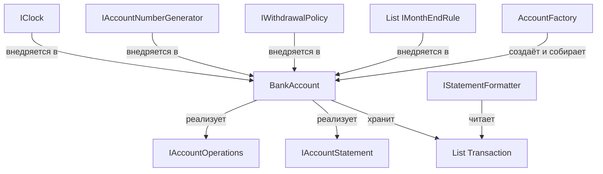

# Рефакторинг банковских счетов: реализация по этапам (SOLID)

Полный разбор всех четырёх этапов в одном документе: анализ нарушений, проектирование, итоговый код с комментариями, схема архитектуры, пояснения и демонстрация расширяемости.

---

## Этап 1. Анализ и фиксация нарушений SOLID

| Принцип | Фрагмент кода | Суть нарушения | Риск / последствие |
|---|---|---|---|
| **SRP** | `BankAccount` целиком | Один класс отвечает сразу за идентификацию счёта (`Number`, `Owner`), хранение и подсчёт баланса, правила овердрафта (`CheckWithdrawalLimit`), месячные операции (`PerformMonthEndTransactions`) и формирование отчёта | Любое изменение любой из этих зон заставляет править один и тот же класс; он растёт и становится хрупким |
| **SRP** | `BankAccount.GetAccountHistory()` | Смешаны доменная логика (выборка транзакций и подсчёт баланса) и представление (форматирование текстового отчёта) | Нельзя добавить другой формат (JSON, CSV) без правки класса счёта |
| **SRP** | `static s_accountNumberSeed` в `BankAccount` | Генерация номера счёта «вшита» в счёт и является глобальным состоянием | Сложно тестировать (номера не воспроизводимы), нельзя заменить схему нумерации |
| **OCP** | Правки базового класса ради линии кредита (`_minimumBalance`, изменение `MakeWithdrawal`, новый `CheckWithdrawalLimit`) | Чтобы добавить новый тип счёта, пришлось менять уже работающий базовый класс | Добавление следующего типа снова потребует правок в базовом классе — расширение через модификацию |
| **OCP** | `0.02m`, `500m`, `0.07m`, `-20` внутри наследников | Правила и их параметры «зашиты» в код классов | Изменение ставки, порога или комиссии требует правки класса; нельзя настроить счёт без перекомпиляции |
| **LSP** | `CheckWithdrawalLimit` в базовом классе vs `LineOfCreditAccount` | Базовый метод **выбрасывает исключение**, переопределённый — **возвращает транзакцию с комиссией**. Контракт разный | Клиент, работающий через `BankAccount`, не может полагаться на поведение метода; подтип ведёт себя иначе, чем обещает родитель |
| **LSP** | `GiftCardAccount : BankAccount` | Подарочная карта по смыслу «только погашается», но наследует `MakeWithdrawal` и общую модель счёта, часть поведения ей не свойственна | Наследование ради переиспользования, а не ради «является»; контракт родителя навязывает лишнее |
| **ISP** | Полное отсутствие интерфейсов | Любой клиент получает «толстый» класс со всем сразу: депозитом, снятием, историей, месячными операциями | Клиент, которому нужен только депозит, вынужден зависеть от методов, которые он не использует |
| **DIP** | `DateTime.Now` в конструкторе и в наследниках | Модуль бизнес-логики напрямую зависит от системных часов | Невозможно протестировать начисление «в конце месяца» детерминированно; нет контроля над датой транзакции |
| **DIP** | `throw new InvalidOperationException(...)` внутри `CheckWithdrawalLimit` | Решение о допустимости операции принимает сам счёт, а не подменяемая политика | Нельзя заменить правило овердрафта без правки класса |

---

## Этап 2. Проектирование изменений

**Идея:** заменить наследование-ради-поведения на **композицию политик и правил**. Счёт становится тонким ядром, а переменные части (правило снятия, месячные операции, генерация номера, часы, формат отчёта) выносятся в подменяемые абстракции.

**Новые абстракции:**

- `IClock` — источник времени (устраняет `DateTime.Now`, DIP).
- `IAccountNumberGenerator` — генерация номера (SRP).
- `IWithdrawalPolicy` → возвращает `WithdrawalDecision` — единый контракт «разрешить / разрешить с комиссией / отклонить» (устраняет LSP-расхождение).
- `IMonthEndRule` — правило конца месяца (проценты на положительный баланс, проценты на долг, ежемесячное пополнение) (OCP, SRP).
- `IStatementFormatter` — форматирование отчёта (SRP).
- `IAccountOperations`, `IAccountStatement` — узкие интерфейсы для клиентов (ISP).

**Схема (текстом):**

```
IClock ──────────────┐
IAccountNumberGenerator ─┤
IWithdrawalPolicy ────┤──► BankAccount ──► List<Transaction>
List<IMonthEndRule> ──┘        │
                               ├─ реализует IAccountOperations
                               └─ реализует IAccountStatement
IStatementFormatter ◄── читает Transactions
AccountFactory ── собирает счёт из политик и правил (пресеты типов)
```

**Что решено:**
- «Магические числа» → параметры конструкторов правил и политик.
- `DateTime.Now` → `IClock`.
- Разные контракты снятия → единый `WithdrawalDecision`.
- Отчёт → отдельный форматтер.
- Новый тип счёта → новый пресет в фабрике, без правок логики существующих.

---

## Этап 3. Рефакторинг — итоговый код (с комментариями)

```csharp
using System;
using System.Collections.Generic;
using System.Linq;
using System.Text;

namespace BankAccounts;

// ======================= Время (DIP) =======================
// Выносим зависимость от времени в интерфейс, чтобы можно было подменить его в тестах.
public interface IClock
{
    DateTime Now { get; }
}

// Реализация для продакшена: берёт реальное время.
public sealed class SystemClock : IClock
{
    public DateTime Now => DateTime.Now;
}

// ============== Генерация номера счёта (SRP) ===============
// Генерация номеров — отдельная ответственность, не должна быть внутри счёта.
public interface IAccountNumberGenerator
{
    string Next();
}

// Простая последовательная нумерация. Можно заменить на GUID или другую стратегию.
public sealed class SequentialAccountNumberGenerator : IAccountNumberGenerator
{
    private int _seed;
    public SequentialAccountNumberGenerator(int seed = 1234567890) => _seed = seed;
    public string Next() => (_seed++).ToString();
}

// ===================== Транзакция ==========================
// Простой DTO: сумма, дата, примечание.
public sealed record Transaction(decimal Amount, DateTime Date, string Note);

// ============ Узкие интерфейсы для клиентов (ISP) ==========
// ISP: клиенты зависят только от того, что им реально нужно.
public interface IAccountOperations
{
    decimal Balance { get; }
    void Deposit(decimal amount, DateTime date, string note);
    void Withdraw(decimal amount, DateTime date, string note);
}

public interface IAccountStatement
{
    IReadOnlyList<Transaction> Transactions { get; }
}

// ================= Политика снятия (LSP, OCP) ==============
// Единый контракт для всех политик снятия: возвращаем решение, а не выбрасываем исключения.
// Это устраняет нарушение LSP между базовым и переопределённым методом.
public sealed record WithdrawalDecision(bool IsAllowed, decimal Fee, string? RejectionReason)
{
    public static WithdrawalDecision Allow() => new(true, 0m, null);
    public static WithdrawalDecision AllowWithFee(decimal fee) => new(true, fee, null);
    public static WithdrawalDecision Reject(string reason) => new(false, 0m, reason);
}

public interface IWithdrawalPolicy
{
    WithdrawalDecision Evaluate(decimal currentBalance, decimal amount, decimal minimumBalance);
}

// Политика по умолчанию: если баланс ниже минимума — отклоняем.
public sealed class StrictWithdrawalPolicy : IWithdrawalPolicy
{
    public WithdrawalDecision Evaluate(decimal currentBalance, decimal amount, decimal minimumBalance)
        => currentBalance - amount < minimumBalance
            ? WithdrawalDecision.Reject("Not sufficient funds for this withdrawal")
            : WithdrawalDecision.Allow();
}

// Политика с овердрафтом: разрешаем, но берём комиссию.
public sealed class OverdraftFeeWithdrawalPolicy : IWithdrawalPolicy
{
    private readonly decimal _fee;
    public OverdraftFeeWithdrawalPolicy(decimal fee) => _fee = fee;

    public WithdrawalDecision Evaluate(decimal currentBalance, decimal amount, decimal minimumBalance)
        => currentBalance - amount < minimumBalance
            ? WithdrawalDecision.AllowWithFee(_fee)
            : WithdrawalDecision.Allow();
}

// ============== Правила конца месяца (OCP, SRP) ============
// Каждое правило — отдельный класс. Новые правила добавляются без изменения старых.
public interface IMonthEndRule
{
    void Apply(IAccountOperations account, DateTime asOf);
}

// Проценты на положительный баланс выше порога (для процентного счёта).
public sealed class InterestOnPositiveBalanceRule : IMonthEndRule
{
    private readonly decimal _rate;
    private readonly decimal _threshold;

    public InterestOnPositiveBalanceRule(decimal rate, decimal threshold)
    {
        _rate = rate;
        _threshold = threshold;
    }

    public void Apply(IAccountOperations account, DateTime asOf)
    {
        if (account.Balance > _threshold)
            account.Deposit(account.Balance * _rate, asOf, "apply monthly interest");
    }
}

// Проценты на долг (для линии кредита).
public sealed class InterestOnNegativeBalanceRule : IMonthEndRule
{
    private readonly decimal _rate;
    public InterestOnNegativeBalanceRule(decimal rate) => _rate = rate;

    public void Apply(IAccountOperations account, DateTime asOf)
    {
        if (account.Balance < 0)
            account.Withdraw(-account.Balance * _rate, asOf, "Charge monthly interest");
    }
}

// Ежемесячное пополнение (для подарочной карты).
public sealed class MonthlyDepositRule : IMonthEndRule
{
    private readonly decimal _amount;
    public MonthlyDepositRule(decimal amount) => _amount = amount;

    public void Apply(IAccountOperations account, DateTime asOf)
    {
        if (_amount != 0)
            account.Deposit(_amount, asOf, "Add monthly deposit");
    }
}

// ============ Форматирование отчёта (SRP) ==================
// Форматирование — отдельная ответственность. Можно добавить JSON/CSV без правки счёта.
public interface IStatementFormatter
{
    string Format(IEnumerable<Transaction> transactions);
}

public sealed class TextStatementFormatter : IStatementFormatter
{
    public string Format(IEnumerable<Transaction> transactions)
    {
        var report = new StringBuilder();
        decimal balance = 0;
        report.AppendLine("Date\t\tAmount\tBalance\tNote");
        foreach (var t in transactions)
        {
            balance += t.Amount;
            report.AppendLine($"{t.Date.ToShortDateString()}\t{t.Amount}\t{balance}\t{t.Note}");
        }
        return report.ToString();
    }
}

// ===================== Банковский счёт =====================
// Тонкий класс-ядро: хранит транзакции, применяет политики и правила.
public class BankAccount : IAccountOperations, IAccountStatement
{
    private readonly List<Transaction> _transactions = new();
    private readonly List<IMonthEndRule> _monthEndRules;
    private readonly IClock _clock;
    private readonly IWithdrawalPolicy _withdrawalPolicy;

    public string Number { get; }
    public string Owner { get; }
    public decimal MinimumBalance { get; }

    // Баланс вычисляется на лету — нет дублирования состояния.
    public decimal Balance => _transactions.Sum(t => t.Amount);
    public IReadOnlyList<Transaction> Transactions => _transactions;

    public BankAccount(
        string owner,
        decimal initialBalance,
        decimal minimumBalance,
        IClock clock,
        IAccountNumberGenerator numberGenerator,
        IWithdrawalPolicy withdrawalPolicy,
        IEnumerable<IMonthEndRule>? monthEndRules = null)
    {
        Owner = owner;
        MinimumBalance = minimumBalance;
        _clock = clock;
        _withdrawalPolicy = withdrawalPolicy;
        _monthEndRules = monthEndRules?.ToList() ?? new List<IMonthEndRule>();
        Number = numberGenerator.Next();

        if (initialBalance > 0)
            Deposit(initialBalance, _clock.Now, "Initial balance");
    }

    public void Deposit(decimal amount, DateTime date, string note)
    {
        if (amount <= 0)
            throw new ArgumentOutOfRangeException(nameof(amount), "Amount of deposit must be positive");
        _transactions.Add(new Transaction(amount, date, note));
    }

    public void Withdraw(decimal amount, DateTime date, string note)
    {
        ArgumentOutOfRangeException.ThrowIfNegativeOrZero(amount);

        // Применяем политику снятия: получаем решение, а не исключение.
        var decision = _withdrawalPolicy.Evaluate(Balance, amount, MinimumBalance);
        if (!decision.IsAllowed)
            throw new InvalidOperationException(decision.RejectionReason);

        _transactions.Add(new Transaction(-amount, date, note));

        // Если есть комиссия — добавляем отдельной транзакцией.
        if (decision.Fee > 0)
            _transactions.Add(new Transaction(-decision.Fee, date, "Apply overdraft fee"));
    }

    public virtual void PerformMonthEndTransactions()
    {
        var asOf = _clock.Now;
        foreach (var rule in _monthEndRules)
            rule.Apply(this, asOf);
    }
}

// ============ Пресеты типов счетов (фабрика) ===============
// Фабрика собирает нужные политики и правила для каждого типа счёта.
// OCP: добавление нового типа — это новый метод, а не правка логики существующих классов.
public sealed class AccountFactory
{
    private readonly IClock _clock;
    private readonly IAccountNumberGenerator _numbers;

    public AccountFactory(IClock clock, IAccountNumberGenerator numbers)
    {
        _clock = clock;
        _numbers = numbers;
    }

    public BankAccount CreateInterestEarning(string owner, decimal initialBalance)
        => new BankAccount(owner, initialBalance, 0m, _clock, _numbers,
            new StrictWithdrawalPolicy(),
            new IMonthEndRule[] { new InterestOnPositiveBalanceRule(0.02m, 500m) });

    public BankAccount CreateLineOfCredit(string owner, decimal initialBalance, decimal creditLimit)
        => new BankAccount(owner, initialBalance, -creditLimit, _clock, _numbers,
            new OverdraftFeeWithdrawalPolicy(20m),
            new IMonthEndRule[] { new InterestOnNegativeBalanceRule(0.07m) });

    public BankAccount CreateGiftCard(string owner, decimal initialBalance, decimal monthlyDeposit)
        => new BankAccount(owner, initialBalance, 0m, _clock, _numbers,
            new StrictWithdrawalPolicy(),
            new IMonthEndRule[] { new MonthlyDepositRule(monthlyDeposit) });
}

// ========================= Точка входа =====================
class Program
{
    static void Main()
    {
        // Все зависимости явно создаются и передаются в фабрику.
        var clock = new SystemClock();
        var factory = new AccountFactory(clock, new SequentialAccountNumberGenerator());
        var formatter = new TextStatementFormatter();

        // Сценарий 1: подарочная карта
        var giftCard = factory.CreateGiftCard("gift card", 100, 50);
        giftCard.Withdraw(20, clock.Now, "get expensive coffee");
        giftCard.Withdraw(50, clock.Now, "buy groceries");
        giftCard.PerformMonthEndTransactions();
        giftCard.Deposit(27.50m, clock.Now, "add some additional spending money");
        Console.WriteLine(formatter.Format(giftCard.Transactions));

        // Сценарий 2: процентный счёт
        var savings = factory.CreateInterestEarning("savings account", 10000);
        savings.Deposit(750, clock.Now, "save some money");
        savings.Deposit(1250, clock.Now, "Add more savings");
        savings.Withdraw(250, clock.Now, "Needed to pay monthly bills");
        savings.PerformMonthEndTransactions();
        Console.WriteLine(formatter.Format(savings.Transactions));

        // Сценарий 3: линия кредита
        var lineOfCredit = factory.CreateLineOfCredit("line of credit", 0, 2000);
        lineOfCredit.Withdraw(1000m, clock.Now, "Take out monthly advance");
        lineOfCredit.Deposit(50m, clock.Now, "Pay back small amount");
        lineOfCredit.Withdraw(5000m, clock.Now, "Emergency funds for repairs");
        lineOfCredit.Deposit(150m, clock.Now, "Partial restoration on repairs");
        lineOfCredit.PerformMonthEndTransactions();
        Console.WriteLine(formatter.Format(lineOfCredit.Transactions));
    }
}
```

**Что изменилось по принципам:**

- **SRP:** `BankAccount` больше не формирует отчёт (`IStatementFormatter`) и не генерирует номера (`IAccountNumberGenerator`).
- **OCP:** ставки, пороги и комиссии стали параметрами правил и политик; новое поведение добавляется новым объектом, а не правкой базового класса.
- **LSP:** все политики снятия возвращают `WithdrawalDecision` — единый контракт вместо «исключение против возврата».
- **ISP:** клиенты зависят от узких `IAccountOperations` / `IAccountStatement`, а не от «толстого» класса.
- **DIP:** время приходит через `IClock`, а не берётся из `DateTime.Now`.

---

## Схема архитектуры



### Пояснения к схеме

- **`IClock`** — абстракция времени. Позволяет подменять источник: в продакшене реальное время, в тестах «замороженные» даты. Реализует **DIP**.
- **`IAccountNumberGenerator`** — выносит нумерацию из счёта. Можно заменить последовательную схему на GUID или префиксы. Соответствует **SRP**.
- **`IWithdrawalPolicy`** — определяет, можно ли снять средства и нужна ли комиссия. Единый контракт `WithdrawalDecision` устраняет нарушение **LSP**.
- **`List<IMonthEndRule>`** — набор правил конца месяца. Новое правило добавляется без изменения существующих — проявление **OCP**.
- **`BankAccount`** — тонкое ядро: хранит только состояние (список транзакций) и координирует поведение через внедренные зависимости. Реализует узкие `IAccountOperations` и `IAccountStatement` (**ISP**). Баланс считается на лету, чтобы избежать рассинхронизации.
- **`IStatementFormatter`** — отвечает за представление отчёта, отделяя его от бизнес-логики (**SRP**).
- **`AccountFactory`** — собирает счёт из готовых компонентов по пресетам типов. Добавление нового типа — новый метод-пресет, без правки логики (**OCP**).

**Как это работает вместе:**
1. **Создание**: фабрика собирает счёт, внедряя нужные политики и правила.
2. **Операции**: при снятии `BankAccount` делегирует проверку в `IWithdrawalPolicy`.
3. **Конец месяца**: `PerformMonthEndTransactions` применяет все правила из `List<IMonthEndRule>`.
4. **Отчётность**: `IStatementFormatter` читает транзакции и формирует отчёт.
5. **Тестирование**: `IClock` подменяется, политики и правила тестируются изолированно.

---

## Этап 4. Демонстрация расширяемости

### Цель этапа

Показать, что после рефакторинга новый тип счёта можно добавить без изменения существующей бизнес-логики. Это подтверждение принципа **OCP**: модули открыты для расширения, но закрыты для модификации.

### Новый тип счёта: студенческий счёт

**Бизнес-требования:**
- Допустимый отрицательный баланс (кредитный лимит): до −500.
- Комиссия за выход за лимит: 10 денежных единиц.
- Процентная ставка: 2,5 % на положительный остаток, если он превышает 300.

Все правила реализуются через уже существующие компоненты — новые классы писать не нужно.

### Реализация через пресет в фабрике

```csharp
/// <summary>
/// Создаёт студенческий счёт: сниженная комиссия за овердрафт и своя процентная ставка.
/// Не меняет ни один существующий класс логики — только конфигурация.
/// </summary>
public BankAccount CreateStudentAccount(string owner, decimal initialBalance)
    => new BankAccount(
        owner: owner,
        initialBalance: initialBalance,
        minimumBalance: -500m,                 // кредитный лимит
        clock: _clock,
        numberGenerator: _numbers,
        withdrawalPolicy: new OverdraftFeeWithdrawalPolicy(fee: 10m),
        monthEndRules: new[]
        {
            new InterestOnPositiveBalanceRule(rate: 0.025m, threshold: 300m)
        });
```

### Пример использования и проверка поведения

```csharp
var student = factory.CreateStudentAccount("student", 400);

// Снятие больше, чем есть на счёте — уходим в минус
student.Withdraw(600m, clock.Now, "tuition");
// Ожидается: баланс −200, комиссия 10 → итого −210

// Конец месяца: баланс отрицательный, правило процентов не сработает
student.PerformMonthEndTransactions();

Console.WriteLine(formatter.Format(student.Transactions));
```

**Ожидаемые транзакции:**
1. Начальный депозит: +400.
2. Снятие 600: −600.
3. Комиссия за овердрафт: −10.
4. Правило конца месяца не применяется (баланс < 300).

**Итоговый баланс:** −210.

### Почему это доказывает расширяемость

| Критерий | Как реализовано |
|----------|------------------|
| **Нет изменений в логике** | Ни `BankAccount`, ни политики, ни правила не правились. |
| **Переиспользование компонентов** | Новый тип собран из существующих `OverdraftFeeWithdrawalPolicy` и `InterestOnPositiveBalanceRule`. |
| **Изолированность конфигурации** | Вся специфика типа счёта — в одном методе фабрики. |
| **Соответствие OCP** | Система расширяется добавлением новых пресетов, а не правкой старой логики. |

### Проверка сохранения поведения существующих типов

| Тип счёта | Сценарий | Расчёт | Ожидаемый баланс |
|-----------|----------|--------|------------------|
| Подарочная карта | 100 − 20 − 50 + 50 + 27,50 | Простая арифметика | **107,50** |
| Процентный счёт | (10 000 + 750 + 1 250 − 250) × 1,02 | Проценты на остаток | **11 985** |
| Линия кредита | (0 − 1 000 + 50 − 5 000 − 20 + 150) × 1,07 | Проценты на долг | **−6 227,4** |

Значения совпадают с исходной реализацией — поведение сохранено.

### Дальнейшее улучшение (опционально)

Чтобы расширение не требовало правки `AccountFactory`, пресеты можно вынести в регистрируемую конфигурацию:

```csharp
private readonly IReadOnlyDictionary<string, Func<string, decimal, BankAccount>> _presets;
```

Тогда новый тип добавляется **регистрацией** в словаре, без изменения кода фабрики. В учебном примере текущий вариант (метод-пресет) уже демонстрирует соблюдение OCP на уровне бизнес-логики.

### Вывод

Архитектура на основе композиции политик и правил:
- позволяет добавлять новые типы счетов быстро и безопасно;
- исключает риск сломать существующую функциональность при расширении;
- делает конфигурацию типов счетов понятной и централизованной;
- соответствует SOLID, особенно принципам OCP и SRP.


---

## Value Objects

После выноса политик и правил следующий логичный шаг — убрать «примитивную одержимость» (primitive obsession), когда деньги, номера и ставки ходят по коду как `decimal` и `string`. Value Object решает это: неизменяемый тип без идентичности, который сравнивается по значению и сам следит за своей корректностью.

### Что оборачиваем

| Примитив | Value Object | Почему |
|---|---|---|
| `decimal` (суммы) | `Money` | Единые арифметика и правила знака, нельзя случайно сложить «сумму» со «ставкой» |
| `string` (номер счёта) | `AccountNumber` | Валидация формата, нельзя передать пустую строку |
| `string` (владелец) | `OwnerName` | Обрезка пробелов, проверка длины |
| `string` (примечание) | `TransactionNote` | Ограничение длины, запрет пустого |
| `decimal` (ставка) | `InterestRate` | Отделяет «процент» от «денег», умеет применять себя к сумме |

### Базовый класс

```csharp
// Общая механика равенства по значению для всех Value Object.
public abstract class ValueObject
{
    protected abstract IEnumerable<object?> GetEqualityComponents();

    public override bool Equals(object? obj)
        => obj is not null
           && obj.GetType() == GetType()
           && GetEqualityComponents().SequenceEqual(((ValueObject)obj).GetEqualityComponents());

    public override int GetHashCode()
        => GetEqualityComponents()
            .Aggregate(1, (hash, component) => HashCode.Combine(hash, component ?? 0));

    public static bool operator ==(ValueObject? a, ValueObject? b) => Equals(a, b);
    public static bool operator !=(ValueObject? a, ValueObject? b) => !Equals(a, b);
}
```

### Деньги

```csharp
public sealed class Money : ValueObject
{
    public decimal Amount { get; }

    private Money(decimal amount) => Amount = amount;

    // Единственная точка создания: можно добавить проверки (например, лимит разрядов).
    public static Money Of(decimal amount) => new(amount);
    public static Money Zero => new(0m);

    public Money Add(Money other) => new(Amount + other.Amount);
    public Money Subtract(Money other) => new(Amount - other.Amount);
    public Money Negate() => new(-Amount);
    public Money Multiply(decimal factor) => new(Amount * factor);
    public Money Abs() => new(Math.Abs(Amount));

    public bool IsNegative => Amount < 0;
    public bool IsPositive => Amount > 0;
    public bool IsGreaterThan(Money other) => Amount > other.Amount;

    public static Money operator +(Money a, Money b) => a.Add(b);
    public static Money operator -(Money a, Money b) => a.Subtract(b);
    public static Money operator *(Money a, decimal factor) => a.Multiply(factor);

    public override string ToString() => Amount.ToString("0.##");

    protected override IEnumerable<object?> GetEqualityComponents()
    {
        yield return Amount;
    }
}
```

### Строковые Value Object

```csharp
public sealed class AccountNumber : ValueObject
{
    public string Value { get; }
    private AccountNumber(string value) => Value = value;

    public static AccountNumber Of(string value)
    {
        if (string.IsNullOrWhiteSpace(value))
            throw new ArgumentException("Account number must not be empty", nameof(value));
        return new AccountNumber(value.Trim());
    }

    public override string ToString() => Value;
    protected override IEnumerable<object?> GetEqualityComponents() { yield return Value; }
}

public sealed class OwnerName : ValueObject
{
    private const int MaxLength = 100;
    public string Value { get; }
    private OwnerName(string value) => Value = value;

    public static OwnerName Of(string value)
    {
        if (string.IsNullOrWhiteSpace(value))
            throw new ArgumentException("Owner name must not be empty", nameof(value));
        if (value.Length > MaxLength)
            throw new ArgumentException($"Owner name must be at most {MaxLength} characters", nameof(value));
        return new OwnerName(value.Trim());
    }

    public override string ToString() => Value;
    protected override IEnumerable<object?> GetEqualityComponents() { yield return Value; }
}

public sealed class TransactionNote : ValueObject
{
    private const int MaxLength = 200;
    public string Value { get; }
    private TransactionNote(string value) => Value = value;

    public static TransactionNote Of(string value)
    {
        if (string.IsNullOrWhiteSpace(value))
            throw new ArgumentException("Note must not be empty", nameof(value));
        if (value.Length > MaxLength)
            throw new ArgumentException($"Note must be at most {MaxLength} characters", nameof(value));
        return new TransactionNote(value.Trim());
    }

    public override string ToString() => Value;
    protected override IEnumerable<object?> GetEqualityComponents() { yield return Value; }
}
```

### Ставка

```csharp
public sealed class InterestRate : ValueObject
{
    // Храним долю: 0.02 = 2 %.
    public decimal Fraction { get; }
    private InterestRate(decimal fraction) => Fraction = fraction;

    public static InterestRate FromFraction(decimal fraction)
    {
        if (fraction < 0)
            throw new ArgumentOutOfRangeException(nameof(fraction), "Rate must not be negative");
        return new InterestRate(fraction);
    }

    // Ставка сама знает, как примениться к сумме.
    public Money ApplyTo(Money amount) => Money.Of(amount.Amount * Fraction);

    public override string ToString() => $"{Fraction * 100:0.##}%";
    protected override IEnumerable<object?> GetEqualityComponents() { yield return Fraction; }
}
```

### Как меняются остальные классы

```csharp
public sealed record Transaction(Money Amount, DateTime Date, TransactionNote Note);

public sealed record WithdrawalDecision(bool IsAllowed, Money Fee, string? RejectionReason)
{
    public static WithdrawalDecision Allow() => new(true, Money.Zero, null);
    public static WithdrawalDecision AllowWithFee(Money fee) => new(true, fee, null);
    public static WithdrawalDecision Reject(string reason) => new(false, Money.Zero, reason);
}

public interface IWithdrawalPolicy
{
    WithdrawalDecision Evaluate(Money currentBalance, Money amount, Money minimumBalance);
}

public sealed class OverdraftFeeWithdrawalPolicy : IWithdrawalPolicy
{
    private readonly Money _fee;
    public OverdraftFeeWithdrawalPolicy(Money fee) => _fee = fee;

    public WithdrawalDecision Evaluate(Money currentBalance, Money amount, Money minimumBalance)
        => currentBalance.Subtract(amount).Amount < minimumBalance.Amount
            ? WithdrawalDecision.AllowWithFee(_fee)
            : WithdrawalDecision.Allow();
}
```

Правило процентов теперь читается почти как постановка задачи:

```csharp
public sealed class InterestOnPositiveBalanceRule : IMonthEndRule
{
    private readonly InterestRate _rate;
    private readonly Money _threshold;

    public InterestOnPositiveBalanceRule(InterestRate rate, Money threshold)
    {
        _rate = rate;
        _threshold = threshold;
    }

    public void Apply(IAccountOperations account, DateTime asOf)
    {
        if (account.Balance.IsGreaterThan(_threshold))
            account.Deposit(_rate.ApplyTo(account.Balance), asOf, TransactionNote.Of("apply monthly interest"));
    }
}
```

### Сам счёт

```csharp
public interface IAccountOperations
{
    Money Balance { get; }
    void Deposit(Money amount, DateTime date, TransactionNote note);
    void Withdraw(Money amount, DateTime date, TransactionNote note);
}

public class BankAccount : IAccountOperations, IAccountStatement
{
    private readonly List<Transaction> _transactions = new();
    // ... зависимости без изменений ...

    public AccountNumber Number { get; }
    public OwnerName Owner { get; }
    public Money MinimumBalance { get; }

    public Money Balance => _transactions.Aggregate(Money.Zero, (sum, t) => sum.Add(t.Amount));

    public void Deposit(Money amount, DateTime date, TransactionNote note)
    {
        if (!amount.IsPositive)
            throw new ArgumentOutOfRangeException(nameof(amount), "Amount of deposit must be positive");
        _transactions.Add(new Transaction(amount, date, note));
    }

    public void Withdraw(Money amount, DateTime date, TransactionNote note)
    {
        if (!amount.IsPositive)
            throw new ArgumentOutOfRangeException(nameof(amount));

        var decision = _withdrawalPolicy.Evaluate(Balance, amount, MinimumBalance);
        if (!decision.IsAllowed)
            throw new InvalidOperationException(decision.RejectionReason);

        _transactions.Add(new Transaction(amount.Negate(), date, note));

        if (decision.Fee.IsPositive)
            _transactions.Add(new Transaction(decision.Fee.Negate(), date, TransactionNote.Of("Apply overdraft fee")));
    }
}
```

Фабрика становится самодокументируемой:

```csharp
public BankAccount CreateStudentAccount(string owner, decimal initialBalance)
    => new BankAccount(
        OwnerName.Of(owner),
        Money.Of(initialBalance),
        Money.Of(-500m),
        _clock,
        _numbers,
        new OverdraftFeeWithdrawalPolicy(Money.Of(10m)),
        new IMonthEndRule[]
        {
            new InterestOnPositiveBalanceRule(InterestRate.FromFraction(0.025m), Money.Of(300m))
        });
```

### Что это даёт и о чём не забыть

- **Безопасность типов:** компилятор больше не даст перепутать ставку с суммой или номер счёта с примечанием.
- **Валидация в одном месте:** некорректные данные отсекаются в момент создания VO, а не где-то в середине логики.
- **Самодокументируемость:** сигнатуры `Deposit(Money, DateTime, TransactionNote)` читаются без пояснений.
- **Равенство по значению:** два `Money.Of(100)` равны, что удобно в тестах.

Осторожно с двумя вещами. Во-первых, **не оборачивайте всё подряд** — VO оправданы там, где есть инвариант или риск перепутать типы; `int`-счётчик транзакций оборачивать не нужно. Во-вторых, **сравнение `Money` через `==`** работает по значению, но если появятся валюты, придётся добавить `Currency` и запретить арифметику между разными валютами — иначе VO создаст ложное чувство безопасности.
