# ДОМАШНЕЕ ЗАДАНИЕ: Работа с классами, коллекциями и источниками данных

**Дисциплина:** Технологии программирования (язык C#)

**Тема:** Классы, коллекции, работа с CSV

**Форма сдачи:** проект C# (Console Application)

**Срок сдачи:** согласно расписанию

---

## Чему научится студент

1. **Проектировать классы** предметной области на основе ERD-диаграммы.
2. **Использовать автосвойства и вычисляемые свойства.**
3. **Реализовывать методы класса.**
4. **Работать с коллекциями** — `List<T>`, `Dictionary<TKey, TValue>`, массивами — без LINQ.
5. **Организовывать загрузку данных из двух источников** — `InMemoryRepository` и `CsvRepository`.
6. **Строить связи между сущностями** через внешние ключи.
7. **Реализовывать аналитические методы** — группировку, сортировку, поиск максимума/минимума.
8. **Оформлять код по стандартам C#.**

---

## Соглашения по оформлению кода

### Именование

| Элемент | Стиль | Пример |
|---------|-------|--------|
| Класс | PascalCase | `Publisher`, `InMemoryRepository` |
| Свойство | PascalCase | `FullName`, `PublisherId` |
| Метод | PascalCase | `GetBooks()`, `FindAuthor()` |
| Приватное поле | _camelCase | `_publishers`, `_basePath` |
| Локальная переменная | camelCase | `foundAuthor`, `totalPages` |
| Параметр метода | camelCase | `bookTitle`, `minScholarship` |

### Файлы

- **Каждый класс — в отдельном файле** с именем, совпадающим с именем класса.
- Один файл — один публичный класс.

### Прочее

- **Запрещено:** LINQ (`Where`, `Select`, `First`, `Sum`, `Average`, `OrderBy`).
- **Разрешено:** `List<T>`, `Dictionary<TKey, TValue>`, массивы, циклы `for`/`foreach`, `if`, `switch`.
- **Комментарии:** `/// <summary>` для классов и публичных методов.

---

## Как читать ERD в этом задании

ERD (Entity-Relationship Diagram) — схема сущностей и связей. По ней вы определяете, **какие классы создавать**, **какие у них свойства, типы и обязательность**, **как организовать связи** через внешние ключи.

### Обозначения на диаграмме

| Пометка | Значение |
|---------|----------|
| **PK** | Первичный ключ. Уникален, всегда заполнен. |
| **FK** | Внешний ключ. Ссылается на `PK` другой сущности. |
| Тип с `?` (`int?`, `string?`) | Свойство **необязательное**, может быть `null`. |
| Тип без `?` | Свойство **обязательное**. |
| `\|\|--o{` | Один-ко-многим: слева — одна запись, справа — 0 или более. |
| `\|\|--\|{` | Один-ко-многим: минимум одна запись справа. |

Типы — C#-типы: `int`, `string`, `double`, `decimal`, `DateTime`, `bool`.

### Что извлекать из ERD

1. **Список классов** — все сущности.
2. **Свойства классов** — поля и их типы.
3. **Обязательность свойств** — наличие `?`.
4. **Направление связи** — по стороне, где нарисован `o{` (там лежит FK).
5. **Алгоритм поиска связанного объекта** — по имени FK.

### Чего в ERD нет

ERD не описывает вычисляемые свойства, методы классов, поведение при отсутствии результата, формат вывода, бизнес-правила, форматы CSV.

### Структура каждого варианта

1. **ERD** 2. **Классы** 3. **Правила предметной области** 4. **Репозитории** 5. **Методы программы** 6. **Пример вывода**.

---

## Репозитории: два источника данных

**В каждом варианте обязательно реализуются ОБА репозитория** с одинаковым набором методов `Get<Сущность>()`.

| Репозиторий | Источник | Где хранится |
|-------------|----------|--------------|
| `InMemoryRepository` | Тестовые данные в коде | В памяти |
| `CsvRepository` | CSV-файлы в папке `data` | На диске |

**Требования к `InMemoryRepository`:** приватные `List<T>` на каждую сущность; конструктор заполняет ≥ 5 записей; публичные `Get<Сущность>()`; без LINQ; внешние ключи согласованы.

**Требования к `CsvRepository`:** отдельный CSV-файл на каждую сущность; первая строка — заголовки; разделитель — запятая; парсинг через `int.Parse`, `double.Parse`, `DateTime.ParseExact`; без LINQ; проверка, что файл не пуст.

**Выбор источника в `Main` — через `switch`:**
```csharp
switch (choice)
{
    case 1: /* загрузка из InMemoryRepository */ break;
    case 2: /* загрузка из CsvRepository("data") */ break;
    default: Console.WriteLine("Неверный выбор"); return;
}
```
Дальше вся логика работает с `List<T>` и не знает, откуда данные.

---

## Пример: Библиотека (подробный разбор)

Этот пример **не входит** в список вариантов. Он показывает, как читать ERD и как писать код.

### ERD

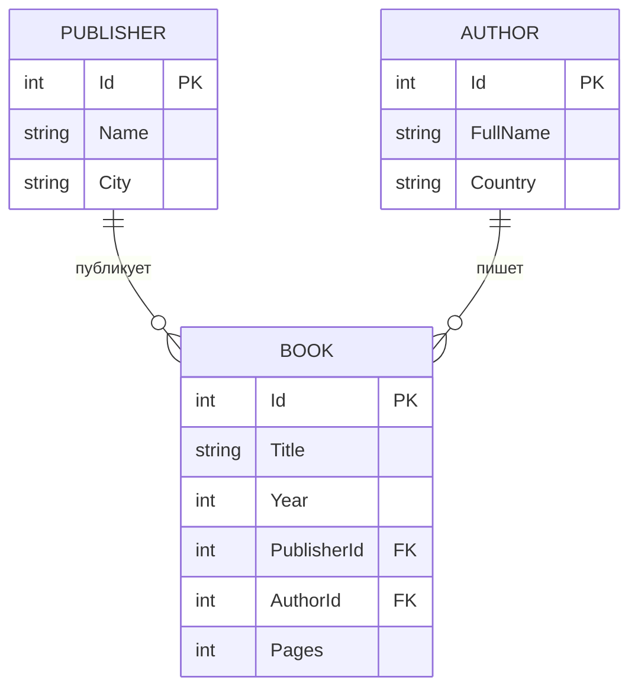
```mermaid
erDiagram
    PUBLISHER ||--o{ BOOK : "публикует"
    AUTHOR    ||--o{ BOOK : "пишет"

    PUBLISHER {
        int    Id   PK
        string Name
        string City
    }
    AUTHOR {
        int    Id       PK
        string FullName
        string Country
    }
    BOOK {
        int    Id          PK
        string Title
        int    Year
        int    PublisherId FK
        int    AuthorId    FK
        int    Pages
    }
```

### Классы

**`Publisher`** — `Id`, `Name`, `City`; `Info` — `"Эксмо (Москва)"`.

**`Author`** — `Id`, `FullName`, `Country`; `GetInfo()` — `"Лев Толстой (Россия)"`.

**`Book`** — `Id`, `Title`, `Year`, `PublisherId`, `AuthorId`, `Pages`; `IsBig` (`Pages > 500`); `GetInfo()` — `"Война и мир (1869, 1225 стр.)"`.

### Правила предметной области

- `Id` уникален в пределах коллекции.
- `Title` книги **не уникально** — поиск возвращает **первую** найденную.
- `Year` — 0–2100. `Pages` > 0.

### Репозитории

`GetPublishers()`, `GetAuthors()`, `GetBooks()` — в обоих репозиториях.

**`InMemoryRepository`** (пример):
```csharp
public class InMemoryRepository
{
    private List<Publisher> _publishers;
    private List<Author> _authors;
    private List<Book> _books;

    public InMemoryRepository()
    {
        _publishers = new List<Publisher>
        {
            new Publisher { Id = 1, Name = "Эксмо", City = "Москва" },
            new Publisher { Id = 2, Name = "Питер", City = "Санкт-Петербург" },
            new Publisher { Id = 3, Name = "АСТ",  City = "Москва" }
        };
        _authors = new List<Author>
        {
            new Author { Id = 1, FullName = "Лев Толстой",       Country = "Россия" },
            new Author { Id = 2, FullName = "Фёдор Достоевский", Country = "Россия" },
            new Author { Id = 3, FullName = "Антон Чехов",       Country = "Россия" }
        };
        _books = new List<Book>
        {
            new Book { Id = 1, Title = "Война и мир",              Year = 1869, PublisherId = 1, AuthorId = 1, Pages = 1225 },
            new Book { Id = 2, Title = "Анна Каренина",            Year = 1877, PublisherId = 1, AuthorId = 1, Pages = 864  },
            new Book { Id = 3, Title = "Преступление и наказание", Year = 1866, PublisherId = 2, AuthorId = 2, Pages = 671  },
            new Book { Id = 4, Title = "Идиот",                    Year = 1869, PublisherId = 2, AuthorId = 2, Pages = 640  },
            new Book { Id = 5, Title = "Вишнёвый сад",             Year = 1904, PublisherId = 3, AuthorId = 3, Pages = 96   }
        };
    }
    public List<Publisher> GetPublishers() { return _publishers; }
    public List<Author>    GetAuthors()    { return _authors; }
    public List<Book>      GetBooks()      { return _books; }
}
```

**`CsvRepository`** — те же данные в `data/publishers.csv`, `data/authors.csv`, `data/books.csv`. Формат CSV:
```
Id,Name,City
1,Эксмо,Москва
...
```
```csharp
public class CsvRepository
{
    private string _basePath;
    public CsvRepository(string basePath) { _basePath = basePath; }

    public List<Book> GetBooks()
    {
        List<Book> result = new List<Book>();
        string[] lines = File.ReadAllLines(Path.Combine(_basePath, "books.csv"));
        if (lines.Length < 2) return result;
        for (int i = 1; i < lines.Length; i++)
        {
            string[] parts = lines[i].Split(',');
            if (parts.Length < 6) continue;
            Book b = new Book();
            b.Id = int.Parse(parts[0]);
            b.Title = parts[1];
            b.Year = int.Parse(parts[2]);
            b.PublisherId = int.Parse(parts[3]);
            b.AuthorId = int.Parse(parts[4]);
            b.Pages = int.Parse(parts[5]);
            result.Add(b);
        }
        return result;
    }
    // GetPublishers(), GetAuthors() — по аналогии
}
```

---

## Вариант 1. Космодром

### ERD

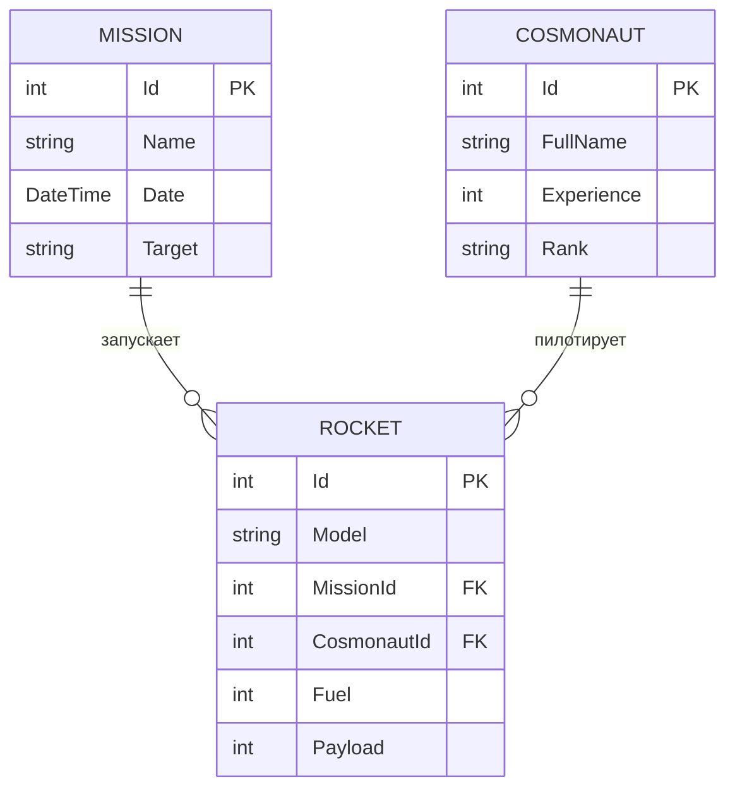
```mermaid
erDiagram
    MISSION   ||--o{ ROCKET : "запускает"
    COSMONAUT ||--o{ ROCKET : "пилотирует"

    MISSION {
        int      Id     PK
        string   Name
        DateTime Date
        string   Target
    }
    ROCKET {
        int    Id          PK
        string Model
        int    MissionId   FK
        int    CosmonautId FK
        int    Fuel
        int    Payload
    }
    COSMONAUT {
        int    Id         PK
        string FullName
        int    Experience
        string Rank
    }
```

Из ERD: у ракеты ровно одна миссия и ровно один космонавт (оба FK обязательны).

### Классы

**`Mission`** — `Id`, `Name`, `Date`, `Target`; `Info` — `"Луна-25 (01.09.2025, Луна)"`.

**`Cosmonaut`** — `Id`, `FullName`, `Experience`, `Rank`; `IsExperienced` (`Experience > 5`); `GetInfo()` — `"Иванов И.И. (10 лет, капитан)"`.

**`Rocket`** — `Id`, `Model`, `MissionId`, `CosmonautId`, `Fuel`, `Payload`; `IsHeavy` (`Payload > 5000`); `GetInfo()` — `"Союз-2 (12000 кг полезной нагрузки)"`.

### Правила предметной области

- `Id` уникален в пределах коллекции.
- `Model` ракеты **не уникальна** — поиск возвращает **первую** найденную.
- `Date` в CSV — `dd.MM.yyyy`. `Fuel`, `Payload` — кг.

### Репозитории

`GetMissions()`, `GetCosmonauts()`, `GetRockets()` — в обоих репозиториях.

### Методы программы

**1. Поиск космонавта по модели ракеты.** Передаётся модель. Найти **первую** ракету с такой моделью, затем по `CosmonautId` — космонавта. Не найдено — `null`.

**2. Поиск миссии для ракеты.** Передаётся объект ракеты. Не найдено — `null`.

**3. Суммарная полезная нагрузка.** Сумма `Payload`. Пустой список — `0`.

**4. Группировка космонавтов по званию.** `Dictionary<string, List<Cosmonaut>>`. Порядок ключей — по первому появлению.

**5. Вывод всех ракет.** `"<Model>" — космонавт <FullName>, миссия "<Name>"`. Не найдено — `"—"`.

### Пример вывода

```
1. FindCosmonaut("Союз-2"): Иванов И.И. (10 лет, капитан)
2. FindMission(rocket "Союз-2"): Луна-25 (01.09.2025, Луна)
3. GetTotalPayload: 42000 кг
4. GetCosmonautsByRank: Капитан — 2, Майор — 2, Лейтенант — 1
5. PrintAllRockets:
"Союз-2" — космонавт Иванов И.И., миссия "Луна-25"
"Протон-М" — космонавт Петров П.П., миссия "Марс-1"
"Ангара-А5" — космонавт Сидоров С.С., миссия "Венера-Д"
"Союз-2" — космонавт Орлов А.А., миссия "Луна-26"
"Восток" — космонавт Соколов П.П., миссия "Луна-25"

Не найдено: FindCosmonaut("Буран") → null
```

---

## Вариант 2. Кинотеатр

### ERD

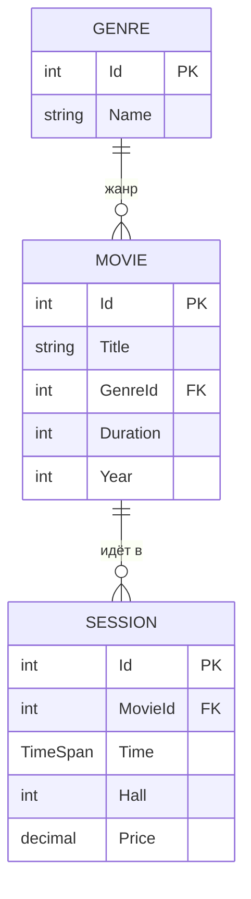
```mermaid
erDiagram
    GENRE ||--o{ MOVIE   : "жанр"
    MOVIE ||--o{ SESSION : "идёт в"

    GENRE {
        int    Id   PK
        string Name
    }
    MOVIE {
        int    Id       PK
        string Title
        int    GenreId  FK
        int    Duration
        int    Year
    }
    SESSION {
        int      Id      PK
        int      MovieId FK
        TimeSpan Time
        int      Hall
        decimal  Price
    }
```

### Классы

**`Genre`** — `Id`, `Name`; `Info` — название жанра.

**`Movie`** — `Id`, `Title`, `GenreId`, `Duration`, `Year`; `IsLong` (`Duration > 120`); `GetInfo()` — `"Интерстеллар (2014, 169 мин)"`.

**`Session`** — `Id`, `MovieId`, `Time`, `Hall`, `Price`; `IsEvening` (`Time >= 18:00`); `GetInfo()` — `"18:30, зал 3, 450 руб."`.

### Правила предметной области

- `Title` фильма уникален. `Name` жанра уникален.
- `Time` в CSV — `HH:mm`. `Price` ≥ 0.

### Репозитории

`GetGenres()`, `GetMovies()`, `GetSessions()`.

### Методы программы

**1. Поиск жанра фильма по названию.** Не найдено — `null`.

**2. Первый сеанс фильма.** Передаётся объект фильма. Не найдено — `null`.

**3. Суммарная длительность всех фильмов.** Пустой список — `0`.

**4. Группировка фильмов по жанрам.** `Dictionary<string, List<Movie>>`. Если жанр не найден — `"Без жанра"`.

**5. Вывод всех фильмов.** `<GetInfo()> — жанр "<Name>"`. Не найдено — `"—"`.

### Пример вывода

```
1. FindGenre("Интерстеллар"): Фантастика
2. FindSession(movie "Интерстеллар"): 18:30, зал 3, 450 руб.
3. GetTotalDuration: 520 минут
4. GroupMoviesByGenre: Фантастика — 2, Драма — 1, Боевик — 1
5. PrintAllMovies:
"Интерстеллар (2014, 169 мин)" — жанр "Фантастика"
"Начало (2010, 148 мин)" — жанр "Фантастика"
"Зелёная миля (1999, 189 мин)" — жанр "Драма"
"Форсаж (2001, 106 мин)" — жанр "Боевик"

Не найдено: FindGenre("Неизвестный фильм") → null
```

---

## Вариант 3. Университет

### ERD

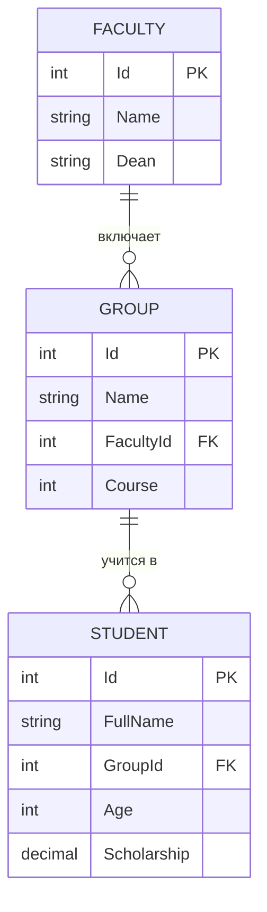
```mermaid
erDiagram
    FACULTY ||--o{ GROUP   : "включает"
    GROUP   ||--o{ STUDENT : "учится в"

    FACULTY {
        int    Id   PK
        string Name
        string Dean
    }
    GROUP {
        int    Id        PK
        string Name
        int    FacultyId FK
        int    Course
    }
    STUDENT {
        int     Id          PK
        string  FullName
        int     GroupId     FK
        int     Age
        decimal Scholarship
    }
```

### Классы

**`Faculty`** — `Id`, `Name`, `Dean`; `Info` — `"Информатики (декан: Иванов И.И.)"`.

**`Group`** — `Id`, `Name`, `FacultyId`, `Course`; `IsSenior` (`Course >= 4`); `GetInfo()` — `"ИС-21 (2 курс)"`.

**`Student`** — `Id`, `FullName`, `GroupId`, `Age`, `Scholarship`; `HasScholarship` (`Scholarship > 0`); `GetInfo()` — `"Иванов И.И. (20 лет, стипендия 8000)"`.

### Правила предметной области

- `Name` группы и факультета уникальны.
- `FullName` студента **не уникально**. `Course` — 1–6. `Scholarship` ≥ 0.

### Репозитории

`GetFaculties()`, `GetGroups()`, `GetStudents()`.

### Методы программы

**1. Поиск группы студента по имени.** Не найдено — `null`.

**2. Поиск факультета группы.** Не найдено — `null`.

**3. Суммарная стипендия.** Пустой список — `0`.

**4. Студенты со стипендией выше порога.** Новый список, отсортированный по убыванию стипендии — **вручную, пузырьковой сортировкой**.

**5. Вывод всех студентов.** `<GetInfo()> — группа <GetInfo()>, факультет "<Name>"`. Не найдено — `"—"`.

### Пример вывода

```
1. FindGroup("Иванов И.И."): ИС-21 (2 курс)
2. FindFaculty(group "ИС-21"): Информатики (декан: Иванов И.И.)
3. GetTotalScholarship: 45000 руб.
4. GetStudentsWithHighScholarship(5000): Петров (8000), Иванов (6500)
5. PrintAllStudents:
"Иванов И.И. (20 лет, стипендия 8000)" — группа "ИС-21 (2 курс)", факультет "Информатики"
"Петров П.П. (21 год, стипендия 6500)" — группа "ИС-21 (2 курс)", факультет "Информатики"
"Сидоров С.С. (19 лет, стипендия 0)" — группа "ИС-22 (1 курс)", факультет "Информатики"

Не найдено: FindGroup("Неизвестный студент") → null
```

---

## Вариант 4. Больница

### ERD

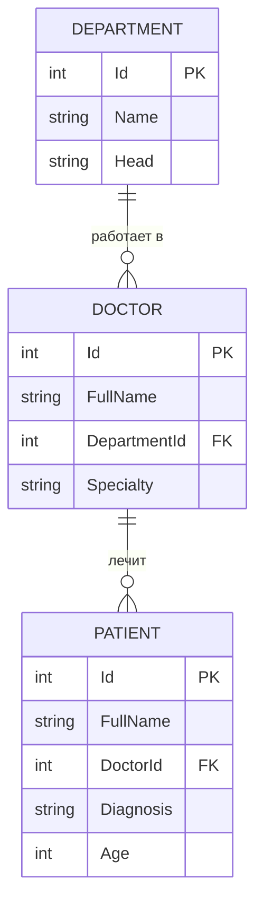
```mermaid
erDiagram
    DEPARTMENT ||--o{ DOCTOR  : "работает в"
    DOCTOR     ||--o{ PATIENT : "лечит"

    DEPARTMENT {
        int    Id   PK
        string Name
        string Head
    }
    DOCTOR {
        int    Id           PK
        string FullName
        int    DepartmentId FK
        string Specialty
    }
    PATIENT {
        int    Id        PK
        string FullName
        int    DoctorId  FK
        string Diagnosis
        int    Age
    }
```

### Классы

**`Department`** — `Id`, `Name`, `Head`; `Info` — `"Терапия (зав.: Сидоров С.С.)"`.

**`Doctor`** — `Id`, `FullName`, `DepartmentId`, `Specialty`; `IsSurgeon` (`Specialty == "Хирург"`); `GetInfo()` — `"Сидоров С.С. (терапевт)"`.

**`Patient`** — `Id`, `FullName`, `DoctorId`, `Diagnosis`, `Age`; `IsElderly` (`Age > 60`); `GetInfo()` — `"Петров П.П. (58 лет, грипп)"`.

### Правила предметной области

- `Name` отделения уникально.
- `FullName` пациента **не уникально**. `Age` — 0–150.

### Репозитории

`GetDepartments()`, `GetDoctors()`, `GetPatients()`.

### Методы программы

**1. Поиск врача пациента.** Не найдено — `null`.

**2. Поиск отделения врача.** Не найдено — `null`.

**3. Средний возраст пациентов.** Пустой список — `0` (защита от деления на ноль).

**4. Количество пациентов по диагнозам.** `Dictionary<string, int>`.

**5. Вывод всех пациентов.** `<GetInfo()> — врач <GetInfo()>, отделение "<Name>"`. Не найдено — `"—"`.

### Пример вывода

```
1. FindDoctor("Петров П.П."): Сидоров С.С. (терапевт)
2. FindDepartment(doctor "Сидоров С.С."): Терапия (зав.: Сидоров С.С.)
3. GetAverageAge: 47 лет
4. CountPatientsByDiagnosis: Грипп — 3, Ангина — 2, Бронхит — 1
5. PrintAllPatients:
"Петров П.П. (58 лет, грипп)" — врач Сидоров С.С. (терапевт), отделение "Терапия"
"Иванов И.И. (34 года, ангина)" — врач Сидоров С.С. (терапевт), отделение "Терапия"
"Смирнов А.А. (72 года, бронхит)" — врач Орлов О.О. (хирург), отделение "Хирургия"

Не найдено: FindDoctor("Неизвестный пациент") → null
```

---

## Вариант 5. Магазин

### ERD

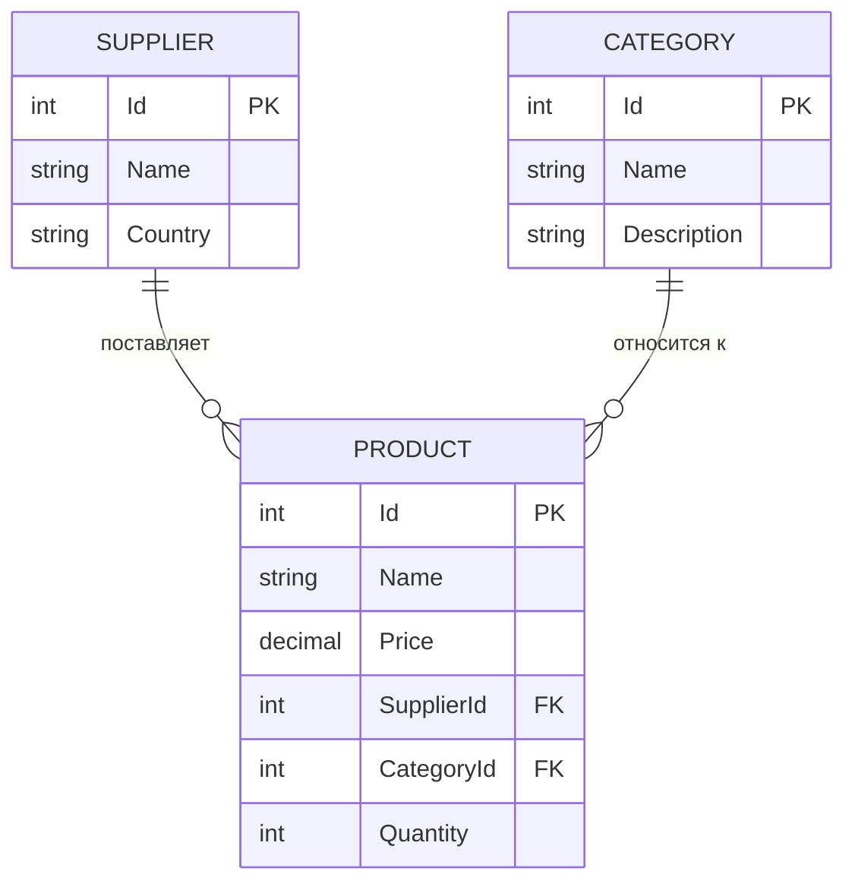
```mermaid
erDiagram
    SUPPLIER ||--o{ PRODUCT : "поставляет"
    CATEGORY ||--o{ PRODUCT : "относится к"

    SUPPLIER {
        int    Id      PK
        string Name
        string Country
    }
    CATEGORY {
        int    Id          PK
        string Name
        string Description
    }
    PRODUCT {
        int     Id         PK
        string  Name
        decimal Price
        int     SupplierId FK
        int     CategoryId FK
        int     Quantity
    }
```

### Классы

**`Supplier`** — `Id`, `Name`, `Country`; `IsForeign` (`Country != "Россия"`); `GetInfo()` — `"Samsung (Южная Корея)"`.

**`Category`** — `Id`, `Name`, `Description`; `Info` — `"Электроника — бытовая техника"`.

**`Product`** — `Id`, `Name`, `Price`, `SupplierId`, `CategoryId`, `Quantity`; `TotalPrice`; `IsExpensive` (`Price > 10000`); `GetInfo()` — `"Ноутбук (75000 руб., 10 шт.)"`.

### Правила предметной области

- `Name` категории и поставщика уникальны.
- `Name` товара **не уникально**. `Price`, `Quantity` ≥ 0.

### Репозитории

`GetSuppliers()`, `GetCategories()`, `GetProducts()`.

### Методы программы

**1. Поиск категории товара.** Не найдено — `null`.

**2. Поиск поставщика товара.** Не найдено — `null`.

**3. Общая стоимость товаров на складе.** Сумма `Price * Quantity`. Пустой список — `0`.

**4. Самый дорогой товар в каждой категории.** `Dictionary<string, Product>` — только для категорий, где есть товары.

**5. Вывод всех товаров.** `<GetInfo()> — категория "<Name>", поставщик <Name>`. Не найдено — `"—"`.

### Пример вывода

```
1. FindCategory("Ноутбук"): Электроника — бытовая техника
2. FindSupplier(product "Ноутбук"): Samsung (Южная Корея)
3. GetTotalPrice: 1250000 руб.
4. GetMostExpensiveProductPerCategory: Электроника — Ноутбук (75000), Одежда — Куртка (12000)
5. PrintAllProducts:
"Ноутбук (75000 руб., 10 шт.)" — категория "Электроника", поставщик "Samsung"
"Куртка (12000 руб., 5 шт.)" — категория "Одежда", поставщик "Adidas"
"Телевизор (45000 руб., 3 шт.)" — категория "Электроника", поставщик "LG"

Не найдено: FindCategory("Неизвестный товар") → null
```

---

## Вариант 6. Автопарк

### ERD

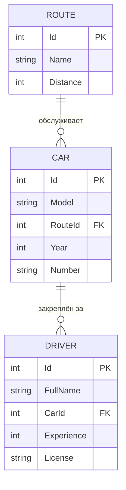
```mermaid
erDiagram
    ROUTE ||--o{ CAR    : "обслуживает"
    CAR   ||--o{ DRIVER : "закреплён за"

    ROUTE {
        int    Id       PK
        string Name
        int    Distance
    }
    CAR {
        int    Id      PK
        string Model
        int    RouteId FK
        int    Year
        string Number
    }
    DRIVER {
        int    Id         PK
        string FullName
        int    CarId      FK
        int    Experience
        string License
    }
```

### Классы

**`Route`** — `Id`, `Name`, `Distance`; `IsLong` (`Distance > 50`); `GetInfo()` — `"Городской (25 км)"`.

**`Car`** — `Id`, `Model`, `RouteId`, `Year`, `Number`; `IsNew` (`Year >= 2020`); `GetInfo()` — `"Toyota Camry (2021, А123БВ)"`.

**`Driver`** — `Id`, `FullName`, `CarId`, `Experience`, `License`; `IsExperienced` (`Experience > 5`); `GetInfo()` — `"Иванов И.И. (10 лет стажа)"`.

### Правила предметной области

- `Number` машины уникален. `Name` маршрута уникально.
- `FullName` водителя **не уникально**. `Distance` ≥ 0. `Year` — 1900–2100.

### Репозитории

`GetRoutes()`, `GetCars()`, `GetDrivers()`.

### Методы программы

**1. Поиск водителя по номеру машины.** Не найдено — `null`.

**2. Поиск маршрута машины.** Не найдено — `null`.

**3. Суммарная протяжённость маршрутов.** Пустой список — `0`.

**4. Водители с более чем одной машиной.** Сравнивать по `FullName`.

**5. Вывод всех машин.** `<GetInfo()> — водитель <GetInfo()>, маршрут "<Name>" (<Distance> км)`. Не найдено — `"—"`.

### Пример вывода

```
1. FindDriver("А123БВ"): Иванов И.И. (10 лет стажа)
2. FindRoute(car "Toyota Camry"): Городской (25 км)
3. GetTotalDistance: 180 км
4. GetDriversWithMultipleCars: Иванов (2), Петров (3)
5. PrintAllCars:
"Toyota Camry (2021, А123БВ)" — водитель Иванов И.И. (10 лет стажа), маршрут "Городской" (25 км)
"Kia Rio (2019, Б456ВГ)" — водитель Петров П.П. (3 года стажа), маршрут "Загородный" (75 км)
"Ford Focus (2022, В789ГД)" — водитель Сидоров С.С. (8 лет стажа), маршрут "Городской" (25 км)

Не найдено: FindDriver("Х000ХХ") → null
```

---

## Вариант 7. Ресторан

### ERD

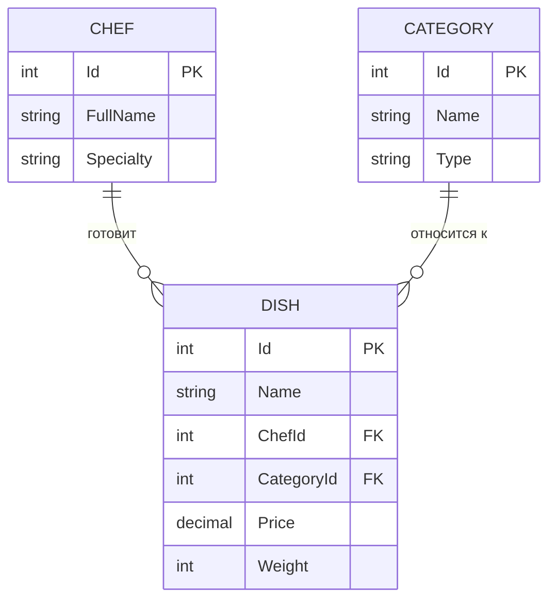
```mermaid
erDiagram
    CHEF     ||--o{ DISH : "готовит"
    CATEGORY ||--o{ DISH : "относится к"

    CHEF {
        int    Id        PK
        string FullName
        string Specialty
    }
    CATEGORY {
        int    Id   PK
        string Name
        string Type
    }
    DISH {
        int     Id         PK
        string  Name
        int     ChefId     FK
        int     CategoryId FK
        decimal Price
        int     Weight
    }
```

### Классы

**`Chef`** — `Id`, `FullName`, `Specialty`; `IsChef` (`Specialty == "Шеф-повар"`); `GetInfo()` — `"Петрова А.А. (шеф-повар)"`.

**`Category`** — `Id`, `Name`, `Type`; `Info` — `"Супы — горячие блюда"`.

**`Dish`** — `Id`, `Name`, `ChefId`, `CategoryId`, `Price`, `Weight`; `PricePerGram`; `IsHeavy` (`Weight > 500`); `GetInfo()` — `"Борщ (350 руб., 400 г)"`.

### Правила предметной области

- `Name` категории уникально. `Weight` > 0.
- `Name` блюда **не уникально**.

### Репозитории

`GetChefs()`, `GetCategories()`, `GetDishes()`.

### Методы программы

**1. Поиск повара блюда.** Не найдено — `null`.

**2. Поиск категории блюда.** Не найдено — `null`.

**3. Общий вес блюд.** Пустой список — `0`.

**4. Блюда указанного повара по цене.** Сортировка по возрастанию — **вручную**.

**5. Вывод всех блюд.** `<GetInfo()> — повар <FullName>, категория "<Name>"`. Не найдено — `"—"`.

### Пример вывода

```
1. FindChef("Борщ"): Петрова А.А. (шеф-повар)
2. FindCategory(dish "Борщ"): Супы — горячие блюда
3. GetTotalWeight: 3200 г
4. GetDishesByChefSortedByPrice("Петрова А.А."): Окрошка (250), Борщ (350), Солянка (400)
5. PrintAllDishes:
"Борщ (350 руб., 400 г)" — повар Петрова А.А., категория "Супы"
"Окрошка (250 руб., 300 г)" — повар Петрова А.А., категория "Супы"
"Солянка (400 руб., 350 г)" — повар Петрова А.А., категория "Супы"

Не найдено: FindChef("Неизвестное блюдо") → null
```

---

## Вариант 8. Аэропорт

### ERD

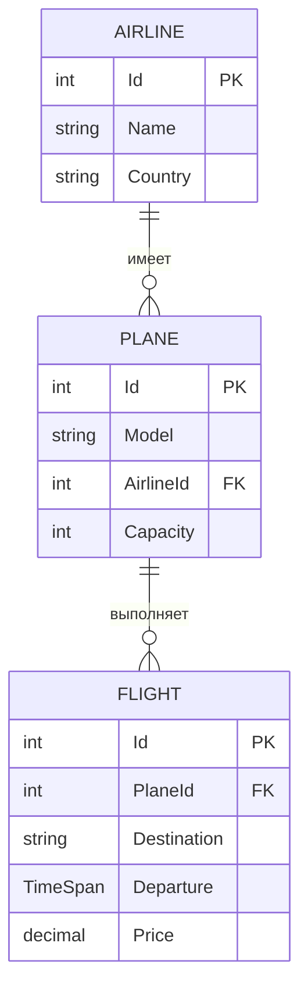
```mermaid
erDiagram
    AIRLINE ||--o{ PLANE  : "имеет"
    PLANE   ||--o{ FLIGHT : "выполняет"

    AIRLINE {
        int    Id      PK
        string Name
        string Country
    }
    PLANE {
        int    Id        PK
        string Model
        int    AirlineId FK
        int    Capacity
    }
    FLIGHT {
        int      Id          PK
        int      PlaneId     FK
        string   Destination
        TimeSpan Departure
        decimal  Price
    }
```

### Классы

**`Airline`** — `Id`, `Name`, `Country`; `IsInternational` (`Country != "Россия"`); `GetInfo()` — `"Аэрофлот (Россия)"`.

**`Plane`** — `Id`, `Model`, `AirlineId`, `Capacity`; `IsBig` (`Capacity > 200`); `GetInfo()` — `"Boeing 737 (180 мест)"`.

**`Flight`** — `Id`, `PlaneId`, `Destination`, `Departure`, `Price`; `IsMorning` (`Departure < 12:00`); `GetInfo()` — `"Москва, 08:30, 5500 руб."`.

### Правила предметной области

- `Name` авиакомпании уникально. `Model` самолёта **не уникальна**.
- `Destination` **не уникально**. `Departure` в CSV — `HH:mm`.

### Репозитории

`GetAirlines()`, `GetPlanes()`, `GetFlights()`.

### Методы программы

**1. Поиск самолёта по направлению.** Не найдено — `null`.

**2. Поиск авиакомпании самолёта.** Не найдено — `null`.

**3. Суммарная вместимость самолётов.** Пустой список — `0`.

**4. Самая загруженная авиакомпания.** По числу рейсов. При равенстве — первая.

**5. Вывод всех рейсов.** `<GetInfo()> — <Plane.Model>, авиакомпания "<Name>"`. Не найдено — `"—"`.

### Пример вывода

```
1. FindPlane("Москва"): Boeing 737 (180 мест)
2. FindAirline(plane "Boeing 737"): Аэрофлот (Россия)
3. GetTotalCapacity: 1200 пассажиров
4. GetBusiestAirline: Аэрофлот (4 рейса)
5. PrintAllFlights:
"Москва, 08:30, 5500 руб." — Boeing 737, авиакомпания "Аэрофлот"
"Санкт-Петербург, 14:15, 4200 руб." — Airbus A320, авиакомпания "Аэрофлот"
"Казань, 20:00, 3800 руб." — Boeing 737, авиакомпания "S7"

Не найдено: FindPlane("Неизвестное направление") → null
```

---

## Вариант 9. Музей

### ERD

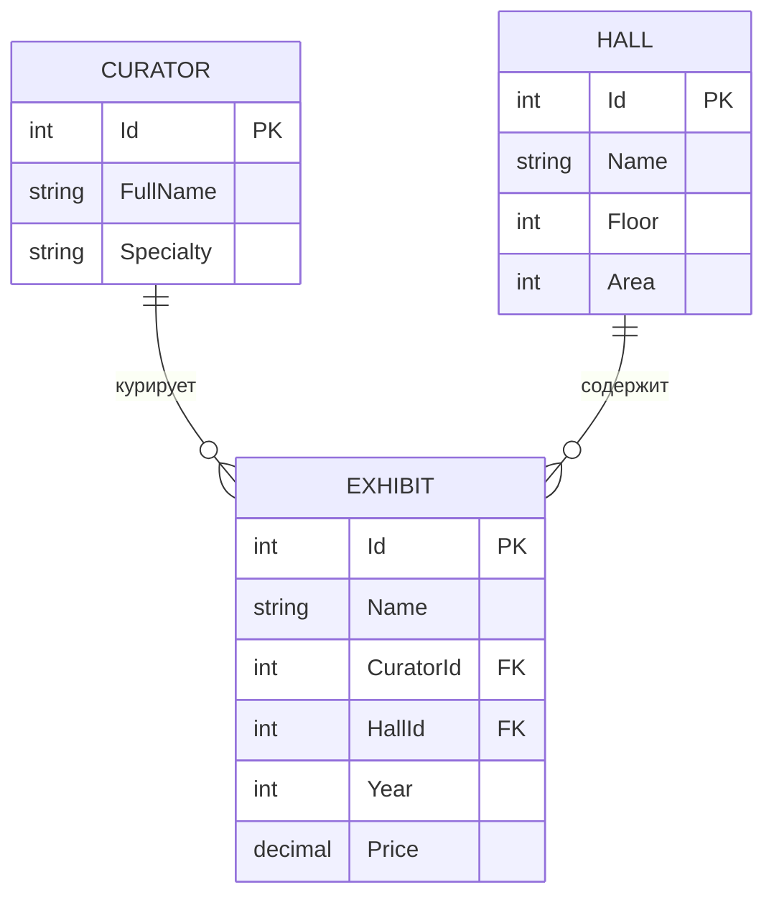
```mermaid
erDiagram
    CURATOR ||--o{ EXHIBIT : "курирует"
    HALL    ||--o{ EXHIBIT : "содержит"

    CURATOR {
        int    Id        PK
        string FullName
        string Specialty
    }
    HALL {
        int    Id    PK
        string Name
        int    Floor
        int    Area
    }
    EXHIBIT {
        int     Id        PK
        string  Name
        int     CuratorId FK
        int     HallId    FK
        int     Year
        decimal Price
    }
```

### Классы

**`Curator`** — `Id`, `FullName`, `Specialty`; `IsRestorer` (`Specialty == "Реставратор"`); `GetInfo()` — `"Смирнова Е.В. (реставратор)"`.

**`Hall`** — `Id`, `Name`, `Floor`, `Area`; `IsUpper` (`Floor > 1`); `GetInfo()` — `"Античность (2 этаж, 200 м²)"`.

**`Exhibit`** — `Id`, `Name`, `CuratorId`, `HallId`, `Year`, `Price`; `IsAncient` (`Year < 1000`); `IsValuable` (`Price > 1000000`); `GetInfo()` — `"Амфора (500 до н.э., 50000 руб.)"`.

### Правила предметной области

- `Name` зала уникально. `Name` экспоната **не уникально**.
- `Year` может быть отрицательным. `Price` ≥ 0.

### Репозитории

`GetCurators()`, `GetHalls()`, `GetExhibits()`.

### Методы программы

**1. Поиск куратора экспоната.** Не найдено — `null`.

**2. Поиск зала экспоната.** Не найдено — `null`.

**3. Общая стоимость экспонатов.** Пустой список — `0`.

**4. Экспонаты зала по году.** Сортировка по возрастанию — **вручную**.

**5. Вывод всех экспонатов.** `<GetInfo()> — куратор <FullName>, зал "<Name>" (<Floor> этаж)`. Не найдено — `"—"`.

### Пример вывода

```
1. FindCurator("Амфора"): Смирнова Е.В. (реставратор)
2. FindHall(exhibit "Амфора"): Античность (2 этаж, 200 м²)
3. GetTotalPrice: 8500000 руб.
4. GetExhibitsByHallSortedByYear("Античность"): Амфора (-500), Статуя (-200)
5. PrintAllExhibits:
"Амфора (500 до н.э., 50000 руб.)" — куратор Смирнова Е.В., зал "Античность" (2 этаж)
"Статуя (200 до н.э., 80000 руб.)" — куратор Смирнова Е.В., зал "Античность" (2 этаж)
"Икона (1500, 200000 руб.)" — куратор Орлова М.И., зал "Средневековье" (1 этаж)

Не найдено: FindCurator("Неизвестный экспонат") → null
```

---

## Вариант 10. Спортзал

### ERD

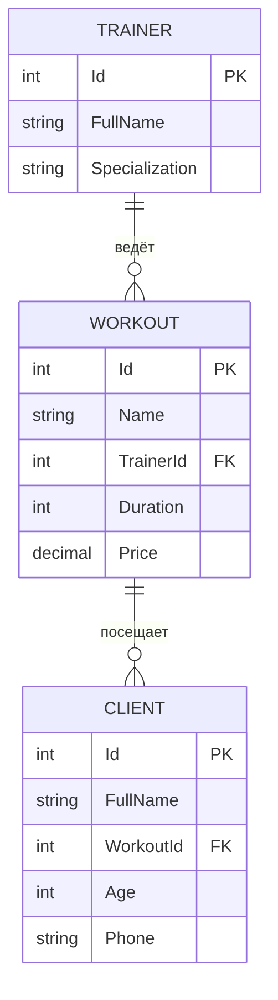
```mermaid
erDiagram
    TRAINER ||--o{ WORKOUT : "ведёт"
    WORKOUT ||--o{ CLIENT  : "посещает"

    TRAINER {
        int    Id             PK
        string FullName
        string Specialization
    }
    WORKOUT {
        int     Id        PK
        string  Name
        int     TrainerId FK
        int     Duration
        decimal Price
    }
    CLIENT {
        int    Id        PK
        string FullName
        int    WorkoutId FK
        int    Age
        string Phone
    }
```

### Классы

**`Trainer`** — `Id`, `FullName`, `Specialization`; `IsYogaTrainer` (`Specialization == "Йога"`); `GetInfo()` — `"Орлова М.И. (йога)"`.

**`Workout`** — `Id`, `Name`, `TrainerId`, `Duration`, `Price`; `PricePerMinute`; `IsLong` (`Duration > 60`); `GetInfo()` — `"Йога (60 мин, 800 руб.)"`.

**`Client`** — `Id`, `FullName`, `WorkoutId`, `Age`, `Phone`; `IsYoung` (`Age < 25`); `GetInfo()` — `"Сергеева О.П. (22 года)"`.

### Правила предметной области

- `Name` тренировки **не уникально**. `Duration` > 0.
- `FullName` тренера **не уникально**.

### Репозитории

`GetTrainers()`, `GetWorkouts()`, `GetClients()`.

### Методы программы

**1. Поиск тренера тренировки.** Не найдено — `null`.

**2. Поиск клиента тренировки.** Не найдено — `null`.

**3. Суммарная длительность.** Пустой список — `0`.

**4. Загрузка тренеров.** `Dictionary<string, int>` — ФИО → суммарная длительность.

**5. Вывод всех тренировок.** `<GetInfo()> — тренер <FullName>, клиент <FullName>`. Не найдено — `"—"`.

### Пример вывода

```
1. FindTrainer("Йога"): Орлова М.И. (йога)
2. FindClient(workout "Йога"): Сергеева О.П. (22 года)
3. GetTotalDuration: 360 минут
4. GetTrainerWorkload: Орлова — 120 мин, Иванов — 150 мин, Петров — 90 мин
5. PrintAllWorkouts:
"Йога (60 мин, 800 руб.)" — тренер Орлова М.И., клиент Сергеева О.П.
"Фитнес (60 мин, 700 руб.)" — тренер Иванов И.И., клиент Кузнецов Д.Д.

Не найдено: FindTrainer("Неизвестная тренировка") → null
```

---

## Вариант 11. Банк

### ERD

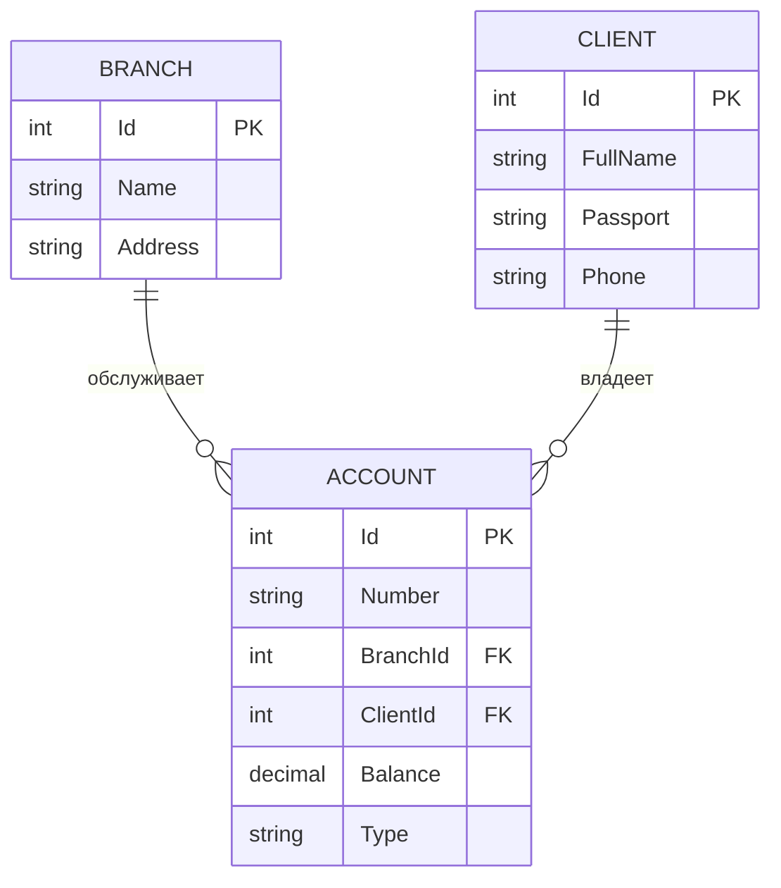
```mermaid
erDiagram
    BRANCH ||--o{ ACCOUNT : "обслуживает"
    CLIENT ||--o{ ACCOUNT : "владеет"

    BRANCH {
        int    Id      PK
        string Name
        string Address
    }
    CLIENT {
        int    Id       PK
        string FullName
        string Passport
        string Phone
    }
    ACCOUNT {
        int     Id       PK
        string  Number
        int     BranchId FK
        int     ClientId FK
        decimal Balance
        string  Type
    }
```

### Классы

**`Branch`** — `Id`, `Name`, `Address`; `IsCentral` (`Name == "Центральное"`); `GetInfo()` — `"Центральное (ул. Ленина, 1)"`.

**`Client`** — `Id`, `FullName`, `Passport`, `Phone`; `GetInfo()` — `"Иванов И.И. (паспорт 1234 567890)"`.

**`Account`** — `Id`, `Number`, `BranchId`, `ClientId`, `Balance`, `Type`; `IsVip` (`Balance > 1000000`); `GetBalanceInUsd(double rate)` (при `rate <= 0` — `0`); `GetInfo()` — `"40817810001 (дебетовый, 250000 руб.)"`.

### Правила предметной области

- `Number` счёта и `Passport` уникальны. `Name` отделения уникально.
- `FullName` клиента **не уникально**.

### Репозитории

`GetBranches()`, `GetClients()`, `GetAccounts()`.

### Методы программы

**1. Поиск клиента по номеру счёта.** Не найдено — `null`.

**2. Поиск отделения счёта.** Не найдено — `null`.

**3. Общий баланс.** Пустой список — `0`.

**4. Клиенты с более чем одним счётом.** Список клиентов, упорядоченный по `Id`.

**5. Вывод всех счетов.** `<GetInfo()> — клиент <FullName>, отделение "<Name>"`. Не найдено — `"—"`.

### Пример вывода

```
1. FindClient("40817810001"): Иванов И.И. (паспорт 1234 567890)
2. FindBranch(account "40817810001"): Центральное (ул. Ленина, 1)
3. GetTotalBalance: 1250000 руб.
4. GetClientsWithMultipleAccounts: Иванов (2), Петров (3)
5. PrintAllAccounts:
"40817810001 (дебетовый, 250000 руб.)" — клиент Иванов И.И., отделение "Центральное"
"40817810002 (кредитный, 100000 руб.)" — клиент Иванов И.И., отделение "Северное"

Не найдено: FindClient("00000000000") → null
```

---

## Вариант 12. Онлайн-курсы

### ERD

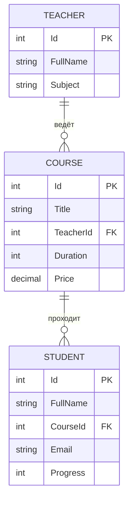
```mermaid
erDiagram
    TEACHER ||--o{ COURSE  : "ведёт"
    COURSE  ||--o{ STUDENT : "проходит"

    TEACHER {
        int    Id       PK
        string FullName
        string Subject
    }
    COURSE {
        int     Id        PK
        string  Title
        int     TeacherId FK
        int     Duration
        decimal Price
    }
    STUDENT {
        int    Id       PK
        string FullName
        int    CourseId FK
        string Email
        int    Progress
    }
```

### Классы

**`Teacher`** — `Id`, `FullName`, `Subject`; `GetInfo()` — `"Петров П.П. (программирование)"`.

**`Course`** — `Id`, `Title`, `TeacherId`, `Duration`, `Price`; `PricePerHour`; `IsLong` (`Duration > 40`); `GetInfo()` — `"C# для начинающих (40 ч, 15000 руб.)"`.

**`Student`** — `Id`, `FullName`, `CourseId`, `Email`, `Progress`; `IsExcellent` (`Progress >= 90`); `IsFailing` (`Progress < 50`); `GetInfo()` — `"Сидоров С.С. (прогресс 75%)"`.

### Правила предметной области

- `Title` курса уникален. `FullName` студента и преподавателя **не уникальны**. `Progress` — 0–100.

### Репозитории

`GetTeachers()`, `GetCourses()`, `GetStudents()`.

### Методы программы

**1. Поиск преподавателя курса.** Не найдено — `null`.

**2. Поиск студента курса.** Не найдено — `null`.

**3. Суммарная длительность курсов.** Пустой список — `0`.

**4. Топ-N студентов по прогрессу.** Сортировка по убыванию — **вручную**. При `N <= 0` — пустой список.

**5. Вывод всех курсов.** `<GetInfo()> — преподаватель <FullName>, студент <FullName> (<Progress>%)`. Не найдено — `"—"`.

### Пример вывода

```
1. FindTeacher("C# для начинающих"): Петров П.П. (программирование)
2. FindStudent(course "C# для начинающих"): Сидоров С.С. (прогресс 75%)
3. GetTotalDuration: 120 часов
4. GetTopStudents(3): Иванов (95%), Петров (88%), Сидоров (75%)
5. PrintAllCourses:
"C# для начинающих (40 ч, 15000 руб.)" — преподаватель Петров П.П., студент Сидоров С.С. (75%)

Не найдено: FindTeacher("Неизвестный курс") → null
```

---

## Вариант 13. Ферма

### ERD

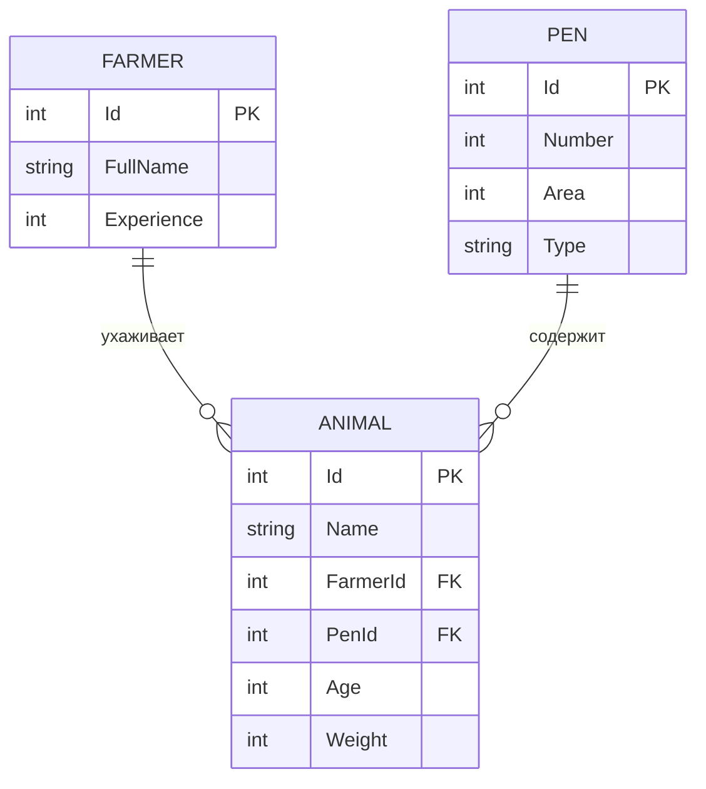
```mermaid
erDiagram
    FARMER ||--o{ ANIMAL : "ухаживает"
    PEN    ||--o{ ANIMAL : "содержит"

    FARMER {
        int    Id         PK
        string FullName
        int    Experience
    }
    PEN {
        int    Id     PK
        int    Number
        int    Area
        string Type
    }
    ANIMAL {
        int    Id       PK
        string Name
        int    FarmerId FK
        int    PenId    FK
        int    Age
        int    Weight
    }
```

### Классы

**`Farmer`** — `Id`, `FullName`, `Experience`; `IsExperienced` (`Experience > 5`); `GetInfo()` — `"Иванов И.И. (10 лет опыта)"`.

**`Pen`** — `Id`, `Number`, `Area`, `Type`; `IsBig` (`Area > 100`); `GetInfo()` — `"Загон №3 (150 м², коровник)"`.

**`Animal`** — `Id`, `Name`, `FarmerId`, `PenId`, `Age`, `Weight`; `IsAdult` (`Age > 2`); `IsHeavy` (`Weight > 500`); `GetInfo()` — `"Бурёнка (3 года, 600 кг)"`.

### Правила предметной области

- `Number` загона уникален. `Name` животного **не уникально**. `Age`, `Weight` ≥ 0.

### Репозитории

`GetFarmers()`, `GetPens()`, `GetAnimals()`.

### Методы программы

**1. Поиск фермера животного.** Не найдено — `null`.

**2. Поиск загона животного.** Не найдено — `null`.

**3. Общий вес животных.** Пустой список — `0`.

**4. Самое тяжёлое животное в каждом загоне.** `Dictionary<string, Animal>` — ключ `"Загон №N"`.

**5. Вывод всех животных.** `<GetInfo()> — фермер <FullName>, загон №<Number>`. Не найдено — `"—"`.

### Пример вывода

```
1. FindFarmer("Бурёнка"): Иванов И.И. (10 лет опыта)
2. FindPen(animal "Бурёнка"): Загон №3 (150 м², коровник)
3. GetTotalWeight: 4500 кг
4. GetHeaviestAnimalPerPen: Загон 1 — Бык (800), Загон 2 — Корова (600), Загон 3 — Бурёнка (600)
5. PrintAllAnimals:
"Бурёнка (3 года, 600 кг)" — фермер Иванов И.И., загон №3
"Бык (5 лет, 800 кг)" — фермер Иванов И.И., загон №1

Не найдено: FindFarmer("Неизвестное животное") → null
```

---

## Вариант 14. IT-компания

### ERD

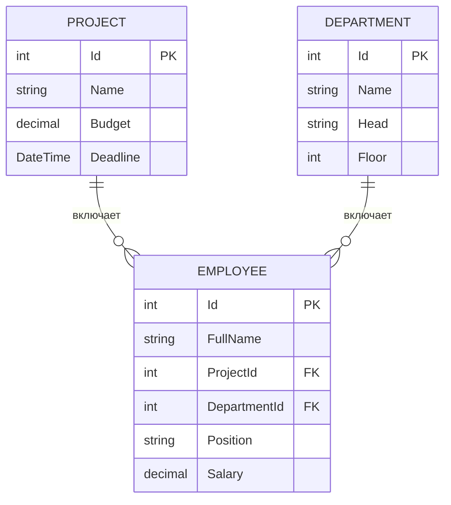
```mermaid
erDiagram
    PROJECT    ||--o{ EMPLOYEE : "включает"
    DEPARTMENT ||--o{ EMPLOYEE : "включает"

    PROJECT {
        int      Id       PK
        string   Name
        decimal  Budget
        DateTime Deadline
    }
    DEPARTMENT {
        int    Id    PK
        string Name
        string Head
        int    Floor
    }
    EMPLOYEE {
        int     Id           PK
        string  FullName
        int     ProjectId    FK
        int     DepartmentId FK
        string  Position
        decimal Salary
    }
```

### Классы

**`Project`** — `Id`, `Name`, `Budget`, `Deadline`; `IsExpensive` (`Budget > 1000000`); `GetInfo()` — `"CRM-система (2 000 000 руб.)"`.

**`Department`** — `Id`, `Name`, `Head`, `Floor`; `IsOnFloor(int floor)`; `GetInfo()` — `"Разработка (зав.: Петров П.П., 3 этаж)"`.

**`Employee`** — `Id`, `FullName`, `ProjectId`, `DepartmentId`, `Position`, `Salary`; `IsSenior` (`Position == "Senior"`); `AnnualSalary` (`Salary * 12`); `GetInfo()` — `"Петров П.П. (Senior, 150000 руб.)"`.

### Правила предметной области

- `Name` проекта и отдела уникальны. `FullName` сотрудника **не уникально**. `Deadline` в CSV — `dd.MM.yyyy`.

### Репозитории

`GetProjects()`, `GetDepartments()`, `GetEmployees()`.

### Методы программы

**1. Поиск отдела сотрудника.** Не найдено — `null`.

**2. Поиск проекта сотрудника.** Не найдено — `null`.

**3. Фонд зарплат.** Пустой список — `0`.

**4. Средняя зарплата по отделам.** `Dictionary<string, decimal>`, округлить до 2 знаков. Отделы без сотрудников не включать.

**5. Вывод всех сотрудников.** `<GetInfo()> — отдел "<Name>", проект "<Name>"`. Не найдено — `"—"`.

### Пример вывода

```
1. FindDepartment("Петров П.П."): Разработка (зав.: Петров П.П., 3 этаж)
2. FindProject(employee "Петров П.П."): CRM-система (2 000 000 руб.)
3. GetTotalSalary: 2500000 руб.
4. GetAverageSalaryByDepartment: Разработка — 150000, Тестирование — 90000
5. PrintAllEmployees:
"Петров П.П. (Senior, 150000 руб.)" — отдел "Разработка", проект "CRM-система"
"Иванов И.И. (Junior, 60000 руб.)" — отдел "Разработка", проект "CRM-система"

Не найдено: FindDepartment("Неизвестный сотрудник") → null
```

---

## Вариант 15. Гостиница

### ERD

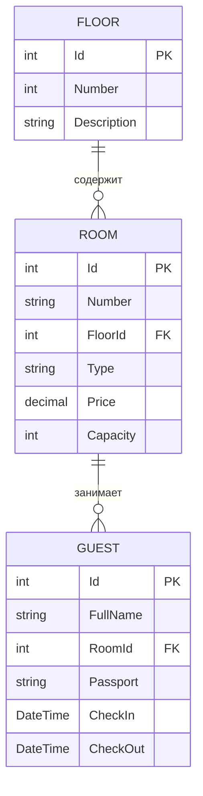
```mermaid
erDiagram
    FLOOR ||--o{ ROOM  : "содержит"
    ROOM  ||--o{ GUEST : "занимает"

    FLOOR {
        int    Id          PK
        int    Number
        string Description
    }
    ROOM {
        int     Id       PK
        string  Number
        int     FloorId  FK
        string  Type
        decimal Price
        int     Capacity
    }
    GUEST {
        int      Id       PK
        string   FullName
        int      RoomId   FK
        string   Passport
        DateTime CheckIn
        DateTime CheckOut
    }
```

### Классы

**`Floor`** — `Id`, `Number`, `Description`; `IsUpper` (`Number > 5`); `GetInfo()` — `"3 этаж (стандарт)"`.

**`Room`** — `Id`, `Number`, `FloorId`, `Type`, `Price`, `Capacity`; `IsLux` (`Type == "Люкс"`); `GetTotalPrice(int days)` (при `days <= 0` — `0`); `GetInfo()` — `"305 (люкс, 5000 руб./сутки)"`.

**`Guest`** — `Id`, `FullName`, `RoomId`, `Passport`, `CheckIn`, `CheckOut`; `StayDays` — количество дней проживания (`(CheckOut - CheckIn).Days`, минимум `0`); `GetInfo()` — `"Иванов И.И. (3 дня)"`.

### Правила предметной области

- `Number` комнаты уникален. `Passport` уникален. `FullName` гостя **не уникально**.
- Даты в CSV — `dd.MM.yyyy`.

### Репозитории

`GetFloors()`, `GetRooms()`, `GetGuests()`.

### Методы программы

**1. Поиск гостя по номеру комнаты.** Не найдено — `null`.

**2. Поиск этажа комнаты.** Не найдено — `null`.

**3. Суммарная стоимость номеров в сутки.** Пустой список — `0`.

**4. Количество гостей в каждом номере.** `Dictionary<string, int>` — только непустые.

**5. Вывод всех номеров.** `<GetInfo()> — этаж <Number>, гостей: <count>`. Не найдено — `"—"`.

### Пример вывода

```
1. FindGuest("305"): Иванов И.И. (3 дня)
2. FindFloor(room "305"): 3 этаж (стандарт)
3. GetTotalPrice: 45000 руб./сутки
4. GetRoomsWithGuests: 305 — 2, 401 — 1, 502 — 3
5. PrintAllRooms:
"305 (люкс, 5000 руб./сутки)" — этаж 3, гостей: 2
"401 (стандарт, 3000 руб./сутки)" — этаж 4, гостей: 1

Не найдено: FindGuest("999") → null
```

---

## Вариант 16. Парк аттракционов

### ERD

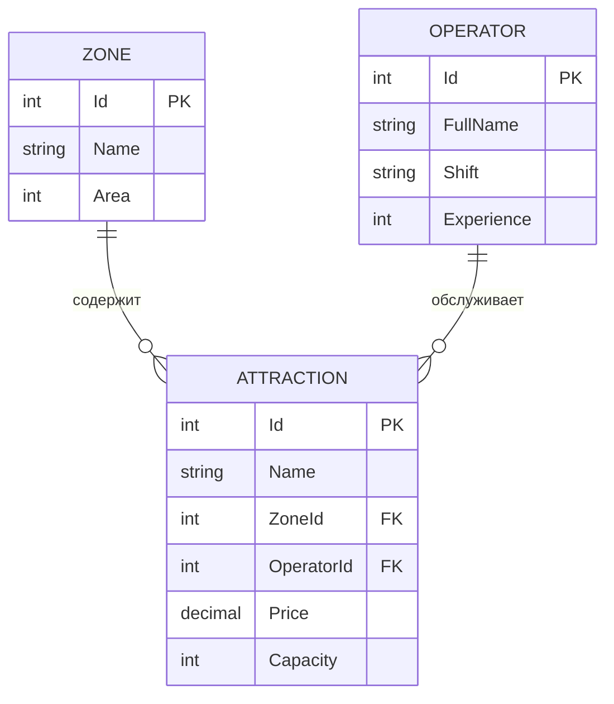
```mermaid
erDiagram
    ZONE     ||--o{ ATTRACTION : "содержит"
    OPERATOR ||--o{ ATTRACTION : "обслуживает"

    ZONE {
        int    Id   PK
        string Name
        int    Area
    }
    OPERATOR {
        int    Id         PK
        string FullName
        string Shift
        int    Experience
    }
    ATTRACTION {
        int     Id         PK
        string  Name
        int     ZoneId     FK
        int     OperatorId FK
        decimal Price
        int     Capacity
    }
```

### Классы

**`Zone`** — `Id`, `Name`, `Area`; `IsFamily` (`Name == "Семейная"`); `GetInfo()` — `"Семейная (500 м²)"`.

**`Operator`** — `Id`, `FullName`, `Shift`, `Experience`; `IsExperienced` (`Experience > 3`); `GetInfo()` — `"Сидоров С.С. (5 лет опыта)"`.

**`Attraction`** — `Id`, `Name`, `ZoneId`, `OperatorId`, `Price`, `Capacity`; `IsExtreme` (имя содержит `"Экстрим"`); `GetTotalRevenue(int visitors)` (при `visitors <= 0` — `0`); `GetInfo()` — `"Колесо обозрения (300 руб., 50 мест)"`.

### Правила предметной области

- `Name` зоны уникально. `Name` аттракциона **не уникально**. `FullName` оператора **не уникально**.

### Репозитории

`GetZones()`, `GetOperators()`, `GetAttractions()`.

### Методы программы

**1. Поиск оператора аттракциона.** Не найдено — `null`.

**2. Поиск зоны аттракциона.** Не найдено — `null`.

**3. Суммарная вместимость.** Пустой список — `0`.

**4. Зона с максимальной вместимостью.** При равенстве — первая. Нет аттракционов — `null`.

**5. Вывод всех аттракционов.** `<GetInfo()> — оператор <FullName>, зона "<Name>"`. Не найдено — `"—"`.

### Пример вывода

```
1. FindOperator("Колесо обозрения"): Сидоров С.С. (5 лет опыта)
2. FindZone(attraction "Колесо обозрения"): Семейная (500 м²)
3. GetTotalCapacity: 400 человек
4. GetZoneWithMaxCapacity: Экстрим (200)
5. PrintAllAttractions:
"Колесо обозрения (300 руб., 50 мест)" — оператор Сидоров С.С., зона "Семейная"
"Американские горки (500 руб., 30 мест)" — оператор Петров П.П., зона "Экстрим"

Не найдено: FindOperator("Неизвестный аттракцион") → null
```

---

## Вариант 17. Пекарня

### ERD

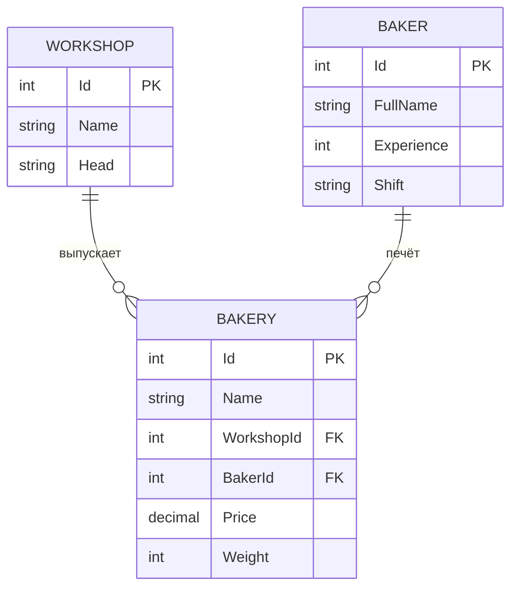
```mermaid
erDiagram
    WORKSHOP ||--o{ BAKERY : "выпускает"
    BAKER    ||--o{ BAKERY : "печёт"

    WORKSHOP {
        int    Id   PK
        string Name
        string Head
    }
    BAKER {
        int    Id         PK
        string FullName
        int    Experience
        string Shift
    }
    BAKERY {
        int     Id         PK
        string  Name
        int     WorkshopId FK
        int     BakerId    FK
        decimal Price
        int     Weight
    }
```

### Классы

**`Workshop`** — `Id`, `Name`, `Head`; `IsConfectionery` (`Name == "Кондитерский"`); `GetInfo()` — `"Кондитерский (зав.: Петрова А.А.)"`.

**`Baker`** — `Id`, `FullName`, `Experience`, `Shift`; `IsExperienced` (`Experience > 3`); `GetInfo()` — `"Петрова А.А. (5 лет опыта)"`.

**`Bakery`** — `Id`, `Name`, `WorkshopId`, `BakerId`, `Price`, `Weight`; `PricePerGram`; `IsHeavy` (`Weight > 300`); `GetInfo()` — `"Круассан (80 руб., 100 г)"`.

### Правила предметной области

- `Name` цеха уникально. `Weight` > 0. `Name` изделия **не уникально**. `FullName` пекаря **не уникально**.

### Репозитории

`GetWorkshops()`, `GetBakers()`, `GetBakery()`.

### Методы программы

**1. Поиск пекаря изделия.** Не найдено — `null`.

**2. Поиск цеха изделия.** Не найдено — `null`.

**3. Общий вес изделий.** Пустой список — `0`.

**4. Пекарь с максимальным весом.** При равенстве — первый. Нет изделий — `null`.

**5. Вывод всех изделий.** `<GetInfo()> — пекарь <FullName>, цех "<Name>"`. Не найдено — `"—"`.

### Пример вывода

```
1. FindBaker("Круассан"): Петрова А.А. (5 лет опыта)
2. FindWorkshop(item "Круассан"): Кондитерский (зав.: Петрова А.А.)
3. GetTotalWeight: 5600 г
4. GetBakerWithMaxWeight: Петрова А.А. (1800 г)
5. PrintAllBakery:
"Круассан (80 руб., 100 г)" — пекарь Петрова А.А., цех "Кондитерский"
"Батон (40 руб., 400 г)" — пекарь Иванов И.И., цех "Хлебный"

Не найдено: FindBaker("Неизвестное изделие") → null
```

---

## Вариант 18. Зоопарк

### ERD

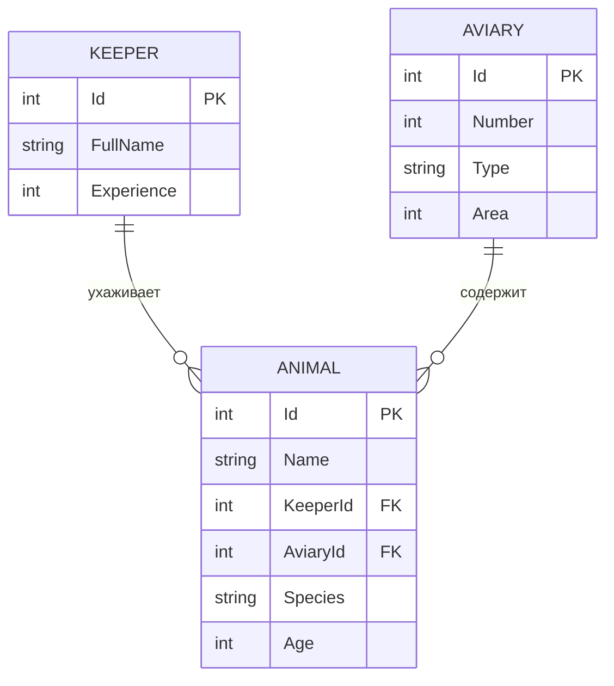
```mermaid
erDiagram
    KEEPER ||--o{ ANIMAL : "ухаживает"
    AVIARY ||--o{ ANIMAL : "содержит"

    KEEPER {
        int    Id         PK
        string FullName
        int    Experience
    }
    AVIARY {
        int    Id     PK
        int    Number
        string Type
        int    Area
    }
    ANIMAL {
        int    Id       PK
        string Name
        int    KeeperId FK
        int    AviaryId FK
        string Species
        int    Age
    }
```

### Классы

**`Keeper`** — `Id`, `FullName`, `Experience`; `IsExperienced` (`Experience > 5`); `GetInfo()` — `"Иванов И.И. (10 лет опыта)"`.

**`Aviary`** — `Id`, `Number`, `Type`, `Area`; `IsBig` (`Area > 50`); `GetInfo()` — `"Вольер №7 (100 м², хищники)"`.

**`Animal`** — `Id`, `Name`, `KeeperId`, `AviaryId`, `Species`, `Age`; `IsPredator` (`Species == "Хищник"`); `IsOld` (`Age > 10`); `GetInfo()` — `"Лев (5 лет, хищник)"`.

### Правила предметной области

- `Number` вольера уникален. `Name` животного **не уникально**. `Age` ≥ 0.

### Репозитории

`GetKeepers()`, `GetAviaries()`, `GetAnimals()`.

### Методы программы

**1. Поиск смотрителя животного.** Не найдено — `null`.

**2. Поиск вольера животного.** Не найдено — `null`.

**3. Средний возраст.** Округлить до целого. Пустой список — `0`.

**4. Количество животных по видам.** `Dictionary<string, int>`.

**5. Вывод всех животных.** `<GetInfo()> — смотритель <FullName>, вольер №<Number>`. Не найдено — `"—"`.

### Пример вывода

```
1. FindKeeper("Лев"): Иванов И.И. (10 лет опыта)
2. FindAviary(animal "Лев"): Вольер №7 (100 м², хищники)
3. GetAverageAge: 8 лет
4. CountAnimalsBySpecies: Хищник — 6, Травоядный — 9
5. PrintAllAnimals:
"Лев (5 лет, хищник)" — смотритель Иванов И.И., вольер №7
"Зебра (7 лет, травоядный)" — смотритель Петров П.П., вольер №3

Не найдено: FindKeeper("Неизвестное животное") → null
```

---

## Вариант 19. Типография

### ERD

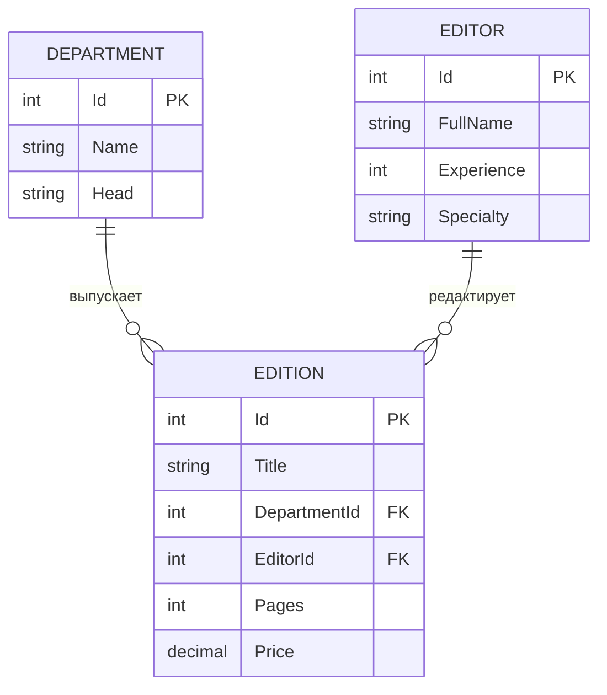
```mermaid
erDiagram
    DEPARTMENT ||--o{ EDITION : "выпускает"
    EDITOR     ||--o{ EDITION : "редактирует"

    DEPARTMENT {
        int    Id   PK
        string Name
        string Head
    }
    EDITOR {
        int    Id         PK
        string FullName
        int    Experience
        string Specialty
    }
    EDITION {
        int     Id           PK
        string  Title
        int     DepartmentId FK
        int     EditorId     FK
        int     Pages
        decimal Price
    }
```

### Классы

**`Department`** — `Id`, `Name`, `Head`; `IsFiction` (`Name == "Художественная литература"`); `GetInfo()` — `"Художественная литература (зав.: Смирнова Е.В.)"`.

**`Editor`** — `Id`, `FullName`, `Experience`, `Specialty`; `IsSenior` (`Experience > 10`); `GetInfo()` — `"Смирнова Е.В. (15 лет опыта)"`.

**`Edition`** — `Id`, `Title`, `DepartmentId`, `EditorId`, `Pages`, `Price`; `IsThick` (`Pages > 500`); `PricePerPage`; `GetInfo()` — `"Тихий Дон (600 стр., 1200 руб.)"`.

### Правила предметной области

- `Title` издания уникален. `Name` отдела уникально. `FullName` редактора **не уникально**. `Pages` > 0.

### Репозитории

`GetDepartments()`, `GetEditors()`, `GetEditions()`.

### Методы программы

**1. Поиск редактора издания.** Не найдено — `null`.

**2. Поиск отдела издания.** Не найдено — `null`.

**3. Суммарное число страниц.** Пустой список — `0`.

**4. Редактор с максимальным числом страниц.** При равенстве — первый. Нет изданий — `null`.

**5. Вывод всех изданий.** `<GetInfo()> — редактор <FullName>, отдел "<Name>"`. Не найдено — `"—"`.

### Пример вывода

```
1. FindEditor("Тихий Дон"): Смирнова Е.В. (15 лет опыта)
2. FindDepartment(edition "Тихий Дон"): Художественная литература (зав.: Смирнова Е.В.)
3. GetTotalPages: 3200
4. GetEditorWithMostPages: Смирнова Е.В. (1200)
5. PrintAllEditions:
"Тихий Дон (600 стр., 1200 руб.)" — редактор Смирнова Е.В., отдел "Художественная литература"
"Война и мир (1225 стр., 1800 руб.)" — редактор Смирнова Е.В., отдел "Художественная литература"

Не найдено: FindEditor("Неизвестное издание") → null
```

---

## Вариант 20. Склад

### ERD

```mermaid
erDiagram
    SECTION     ||--o{ ITEM : "хранит"
    STOREKEEPER ||--o{ ITEM : "отвечает за"

    SECTION {
        int    Id   PK
        string Name
        int    Area
    }
    STOREKEEPER {
        int    Id         PK
        string FullName
        string Shift
        int    Experience
    }
    ITEM {
        int     Id            PK
        string  Name
        int     SectionId     FK
        int     StorekeeperId FK
        int     Quantity
        decimal Price
    }
```

### Классы

**`Section`** — `Id`, `Name`, `Area`; `IsBig` (`Area > 200`); `GetInfo()` — `"Метизы (300 м²)"`.

**`Storekeeper`** — `Id`, `FullName`, `Shift`, `Experience`; `IsMorningShift` (`Shift == "Утренняя"`); `GetInfo()` — `"Петров П.П. (5 лет опыта)"`.

**`Item`** — `Id`, `Name`, `SectionId`, `StorekeeperId`, `Quantity`, `Price`; `TotalValue`; `IsLowStock(int threshold)`; `GetInfo()` — `"Болты М8 (1000 шт., 5 руб.)"`.

### Правила предметной области

- `Name` секции уникально. `Name` товара **не уникально**. `FullName` кладовщика **не уникально**. `Quantity`, `Price` ≥ 0.

### Репозитории

`GetSections()`, `GetStorekeepers()`, `GetItems()`.

### Методы программы

**1. Поиск кладовщика товара.** Не найдено — `null`.

**2. Поиск секции товара.** Не найдено — `null`.

**3. Общее количество товаров.** Пустой список — `0`.

**4. Товары ниже порога.** Список товаров с `Quantity < threshold`.

**5. Вывод всех товаров.** `<GetInfo()> — кладовщик <FullName>, секция "<Name>"`. Не найдено — `"—"`.

### Пример вывода

```
1. FindStorekeeper("Болты М8"): Петров П.П. (5 лет опыта)
2. FindSection(item "Болты М8"): Метизы (300 м²)
3. GetTotalQuantity: 15000 шт.
4. GetItemsBelowThreshold(100): Гайки (50), Шайбы (80)
5. PrintAllItems:
"Болты М8 (1000 шт., 5 руб.)" — кладовщик Петров П.П., секция "Метизы"
"Гайки М8 (50 шт., 3 руб.)" — кладовщик Петров П.П., секция "Метизы"

Не найдено: FindStorekeeper("Неизвестный товар") → null
```

---

## Вариант 21. Турагентство

### ERD

```mermaid
erDiagram
    COUNTRY ||--o{ TOUR : "направление"
    MANAGER ||--o{ TOUR : "ведёт"

    COUNTRY {
        int    Id        PK
        string Name
        string Continent
    }
    MANAGER {
        int    Id         PK
        string FullName
        string Phone
        int    Experience
    }
    TOUR {
        int     Id        PK
        string  Name
        int     CountryId FK
        int     ManagerId FK
        decimal Price
        int     Days
    }
```

### Классы

**`Country`** — `Id`, `Name`, `Continent`; `IsEurope` (`Continent == "Европа"`); `GetInfo()` — `"Турция (Азия)"`.

**`Manager`** — `Id`, `FullName`, `Phone`, `Experience`; `IsExperienced` (`Experience > 3`); `GetInfo()` — `"Иванова А.А. (5 лет опыта)"`.

**`Tour`** — `Id`, `Name`, `CountryId`, `ManagerId`, `Price`, `Days`; `PricePerDay`; `IsLong` (`Days > 10`); `GetInfo()` — `"Пляжный отдых (7 дней, 50000 руб.)"`.

### Правила предметной области

- `Name` страны уникально. `Name` тура **не уникально**. `FullName` менеджера **не уникально**. `Days` > 0.

### Репозитории

`GetCountries()`, `GetManagers()`, `GetTours()`.

### Методы программы

**1. Поиск менеджера тура.** Не найдено — `null`.

**2. Поиск страны тура.** Не найдено — `null`.

**3. Суммарное число дней.** Пустой список — `0`.

**4. Самая популярная страна.** По числу туров. При равенстве — первая. Нет туров — `null`.

**5. Вывод всех туров.** `<GetInfo()> — менеджер <FullName>, страна "<Name>"`. Не найдено — `"—"`.

### Пример вывода

```
1. FindManager("Пляжный отдых"): Иванова А.А. (5 лет опыта)
2. FindCountry(tour "Пляжный отдых"): Турция (Азия)
3. GetTotalDays: 56
4. GetMostPopularCountry: Турция (3 тура)
5. PrintAllTours:
"Пляжный отдых (7 дней, 50000 руб.)" — менеджер Иванова А.А., страна "Турция"
"Экскурсионный (5 дней, 40000 руб.)" — менеджер Петров П.П., страна "Италия"

Не найдено: FindManager("Неизвестный тур") → null
```

---

## Вариант 22. Кофейня

### ERD

```mermaid
erDiagram
    SHIFT   ||--o{ DRINK : "включает"
    BARISTA ||--o{ DRINK : "готовит"

    SHIFT {
        int      Id   PK
        string   Time
        DateTime Date
    }
    BARISTA {
        int    Id         PK
        string FullName
        int    Experience
        double Rating
    }
    DRINK {
        int     Id        PK
        string  Name
        int     ShiftId   FK
        int     BaristaId FK
        decimal Price
        int     Volume
    }
```

### Классы

**`Shift`** — `Id`, `Time`, `Date`; `IsMorning` (`Time == "Утренняя"`); `GetInfo()` — `"Утренняя (01.09.2025)"`.

**`Barista`** — `Id`, `FullName`, `Experience`, `Rating`; `IsExperienced` (`Experience > 2`); `GetInfo()` — `"Петров П.П. (3 года, рейтинг 4.8)"`.

**`Drink`** — `Id`, `Name`, `ShiftId`, `BaristaId`, `Price`, `Volume`; `PricePerMl`; `IsHot` (имя содержит `"Кофе"` или `"Чай"`); `GetInfo()` — `"Латте (250 руб., 300 мл)"`.

### Правила предметной области

- `Name` напитка **не уникально**. `FullName` бариста **не уникально**. `Rating` — 0–5. `Volume` > 0. `Date` в CSV — `dd.MM.yyyy`.

### Репозитории

`GetShifts()`, `GetBaristas()`, `GetDrinks()`.

### Методы программы

**1. Поиск бариста напитка.** Не найдено — `null`.

**2. Поиск смены напитка.** Не найдено — `null`.

**3. Общий объём напитков.** Пустой список — `0`.

**4. Средний рейтинг по бариста.** `Dictionary<string, double>`, округлить до 1 знака.

**5. Вывод всех напитков.** `<GetInfo()> — бариста <FullName>, смена "<Time>"`. Не найдено — `"—"`.

### Пример вывода

```
1. FindBarista("Латте"): Петров П.П. (3 года, рейтинг 4.8)
2. FindShift(drink "Латте"): Утренняя (01.09.2025)
3. GetTotalVolume: 3500 мл
4. GetBaristaRating: Петров — 4.8, Иванов — 4.5
5. PrintAllDrinks:
"Латте (250 руб., 300 мл)" — бариста Петров П.П., смена "Утренняя"
"Капучино (220 руб., 250 мл)" — бариста Иванов И.И., смена "Утренняя"

Не найдено: FindBarista("Неизвестный напиток") → null
```

---

## Вариант 23. Фотостудия

### ERD

```mermaid
erDiagram
    PHOTOGRAPHER ||--o{ PHOTOSESSION : "проводит"
    CLIENT       ||--o{ PHOTOSESSION : "заказывает"

    PHOTOGRAPHER {
        int    Id         PK
        string FullName
        int    Experience
    }
    CLIENT {
        int    Id       PK
        string FullName
        string Phone
        string Email
    }
    PHOTOSESSION {
        int      Id             PK
        string   Name
        int      PhotographerId FK
        int      ClientId       FK
        DateTime Date
        decimal  Price
        int      Duration
    }
```

### Классы

**`Photographer`** — `Id`, `FullName`, `Experience`; `IsExperienced` (`Experience > 5`); `GetInfo()` — `"Сидоров С.С. (8 лет опыта)"`.

**`Client`** — `Id`, `FullName`, `Phone`, `Email`; `HasEmail()` — `true`, если `Email` не пуст; `GetInfo()` — `"Иванова А.А. (ivanova@mail.ru)"`.

**`PhotoSession`** — `Id`, `Name`, `PhotographerId`, `ClientId`, `Date`, `Price`, `Duration`; `PricePerHour`; `IsLong` (`Duration > 3`); `GetInfo()` — `"Свадебная (3 ч, 15000 руб.)"`.

### Правила предметной области

- `Name` фотосессии **не уникально**. `FullName` фотографа и клиента **не уникальны**. `Duration` > 0. `Date` в CSV — `dd.MM.yyyy`.

### Репозитории

`GetPhotographers()`, `GetClients()`, `GetSessions()`.

### Методы программы

**1. Поиск фотографа сессии.** Не найдено — `null`.

**2. Поиск клиента сессии.** Не найдено — `null`.

**3. Общая длительность сессий.** Пустой список — `0`.

**4. Фотограф с максимальной выручкой.** При равенстве — первый. Нет сессий — `null`.

**5. Вывод всех сессий.** `<GetInfo()> — фотограф <FullName>, клиент <FullName>`. Не найдено — `"—"`.

### Пример вывода

```
1. FindPhotographer("Свадебная"): Сидоров С.С. (8 лет опыта)
2. FindClient(session "Свадебная"): Иванова А.А. (ivanova@mail.ru)
3. GetTotalDuration: 12 часов
4. GetPhotographerWithMaxRevenue: Сидоров С.С. (45000 руб.)
5. PrintAllSessions:
"Свадебная (3 ч, 15000 руб.)" — фотограф Сидоров С.С., клиент Иванова А.А.
"Портретная (2 ч, 8000 руб.)" — фотограф Петров П.П., клиент Кузнецов Д.Д.

Не найдено: FindPhotographer("Неизвестная сессия") → null
```

---

## Вариант 24. Автосалон

### ERD

```mermaid
erDiagram
    BRAND   ||--o{ CAR : "выпускает"
    MANAGER ||--o{ CAR : "продаёт"

    BRAND {
        int    Id      PK
        string Name
        string Country
    }
    MANAGER {
        int    Id         PK
        string FullName
        string Phone
        int    Experience
    }
    CAR {
        int     Id        PK
        string  Model
        int     BrandId   FK
        int     ManagerId FK
        decimal Price
        int     Year
    }
```

### Классы

**`Brand`** — `Id`, `Name`, `Country`; `IsForeign` (`Country != "Россия"`); `GetInfo()` — `"Toyota (Япония)"`.

**`Manager`** — `Id`, `FullName`, `Phone`, `Experience`; `IsExperienced` (`Experience > 3`); `GetInfo()` — `"Петров П.П. (5 лет опыта)"`.

**`Car`** — `Id`, `Model`, `BrandId`, `ManagerId`, `Price`, `Year`; `IsNew` (`Year >= 2023`); `GetDepreciation(int years)` — линейно `Price * (1 - 0.1 * years)`, при `years <= 0` — `Price`, при `years > 10` — `0`; `GetInfo()` — `"Camry (2023, 3000000 руб.)"`.

### Правила предметной области

- `Name` бренда уникально. `Model` машины **не уникальна**. `FullName` менеджера **не уникально**. `Year` — 1900–2100. `Price` ≥ 0.

### Репозитории

`GetBrands()`, `GetManagers()`, `GetCars()`.

### Методы программы

**1. Поиск менеджера автомобиля.** Не найдено — `null`.

**2. Поиск бренда автомобиля.** Не найдено — `null`.

**3. Общая стоимость автомобилей.** Пустой список — `0`.

**4. Машины бренда по цене.** Сортировка по возрастанию — **вручную**.

**5. Вывод всех автомобилей.** `<GetInfo()> — менеджер <FullName>, бренд "<Name>"`. Не найдено — `"—"`.

### Пример вывода

```
1. FindManager("Camry"): Петров П.П. (5 лет опыта)
2. FindBrand(car "Camry"): Toyota (Япония)
3. GetTotalPrice: 24000000 руб.
4. GetCarsByBrandSortedByPrice("Toyota"): Corolla (2000000), Camry (3000000)
5. PrintAllCars:
"Camry (2023, 3000000 руб.)" — менеджер Петров П.П., бренд "Toyota"
"Corolla (2023, 2000000 руб.)" — менеджер Иванов И.И., бренд "Toyota"

Не найдено: FindManager("Неизвестная модель") → null
```

---

## Вариант 25. Аптека

### ERD

```mermaid
erDiagram
    CATEGORY   ||--o{ MEDICINE : "содержит"
    PHARMACIST ||--o{ MEDICINE : "отпускает"

    CATEGORY {
        int    Id          PK
        string Name
        string Description
    }
    PHARMACIST {
        int    Id         PK
        string FullName
        string Shift
        int    Experience
    }
    MEDICINE {
        int     Id           PK
        string  Name
        int     CategoryId   FK
        int     PharmacistId FK
        decimal Price
        int     Quantity
    }
```

### Классы

**`Category`** — `Id`, `Name`, `Description`; `Info` — `"Обезболивающие — от боли"`.

**`Pharmacist`** — `Id`, `FullName`, `Shift`, `Experience`; `IsExperienced` (`Experience > 3`); `GetInfo()` — `"Иванова А.А. (5 лет опыта)"`.

**`Medicine`** — `Id`, `Name`, `CategoryId`, `PharmacistId`, `Price`, `Quantity`; `TotalValue`; `IsLowStock(int threshold)`; `GetInfo()` — `"Аспирин (50 руб., 100 уп.)"`.

### Правила предметной области

- `Name` категории уникально. `Name` лекарства **не уникально**. `FullName` фармацевта **не уникально**. `Price`, `Quantity` ≥ 0.

### Репозитории

`GetCategories()`, `GetPharmacists()`, `GetMedicines()`.

### Методы программы

**1. Поиск фармацевта лекарства.** Не найдено — `null`.

**2. Поиск категории лекарства.** Не найдено — `null`.

**3. Общее количество упаковок.** Пустой список — `0`.

**4. Лекарства ниже порога.** Список с `Quantity < threshold`.

**5. Вывод всех лекарств.** `<GetInfo()> — фармацевт <FullName>, категория "<Name>"`. Не найдено — `"—"`.

### Пример вывода

```
1. FindPharmacist("Аспирин"): Иванова А.А. (5 лет опыта)
2. FindCategory(medicine "Аспирин"): Обезболивающие — от боли
3. GetTotalQuantity: 500 упаковок
4. GetLowStockMedicines(20): Аспирин (10), Анальгин (15)
5. PrintAllMedicines:
"Аспирин (50 руб., 100 уп.)" — фармацевт Иванова А.А., категория "Обезболивающие"
"Анальгин (30 руб., 15 уп.)" — фармацевт Иванова А.А., категория "Обезболивающие"

Не найдено: FindPharmacist("Неизвестное лекарство") → null
```

---

## Вариант 26. Киностудия

### ERD

```mermaid
erDiagram
    STUDIO   ||--o{ FILM : "выпускает"
    DIRECTOR ||--o{ FILM : "снимает"

    STUDIO {
        int    Id      PK
        string Name
        string Country
    }
    DIRECTOR {
        int    Id         PK
        string FullName
        int    Experience
        int    Awards
    }
    FILM {
        int     Id         PK
        string  Title
        int     StudioId   FK
        int     DirectorId FK
        int     Year
        decimal Budget
    }
```

### Классы

**`Studio`** — `Id`, `Name`, `Country`; `IsForeign` (`Country != "Россия"`); `GetInfo()` — `"Warner Bros (США)"`.

**`Director`** — `Id`, `FullName`, `Experience`, `Awards`; `IsExperienced` (`Experience > 10`); `GetInfo()` — `"Нолан К. (20 лет, 5 наград)"`.

**`Film`** — `Id`, `Title`, `StudioId`, `DirectorId`, `Year`, `Budget`; `IsExpensive` (`Budget > 100000000`); `GetInfo()` — `"Начало (2010, 160000000 руб.)"`.

### Правила предметной области

- `Title` фильма уникален. `Name` студии уникально. `FullName` режиссёра **не уникально**. `Awards`, `Budget` ≥ 0.

### Репозитории

`GetStudios()`, `GetDirectors()`, `GetFilms()`.

### Методы программы

**1. Поиск режиссёра фильма.** Не найдено — `null`.

**2. Поиск студии фильма.** Не найдено — `null`.

**3. Общий бюджет.** Пустой список — `0`.

**4. Режиссёр с максимальным бюджетом.** При равенстве — первый. Нет фильмов — `null`.

**5. Вывод всех фильмов.** `<GetInfo()> — режиссёр <FullName>, студия "<Name>"`. Не найдено — `"—"`.

### Пример вывода

```
1. FindDirector("Начало"): Нолан К. (20 лет, 5 наград)
2. FindStudio(film "Начало"): Warner Bros (США)
3. GetTotalBudget: 500000000 руб.
4. GetDirectorWithMaxBudget: Нолан К. (300000000)
5. PrintAllFilms:
"Начало (2010, 160000000 руб.)" — режиссёр Нолан К., студия "Warner Bros"
"Интерстеллар (2014, 140000000 руб.)" — режиссёр Нолан К., студия "Paramount"

Не найдено: FindDirector("Неизвестный фильм") → null
```

---

## Вариант 27. Вокзал

### ERD

```mermaid
erDiagram
    DIRECTION ||--o{ TRAIN : "по направлению"
    DRIVER    ||--o{ TRAIN : "управляет"

    DIRECTION {
        int    Id       PK
        string Name
        int    Distance
    }
    DRIVER {
        int    Id         PK
        string FullName
        int    Experience
        string License
    }
    TRAIN {
        int    Id          PK
        string Number
        int    DirectionId FK
        int    DriverId    FK
        int    Capacity
        string Type
    }
```

### Классы

**`Direction`** — `Id`, `Name`, `Distance`; `IsLong` (`Distance > 500`); `GetInfo()` — `"Москва-Питер (650 км)"`.

**`Driver`** — `Id`, `FullName`, `Experience`, `License`; `IsExperienced` (`Experience > 10`); `GetInfo()` — `"Иванов И.И. (15 лет стажа)"`.

**`Train`** — `Id`, `Number`, `DirectionId`, `DriverId`, `Capacity`, `Type`; `IsFast` (`Type == "Скоростной"`); `GetInfo()` — `"№123 (Скоростной, 500 мест)"`.

### Правила предметной области

- `Number` поезда уникален. `Name` направления уникально. `FullName` машиниста **не уникально**. `Capacity`, `Distance` > 0.

### Репозитории

`GetDirections()`, `GetDrivers()`, `GetTrains()`.

### Методы программы

**1. Поиск машиниста поезда.** Не найдено — `null`.

**2. Поиск направления поезда.** Не найдено — `null`.

**3. Суммарная вместимость поездов.** Пустой список — `0`.

**4. Число поездов по направлениям.** `Dictionary<string, int>` — только непустые.

**5. Вывод всех поездов.** `<GetInfo()> — машинист <FullName>, направление "<Name>"`. Не найдено — `"—"`.

### Пример вывода

```
1. FindDriver("№123"): Иванов И.И. (15 лет стажа)
2. FindDirection(train "№123"): Москва-Питер (650 км)
3. GetTotalCapacity: 5000 пассажиров
4. GetDirectionsByTrainCount: Москва-Питер — 3, Москва-Казань — 2
5. PrintAllTrains:
"№123 (Скоростной, 500 мест)" — машинист Иванов И.И., направление "Москва-Питер"
"№456 (Пассажирский, 400 мест)" — машинист Петров П.П., направление "Москва-Казань"

Не найдено: FindDriver("№999") → null
```

---

## Вариант 28. Галерея

### ERD

```mermaid
erDiagram
    EXHIBITION ||--o{ PAINTING : "выставляет"
    ARTIST     ||--o{ PAINTING : "написал"

    EXHIBITION {
        int      Id   PK
        string   Name
        DateTime Date
    }
    ARTIST {
        int    Id       PK
        string FullName
        string Country
        string Style
    }
    PAINTING {
        int     Id           PK
        string  Title
        int     ExhibitionId FK
        int     ArtistId     FK
        int     Year
        decimal Price
    }
```

### Классы

**`Exhibition`** — `Id`, `Name`, `Date`; `Info` — `"Постимпрессионизм (01.09.2025)"`.

**`Artist`** — `Id`, `FullName`, `Country`, `Style`; `IsForeign` (`Country != "Россия"`); `GetInfo()` — `"Ван Гог (Нидерланды, постимпрессионизм)"`.

**`Painting`** — `Id`, `Title`, `ExhibitionId`, `ArtistId`, `Year`, `Price`; `IsValuable` (`Price > 1000000`); `GetInfo()` — `"Подсолнухи (1888, 5000000 руб.)"`.

### Правила предметной области

- `Title` картины уникален. `Name` выставки уникально. `FullName` художника **не уникально**. `Year` — целое. `Date` в CSV — `dd.MM.yyyy`. `Price` ≥ 0.

### Репозитории

`GetExhibitions()`, `GetArtists()`, `GetPaintings()`.

### Методы программы

**1. Поиск художника картины.** Не найдено — `null`.

**2. Поиск выставки картины.** Не найдено — `null`.

**3. Общая стоимость картин.** Пустой список — `0`.

**4. Художник с максимальным числом картин.** При равенстве — первый. Нет картин — `null`.

**5. Вывод всех картин.** `<GetInfo()> — художник <FullName>, выставка "<Name>"`. Не найдено — `"—"`.

### Пример вывода

```
1. FindArtist("Подсолнухи"): Ван Гог (Нидерланды, постимпрессионизм)
2. FindExhibition(painting "Подсолнухи"): Постимпрессионизм (01.09.2025)
3. GetTotalPrice: 15000000 руб.
4. GetArtistWithMostPaintings: Ван Гог (3)
5. PrintAllPaintings:
"Подсолнухи (1888, 5000000 руб.)" — художник Ван Гог, выставка "Постимпрессионизм"
"Звёздная ночь (1889, 6000000 руб.)" — художник Ван Гог, выставка "Постимпрессионизм"

Не найдено: FindArtist("Неизвестная картина") → null
```

---

## Вариант 29. Стадион

### ERD

```mermaid
erDiagram
    COACH ||--o{ TEAM  : "тренирует"
    TEAM  ||--o{ MATCH : "играет"

    COACH {
        int    Id       PK
        string FullName
    }
    TEAM {
        int     Id       PK
        string  Name
        int     CoachId  FK
        string  City
        decimal Budget
    }
    MATCH {
        int      Id       PK
        int      TeamId   FK
        string   Opponent
        DateTime Date
        string   Score
        string   Stadium
    }
```

### Классы

**`Coach`** — `Id`, `FullName`; `GetInfo()` — `"Иванов И.И."`.

**`Team`** — `Id`, `Name`, `CoachId`, `City`, `Budget`; `IsRich` (`Budget > 100000000`); `GetInfo()` — `"Спартак (Москва, 500000000 руб.)"`.

**`Match`** — `Id`, `TeamId`, `Opponent`, `Date`, `Score`, `Stadium`; `GetGoals()` — сумма голов из строки `Score` через `Split(':')`; `GetInfo()` — `"Спартак — Зенит (2:1, 01.09.2025)"`.

### Правила предметной области

- `Name` команды уникально. `Score` в формате `"X:Y"`. `Date` в CSV — `dd.MM.yyyy`.

### Репозитории

`GetCoaches()`, `GetTeams()`, `GetMatches()`.

### Методы программы

**1. Поиск тренера команды.** Не найдено — `null`.

**2. Поиск команды матча.** Не найдено — `null`.

**3. Общее количество голов.** Сумма `GetGoals()` по всем матчам. Пустой список — `0`.

**4. Очки команд.** `Dictionary<string, int>`: победа +3, ничья +1, поражение +0.

**5. Вывод всех матчей.** `<GetInfo()> — команда "<Team.Name>", тренер <Coach.FullName>`. Не найдено — `"—"`.

### Пример вывода

```
1. FindCoach("Спартак"): Иванов И.И.
2. FindTeam(match "Спартак — Зенит"): Спартак (Москва, 500000000 руб.)
3. GetTotalGoals: 24
4. GetTeamStats: Спартак — 15, Зенит — 12, ЦСКА — 9
5. PrintAllMatches:
"Спартак — Зенит (2:1, 01.09.2025)" — команда "Спартак", тренер Иванов И.И.
"ЦСКА — Динамо (1:1, 08.09.2025)" — команда "ЦСКА", тренер Петров П.П.

Не найдено: FindCoach("Неизвестная команда") → null
```

---

## Вопросы для подготовки к сдаче

### Теория ООП
1. Что такое класс и объект? В чём разница?
2. Что такое автосвойство? Чем оно отличается от обычного свойства с полем?
3. Что такое вычисляемое свойство? Когда его использовать вместо метода?
4. В чём разница между свойством и методом?
5. Что такое конструктор? Какие виды конструкторов бывают?
6. Что такое инкапсуляция?
7. Что такое внешний ключ в контексте классов?
8. Что такое `null`? Как правильно обрабатывать `null` при поиске?

### Коллекции
9. Чем `List<T>` отличается от массива `T[]`?
10. Что такое `Dictionary<TKey, TValue>`?
11. Как добавить элемент в `List<T>`? Как проверить наличие ключа в `Dictionary`?
12. Как перебрать элементы `Dictionary` без LINQ?
13. Как отсортировать `List<T>` без LINQ? Опишите пузырьковую сортировку.

### Работа с CSV
14. Как прочитать файл в C#?
15. Как разбить строку CSV на части?
16. Как преобразовать строку в число?
17. Как обработать ситуацию с пустым файлом?
18. Почему важно проверять `parts.Length`?

### Архитектура программы
19. Зачем разделять `InMemoryRepository` и `CsvRepository`?
20. Почему каждый класс должен быть в отдельном файле?
21. Как выбрать источник данных через `switch`?
22. Что такое Single Responsibility?

### Методы поиска и аналитики
23. Как найти связанный объект по внешнему ключу без LINQ?
24. Как найти максимальное значение в `Dictionary` без LINQ?
25. Как сгруппировать объекты по признаку без LINQ?
26. Как подсчитать количество объектов с одинаковым значением поля?
27. Как реализовать поиск по вводу через `Console.ReadLine()`?

### Именование и оформление
28. Как правильно именовать классы, свойства и методы?
29. Как правильно именовать приватные поля?
30. Зачем нужны XML-комментарии?

### Практические
31. Что произойдёт, если внешний ключ ссылается на несуществующую запись?
32. Как проверить, что поиск не нашёл результат?
33. Как вывести данные в формате `"Книга "X" написана Y"`?
34. Как избежать деления на ноль?
35. Как убедиться, что InMemory и CSV дают одинаковые результаты?
