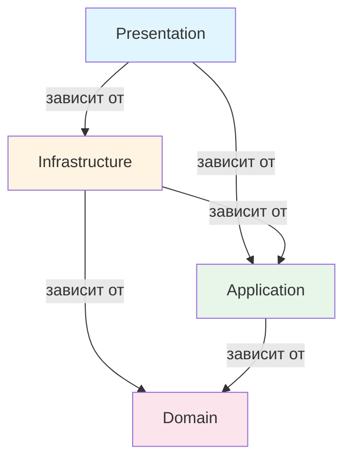
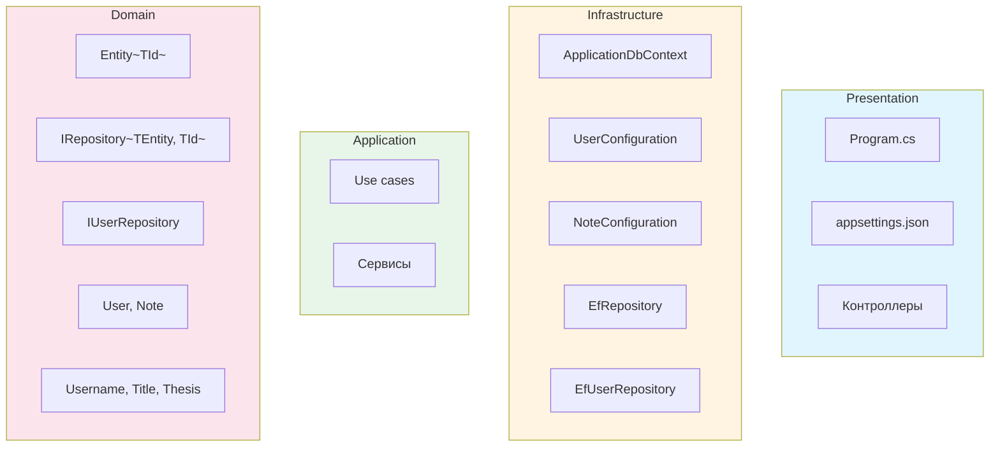

# ЛЕКЦИЯ. Часть 1. ASP.NET Core, архитектура и основы EF Core
 
**Тема:** Инфраструктурный слой на EF Core и ASP.NET Core.

---

## Содержание части 1

1. Что такое ASP.NET Core
2. Место инфраструктурного слоя в архитектуре
3. Доменные абстракции
4. Основы EF Core
5. Конфигурация сущностей через IEntityTypeConfiguration
6. Конвертеры значений
7. Настройка связей

---

## 1. Что такое ASP.NET Core

### 1.1. Определение

**ASP.NET Core** — кроссплатформенный, модульный фреймворк для построения веб-приложений и HTTP API на .NET. NotesService — типичный микросервис: он предоставляет REST API для работы с заметками.

**Ключевые особенности:**
- Кроссплатформенность (Windows, Linux, macOS).
- Модульность: приложение собирается из middleware-компонентов.
- Встроенный DI-контейнер.
- Гибкая конфигурация: `appsettings.json`, переменные среды, аргументы CLI.
- Встроенный веб-сервер Kestrel.
- Минимальная модель хостинга: `Program.cs` с top-level statements.

### 1.2. Основные термины

**Веб-приложение** — программа, которая принимает запросы по сети и возвращает ответы. Обычно работает на сервере и доступна клиентам через интернет или локальную сеть.

**HTTP API** — интерфейс, через который одна программа общается с другой по протоколу HTTP. Клиент отправляет запрос, сервер возвращает ответ.

**Микросервис** — небольшое приложение, решающее одну задачу. NotesService — микросервис, который занимается только заметками. Он может общаться с другими микросервисами (например, с сервисом аутентификации) по сети.

**REST API** — стиль построения HTTP API, при котором каждый URL соответствует ресурсу, а HTTP-метод указывает действие:
- `GET /api/notes` — получить все заметки.
- `GET /api/notes/123` — получить заметку с id 123.
- `POST /api/notes` — создать новую заметку.
- `PUT /api/notes/123` — обновить заметку.
- `DELETE /api/notes/123` — удалить заметку.

**HTTP-метод** — глагол, указывающий, что клиент хочет сделать: `GET` (прочитать), `POST` (создать), `PUT` (обновить), `DELETE` (удалить).

**HTTP-запрос** — сообщение от клиента к серверу. Содержит метод, URL, заголовки, возможно — тело.

**HTTP-ответ** — сообщение от сервера к клиенту. Содержит код (200, 404, 500), заголовки и тело.

**JSON** — текстовый формат обмена данными. Выглядит как объект JavaScript: `{ "id": 1, "title": "Note" }`. В REST API чаще всего используется для тел запросов и ответов.

**Kestrel** — встроенный кроссплатформенный веб-сервер ASP.NET Core. Принимает TCP-соединения, разбирает HTTP-запросы, передаёт их в приложение. Может работать самостоятельно или за обратным прокси (Nginx, IIS).

**HttpContext** — объект, содержащий всю информацию о текущем HTTP-запросе и ответе: метод, URL, заголовки, тело, cookies, пользователя. Создаётся Kestrel для каждого запроса.

**Endpoint** — обработчик конкретного URL. Например, `GET /api/notes` — это endpoint, который возвращает список заметок.

### 1.3. Минимальное приложение

```csharp
var builder = WebApplication.CreateBuilder(args);
var app = builder.Build();
app.MapGet("/", () => "Hello World!");
app.Run();
```

**Разбор:**
- `WebApplication.CreateBuilder(args)` — создаёт **билдер** с преднастроенной конфигурацией, логированием и DI.
- `builder.Services` — коллекция сервисов для DI.
- `builder.Configuration` — доступ к настройкам.
- `builder.Build()` — создаёт приложение.
- `app.MapGet(...)` — регистрирует endpoint.
- `app.Run()` — запускает Kestrel и блокирует поток.

### 1.4. Middleware

**Middleware** — это компоненты, которые обрабатывают HTTP-запрос по очереди.

**Как это работает:** запрос входит в приложение и проходит через конвейер middleware. Каждый компонент может:
- Обработать запрос полностью и вернуть ответ.
- Изменить запрос и передать дальше.
- Прервать обработку (например, вернуть ошибку авторизации).

**Аналогия:** представьте конвейер на заводе. Деталь (запрос) проходит через несколько станций (middleware). Каждая станция что-то делает: красит, шлифует, проверяет. В конце — упаковка (endpoint). Ответ идёт обратно по тому же конвейеру.

**Примеры middleware:**
- **Логирование** — записывает в лог метод, URL, время обработки.
- **Аутентификация** — проверяет, кто отправил запрос (по токену, cookie).
- **Авторизация** — проверяет, есть ли у пользователя права на этот URL.
- **Маршрутизация** — определяет, какой endpoint должен обработать запрос.
- **Обработка ошибок** — перехватывает исключения и формирует ответ с кодом 500.
- **CORS** — управляет кросс-доменными запросами.
- **Сжатие** — сжимает ответ перед отправкой.

**Порядок middleware критичен.** `UseRouting` должен идти до `MapControllers`, `UseAuthentication` — до `UseAuthorization`. Если перепутать — авторизация не сработает.

**Почему порядок важен?**  
Представьте, что вы сначала проверяете права (авторизация), а потом узнаёте, кто пришёл (аутентификация). Логически это невозможно: нельзя проверить права, не зная пользователя. Поэтому `UseAuthentication` всегда идёт до `UseAuthorization`.

### 1.5. Dependency Injection

**Dependency Injection (DI)** — паттерн, при котором объект не создаёт свои зависимости сам, а получает их извне.

**Зависимость** — это объект, который нужен другому объекту для работы. Например, контроллеру нужен репозиторий — репозиторий и есть зависимость контроллера.

**Без DI:**
```csharp
public class UsersController
{
    private readonly IUserRepository _repository;

    public UsersController()
    {
        _repository = new EfUserRepository(new ApplicationDbContext(...));
    }
}
```
Проблема: контроллер жёстко связан с конкретной реализацией. Трудно тестировать. Приходится вручную создавать всю цепочку зависимостей.

**С DI:**
```csharp
public class UsersController(IUserRepository repository)
{
    // repository подставлен контейнером
}
```
Контроллер не знает, как создаётся репозиторий. Он просто получает готовый объект.

**DI-контейнер** — объект, который хранит регистрации («интерфейс → реализация») и умеет создавать объекты, автоматически подставляя их зависимости.

**Простейший пример регистрации:**

```csharp
builder.Services.AddScoped<IMyService, MyService>();
```

Мы говорим контейнеру: «Когда кто-то попросит `IMyService`, создай `MyService`».

**Три времени жизни сервисов:**

- **Transient** — новый экземпляр при каждом запросе. Подходит для лёгких stateless-сервисов.
- **Scoped** — один экземпляр на HTTP-запрос. Все, кто запросит сервис в рамках одного запроса, получат один и тот же объект.
- **Singleton** — один экземпляр на всё приложение. Подходит для кэшей, конфигураций.

`DbContext` регистрируется как **Scoped**. Почему?

- Если сделать его **Singleton** — два параллельных запроса будут писать в один контекст. Трекер изменений перемешается, `SaveChanges` одного запроса сохранит изменения другого.
- Если сделать **Transient** — каждый репозиторий получит свой контекст. Изменения, сделанные одним репозиторием, не будут видны другому. Unit of Work перестанет работать.
- **Scoped** — идеальный компромисс.

**Внедрение через конструктор:**

```csharp
public class MyController(IMyService service) : ControllerBase
{
    // service доступен внутри класса
}
```

Здесь используется **primary constructor** — синтаксис из C# 12. Раньше пришлось бы писать отдельное поле и конструктор.

### 1.6. Конфигурация

**Конфигурация** — это настройки приложения: строка подключения к БД, уровни логирования, ключи API.

Источники конфигурации (в порядке приоритета, от слабого к сильному):
1. `appsettings.json` — базовый файл.
2. `appsettings.{Environment}.json` — настройки для конкретного окружения.
3. **Секреты пользователя** — только Development.
4. **Переменные среды** — для Production и CI/CD.
5. **Аргументы командной строки**.

Каждый следующий источник переопределяет предыдущий.

**Окружение (Environment)** — режим работы приложения: `Development`, `Staging`, `Production`. Определяется переменной среды `ASPNETCORE_ENVIRONMENT`.

**Простейший `appsettings.json`:**

```json
{
  "ConnectionStrings": {
    "Default": "Host=localhost;Database=mydb;UserName=postgres;Password=12345;"
  }
}
```

**Чтение строки подключения:**

```csharp
var connectionString = builder.Configuration.GetConnectionString("Default");
```

### 1.7. Swagger

**Swagger** — инструмент для документирования HTTP API. Генерирует интерактивную страницу, где можно:
- Посмотреть список всех endpoint'ов.
- Увидеть ожидаемые параметры и формат ответа.
- Отправить тестовый запрос прямо из браузера.

**OpenAPI** — спецификация (формат описания) API. Swagger — инструмент, который умеет читать и отображать эту спецификацию.

**Зачем Swagger:**
- **Документация.** Разработчики видят, какие endpoint'ы есть и как их вызывать.
- **Тестирование.** Не нужно писать curl-команды вручную.
- **Контракт.** Клиенты знают, что ожидать.

**Как подключить:**

```csharp
builder.Services.AddSwaggerGen(c =>
{
    c.SwaggerDoc("v1", new OpenApiInfo
    {
        Version = "v1",
        Title = "Notes service API",
        Description = "API for creating, viewing, storing, modifying, and deleting notes."
    });
});

builder.Services.AddEndpointsApiExplorer();

// ...

if (app.Environment.IsDevelopment())
{
    app.UseSwagger();
    app.UseSwaggerUI();
}
```

**Что здесь происходит:**
- `AddSwaggerGen` — регистрирует генератор OpenAPI-документа.
- `AddEndpointsApiExplorer` — позволяет Swagger находить все endpoint'ы.
- `UseSwagger` — middleware, отдающий JSON-спецификацию.
- `UseSwaggerUI` — middleware, отдающий интерактивную HTML-страницу.

После запуска Swagger доступен по адресу `https://localhost:{port}/swagger`.

### 1.8. Контроллеры

**Контроллер** — класс, который обрабатывает HTTP-запросы. Каждый публичный метод контроллера (action) привязан к определённому URL и HTTP-методу.

**Action** — метод контроллера, обрабатывающий запрос.

**Простейший контроллер:**

```csharp
[ApiController]
[Route("api/[controller]")]
public class NotesController : ControllerBase
{
    [HttpGet]
    public IActionResult GetAll() => Ok(new[] { "note1", "note2" });
}
```

**Разбор:**
- `[ApiController]` — атрибут, включающий автоматическую валидацию модели и привязку параметров.
- `[Route("api/[controller]")]` — маршрут. `[controller]` заменяется на имя контроллера без суффикса `Controller`. То есть `/api/notes`.
- `ControllerBase` — базовый класс для API-контроллеров. Предоставляет методы `Ok`, `NotFound`, `BadRequest` и другие.
- `[HttpGet]` — атрибут, указывающий, что метод обрабатывает GET-запросы.
- `Ok(...)` — возвращает HTTP 200 с переданным объектом.

**Атрибут** — специальная конструкция в C#, которая добавляет метаданные к классу, методу или свойству. Начинается с `[`. ASP.NET Core и EF Core активно используют атрибуты для настройки.

**Маршрутизация** — процесс сопоставления URL с конкретным action. `GET /api/notes` → `NotesController.GetAll`. `GET /api/notes/123` → `NotesController.GetById(123)`.

**Модель** — в контексте ASP.NET Core это объект, который приходит в action или возвращается из него. Например, `[FromBody] User user` — модель, полученная из тела запроса.

### 1.9. Program.cs NotesService

```csharp
var builder = WebApplication.CreateBuilder(args);

var connectionString = builder.Configuration.GetConnectionString(nameof(ApplicationDbContext));

if (string.IsNullOrEmpty(connectionString))
{
    throw new InvalidOperationException("Connection string for NotesServiceDbContext is not configured.");
}

builder.Services.AddNpgsql<ApplicationDbContext>(connectionString, options =>
{
    options.MigrationsAssembly("NotesService.Infrastructure.EntityFramework");
});

builder.Services.AddSwaggerGen(c =>
{
    c.SwaggerDoc("v1", new OpenApiInfo
    {
        Version = "v1",
        Title = "Notes service API",
        Description = "API for creating, viewing, storing, modifying, and deleting notes."
    });
});

builder.Services.AddDbContext<ApplicationDbContext>(options =>
{
    options.UseNpgsql(connectionString);
});

builder.Services.AddControllers();
builder.Services.AddEndpointsApiExplorer();
builder.Services.AddSwaggerGen();

var app = builder.Build();

if (app.Environment.IsDevelopment())
{
    app.UseSwagger();
    app.UseSwaggerUI();
}

app.UseAuthorization();
app.MapControllers();

app.MigrateDatabase<ApplicationDbContext>();

app.Run();
```

**Пошаговый разбор:**
1. Создаётся билдер.
2. Читается строка подключения, проверяется на пустоту.
3. `AddNpgsql` регистрирует `DbContext` с провайдером PostgreSQL и указывает сборку миграций.
4. Настраивается Swagger.
5. `AddDbContext` — дополнительная регистрация.
6. `AddControllers` включает контроллеры.
7. `AddEndpointsApiExplorer` нужен для Swagger.
8. Строится приложение.
9. В Development включается Swagger UI.
10. Подключается авторизация и маршрутизация.
11. Автоматическое применение миграций.
12. Запуск.

---

## 2. Место инфраструктурного слоя в архитектуре

Слои и зависимости по принципам **чистой архитектуры**.

---

## Диаграмма 1. Слои и зависимости 



**Что показывает диаграмма:**

- Четыре слоя расположены вертикально: Presentation → Infrastructure → Application → Domain.
- Стрелки показывают зависимости: кто от кого зависит.
- Domain — внизу, он ни от кого не зависит.
- Presentation — наверху, зависит от Infrastructure и Application.
- Infrastructure зависит от Application и Domain.
- Application зависит только от Domain.

**Правило:** стрелки всегда идут **сверху вниз**. Внутренние слои не знают о внешних.

---

## Диаграмма 2. Наполнение каждого слоя



**Что показывает диаграмма:**

- **Основные слои расположены вертикально** — сверху вниз.
- **Внутренние блоки каждого слоя расположены горизонтально** — в одну строку.
- Presentation: `Program.cs`, `appsettings.json`, контроллеры.
- Infrastructure: `ApplicationDbContext`, конфигурации, репозитории.
- Application: use cases, сервисы.
- Domain: сущности, интерфейсы репозиториев, value objects.

---

**Слой** — набор классов, объединённых общей ответственностью.

**Слой Presentation** — взаимодействует с внешним миром: HTTP-запросы, CLI, gRPC. В нашем случае — ASP.NET Core Web API с контроллерами.

**Слой Infrastructure** — реализует доступ к внешним ресурсам: БД, файлы, сторонние сервисы. В нашем случае — EF Core и репозитории.

**Слой Application** — содержит use cases (сценарии использования). Это бизнес-логика приложения, которая orchestrating работу домена. Будет рассмотрен в следующей лекции.

**Слой Domain** — ядро приложения. Сущности, value objects, интерфейсы репозиториев, доменные правила.

**Правила зависимостей:**
- **Domain** — не зависит ни от чего.
- **Application** — зависит только от Domain.
- **Infrastructure** — зависит от Application и Domain.
- **Presentation** — зависит от Application и Infrastructure.

**Зачем разделять?**
- Домен тестируется без БД и HTTP.
- Можно заменить EF Core на Dapper.
- Понятная структура для команды.
- Application-слой изолирует бизнес-сценарии от деталей инфраструктуры и представления.

---

## 3. Доменные абстракции

**Сущность (Entity)** — объект с уникальным идентификатором и жизненным циклом. Два пользователя с одинаковым именем — разные сущности, если у них разные id.

**`Entity<TId>`** — базовый класс сущности с идентификатором. `TId` — тип идентификатора (`Guid`, `int`, `long`).

**Value Object** — объект, определяемый своими значениями, а не идентификатором. Иммутабелен: после создания его нельзя изменить.

**`IRepository<TEntity, TId>`** — обобщённый интерфейс репозитория:

```csharp
public interface IRepository<TEntity, TId>
    where TEntity : Entity<TId>
    where TId : struct, IEquatable<TId>
{
    Task<IEnumerable<TEntity>> GetAllAsync(CancellationToken ct, bool asNoTracking = false);
    Task<TEntity?> GetByIdAsync(TId id, CancellationToken ct);
    Task<TEntity?> AddAsync(TEntity entity, CancellationToken ct);
    Task<bool> UpdateAsync(TEntity entity, CancellationToken ct);
    Task<bool> DeleteAsync(TEntity entity, CancellationToken ct);
    Task<bool> DeleteAsync(TId id, CancellationToken ct);
}
```

**Ограничения generic** — правила, какие типы можно подставить. `where TEntity : Entity<TId>` — `TEntity` должен быть наследником `Entity<TId>`. `where TId : struct, IEquatable<TId>` — `TId` — значимый тип, реализующий `IEquatable`.

**`IUserRepository`** — специализированный интерфейс для `User`:

```csharp
public interface IUserRepository : IRepository<User, Guid>
{
    Task<User?> GetUserByUsernameAsync(string username, CancellationToken ct);
}
```

**Value objects в NotesService:** `Username`, `Title`, `Thesis`. Они иммутабельны и валидируют данные в конструкторе.

**Зачем value objects:**
- **Валидация в конструкторе.** `new Username("")` бросает исключение.
- **Типобезопасность.** Нельзя передать `Title` туда, где ждут `Username`.
- **Инкапсуляция правил.** Логика валидации внутри типа.

---

## 4. Основы EF Core

### 4.1. Переход от ASP.NET Core к EF Core

ASP.NET Core принимает HTTP-запрос и передаёт его контроллеру. Контроллер вызывает репозиторий, который обращается к базе данных. Для работы с БД используется EF Core.

### 4.2. Что такое EF Core

**Entity Framework Core** — ORM (Object-Relational Mapping) для .NET. Позволяет работать с БД через объекты C#, а не через SQL.

**ORM** — прослойка между объектами в коде и таблицами в БД. Вы работаете с классами `User`, `Note`, а ORM генерирует SQL, конвертирует строки в объекты, обрабатывает NULL, защищает от SQL-инъекций.

**Зачем ORM:** без него пришлось бы писать SQL вручную для каждой сущности, вручную конвертировать строки в объекты, обрабатывать NULL. Это долго и чревато ошибками.

**Основные понятия:**
- **DbContext** — сессия работы с БД (Unit of Work).
- **DbSet<T>** — коллекция сущностей (Repository).
- **Entity** — класс, маппящийся на таблицу.
- **Change Tracker** — отслеживает изменения.
- **Migration** — код, описывающий изменение схемы.

**EF Core — не единственный ORM для .NET.** Альтернативы: Dapper (микро-ORM, быстрее, больше ручного кода), ADO.NET (чистый SQL), NHibernate. EF Core выбран за баланс между удобством и производительностью, а также за поддержку миграций.

### 4.3. DbContext — Unit of Work

**DbContext** — Unit of Work. Управляет сессией работы с БД и отслеживает изменения.

**Unit of Work** — паттерн, при котором все изменения в рамках одной операции накапливаются и сохраняются вместе, одной транзакцией.

**Транзакция** — набор операций, выполняемых как единое целое. Либо все успешно, либо ни одна. Обеспечивает ACID: атомарность, согласованность, изоляцию, долговечность.

**Зачем Unit of Work:** если переводите деньги с одного счёта на другой и после первой операции что-то падает — деньги пропадут. Unit of Work решает проблему: накапливает изменения и сохраняет их все вместе.

**Change Tracker** — внутренний механизм EF Core, который запоминает, какие сущности загружены и какие свойства менялись. На основе этого решает, какие SQL-запросы генерировать при `SaveChanges`.

### 4.4. DbSet — Repository

**DbSet<T>** — репозиторий для сущностей типа T.

```csharp
public DbSet<Product> Products { get; set; }
```

**DbSet на уровне SQL.** `DbSet<User> Users` соответствует таблице `Users`. Каждое свойство `User` — колонка. Каждый экземпляр `User` — строка.

Когда вы пишете `context.Users.Add(user)`, EF Core готовит INSERT. Когда `context.Users.Where(u => u.Id == id)` — SELECT с WHERE. Реальный SQL генерируется при `SaveChanges` или при материализации запроса.

**Что умеет DbSet:**
- **LINQ-запросы:** `context.Products.Where(p => p.Price > 100).ToList()`.
- **Add / Update / Remove.**
- **FindAsync:** ищет в трекере, потом в БД.
- **Include:** eager loading связанных данных.

**LINQ** (Language Integrated Query) — способ писать запросы прямо в C#. Вместо `SELECT * FROM Products WHERE Price > 100` вы пишете `context.Products.Where(p => p.Price > 100)`. EF Core транслирует это в SQL.

**Eager loading** — стратегия загрузки связанных данных сразу. `Include` выполняет JOIN и загружает всё одним запросом.

**Lazy loading** — стратегия, при которой связанные данные загружаются при первом обращении. Отключён по умолчанию, может привести к N+1 проблеме.

**N+1 проблема** — если загрузить 100 пользователей и для каждого обратиться к его заметкам, будет 1 запрос на пользователей + 100 на заметки. 101 запрос. Eager loading решает проблему.

### 4.5. Трекинг изменений

EF Core по умолчанию отслеживает все загруженные сущности. Загрузили пользователя, поменяли `Username`, вызвали `SaveChanges` — EF сам сгенерирует `UPDATE`.

**Проблемы трекинга:**
- Загруженные сущности остаются в памяти до конца контекста.
- Если загрузить одну и ту же сущность дважды — вернётся один и тот же объект.
- Для read-only запросов трекинг — лишняя нагрузка.

**Решение — `AsNoTracking()`:**

```csharp
var products = await context.Products.AsNoTracking().ToListAsync();
```

Запрос быстрее, но изменения не отслеживаются. Используйте для отчётов и списков.

**`FindAsync` vs `FirstOrDefaultAsync`:**
- `FindAsync(id)` сначала ищет сущность в трекере. Если её нет — делает запрос к БД.
- `FirstOrDefaultAsync` всегда идёт в БД.

**Кэш запросов** — EF Core кэширует план выполнения запросов, чтобы не компилировать их каждый раз. Это не кэш результатов — сами данные не кэшируются.

### 4.6. ApplicationDbContext из NotesService

```csharp
public class ApplicationDbContext(DbContextOptions<ApplicationDbContext> options) : DbContext(options)
{
    public DbSet<User> Users { get; set; }
    public DbSet<Note> Notes { get; set; }

    protected override void OnConfiguring(DbContextOptionsBuilder optionsBuilder)
    {
        optionsBuilder.EnableSensitiveDataLogging();
        base.OnConfiguring(optionsBuilder);
    }

    protected override void OnModelCreating(ModelBuilder modelBuilder)
    {
        modelBuilder.ApplyConfigurationsFromAssembly(GetType().Assembly);
    }
}
```

**DbContextOptions<T>** — объект с настройками контекста: строка подключения, провайдер (PostgreSQL, SQL Server), параметры логирования. Передаётся в конструктор `DbContext` через DI.

**Зачем:** `DbContext` не должен сам знать, к какой БД подключаться. Это позволяет в тестах подставить InMemory-провайдер, а в production — PostgreSQL.

**OnConfiguring** — вызывается при создании контекста. Здесь включается `EnableSensitiveDataLogging()`. В production это небезопасно — в логи могут попасть пароли и персональные данные.

**OnModelCreating** — вызывается при построении модели, один раз за время жизни приложения. `ApplyConfigurationsFromAssembly` автоматически находит все классы `IEntityTypeConfiguration<T>` в текущей сборке.

**Модель** — описание того, как классы C# маппятся на таблицы БД. Строится один раз.

**Почему `DbContext` не Singleton:** не потокобезопасен.  
**Почему не Transient:** каждый репозиторий получит свой контекст, Unit of Work перестанет работать.

---

## 5. Конфигурация сущностей через IEntityTypeConfiguration

### 5.1. Data Annotations vs Fluent API

**Data Annotations** — атрибуты на свойствах (`[Key]`, `[Required]`, `[MaxLength]`). Просто, но засоряет домен.

**Fluent API** — отдельные классы `IEntityTypeConfiguration<T>`. Чисто, гибко, Domain не знает о EF.

**Fluent API** (в общем смысле) — стиль программирования, при котором методы вызываются цепочкой. Читается как предложение.

### 5.2. Простейшая конфигурация

```csharp
public class ProductConfiguration : IEntityTypeConfiguration<Product>
{
    public void Configure(EntityTypeBuilder<Product> builder)
    {
        builder.HasKey(p => p.Id);
        builder.Property(p => p.Name)
            .IsRequired()
            .HasMaxLength(100);
        builder.Property(p => p.Price)
            .HasColumnType("decimal(18,2)");
    }
}
```

**EntityTypeBuilder** — объект, предоставляющий методы для настройки сущности.

### 5.3. NoteConfiguration

```csharp
public class NoteConfiguration : IEntityTypeConfiguration<Note>
{
    public void Configure(EntityTypeBuilder<Note> builder)
    {
        builder.HasKey(x => x.Id);
        builder.Property(x => x.Id).IsRequired();
        builder.Property(x => x.Title)
            .IsRequired(false)
            .HasConversion(title => title!.Value, str => new Title(str))
            .HasMaxLength(TitleValidator.MAX_LENGTH);
        builder.Property(x => x.Thesis)
            .IsRequired()
            .HasConversion(thesis => thesis.Value, str => new Thesis(str));
        builder.Property(x => x.CreationData).IsRequired().HasConversion(
            src => src.Kind == DateTimeKind.Utc ? src : DateTime.SpecifyKind(src, DateTimeKind.Utc),
            dst => dst.Kind == DateTimeKind.Utc ? dst : DateTime.SpecifyKind(dst, DateTimeKind.Utc)
        );
        builder.Property(x => x.ModificationData).IsRequired(false).HasConversion(
            src => !src.HasValue ? src : src.Value.Kind == DateTimeKind.Utc ? src : DateTime.SpecifyKind(src.Value, DateTimeKind.Utc),
            dst => !dst.HasValue ? dst : dst.Value.Kind == DateTimeKind.Utc ? dst : DateTime.SpecifyKind(dst.Value, DateTimeKind.Utc)
        );
        builder.HasOne(x => x.User).WithMany("_notes");
    }
}
```

**Null-forgiving operator (`!`)** — способ сказать компилятору: «Я знаю, что здесь не null, не предупреждай». Используется, когда компилятор с включёнными nullable reference types не может сам доказать, что значение не null.

**DateTimeKind** — перечисление `Utc`, `Local`, `Unspecified`. Npgsql требует UTC для `timestamp with time zone`.

### 5.4. UserConfiguration

```csharp
public class UserConfiguration : IEntityTypeConfiguration<User>
{
    public void Configure(EntityTypeBuilder<User> builder)
    {
        builder.HasKey(x => x.Id);
        builder.Property(x => x.Id).IsRequired();
        builder.Property(x => x.Username)
            .IsRequired()
            .HasConversion(username => username.Value, str => new Username(str))
            .HasMaxLength(UsernameValidator.MAX_LENGTH);
        builder.HasMany<Note>("_notes")
            .WithOne(x => x.User)
            .HasForeignKey("UserId")
            .HasPrincipalKey(x => x.Id);
        builder.Ignore(x => x.Notes);
    }
}
```

**Теневое свойство** — свойство, существующее только в модели EF Core, но не в классе C#. Используется для хранения внешнего ключа, если в классе его нет.

**Backing field** — приватное поле, в котором хранятся данные. EF Core работает с ним, а домен контролирует изменения через методы.

---

## 6. Конвертеры значений

**Value Converter** — механизм EF Core, преобразующий пользовательский тип в примитив.

```csharp
.HasConversion(
    v => v.Value,          // в БД
    v => new Username(v)   // из БД
)
```

**Зачем:**
- Хранить value objects в БД как примитивы.
- Сохранять инкапсуляцию домена.
- При чтении — восстанавливать value object с валидацией.

**Ограничения:**
- Нельзя использовать с навигационными свойствами.
- Иногда нельзя сравнивать сконвертированные свойства в LINQ напрямую.

**Пример:** в `EfUserRepository.GetUserByUsernameAsync` используется `.Equals(new Username(username))`, а не `==`. EF Core транслирует `.Equals` через конвертер, но не всегда — `==`.

---

## 7. Настройка связей

**Связь** — отношение между двумя сущностями.

**Типы связей в EF Core:**
- **One-to-Many** — один `User` — много `Note`.
- **One-to-One** — один `User` — один `Profile`.
- **Many-to-Many** — `Book` — `Author`.

**One-to-Many — простейший пример:**

```csharp
builder.Entity<Order>()
    .HasOne(o => o.Customer)
    .WithMany(c => c.Orders)
    .HasForeignKey(o => o.CustomerId);
```

**One-to-One — простейший пример:**

```csharp
builder.Entity<User>()
    .HasOne(u => u.Profile)
    .WithOne(p => p.User)
    .HasForeignKey<Profile>(p => p.UserId);
```

**Many-to-Many — простейший пример:**

```csharp
builder.Entity<Book>()
    .HasMany(b => b.Authors)
    .WithMany(a => a.Books)
    .UsingEntity(j => j.ToTable("BookAuthors"));
```

EF Core создаст промежуточную таблицу `BookAuthors`.

**Пример из NotesService:**

```csharp
builder.HasMany<Note>("_notes")
    .WithOne(x => x.User)
    .HasForeignKey("UserId")
    .HasPrincipalKey(x => x.Id);
```

**Методы:**
- `HasMany` / `HasOne` — сторона связи.
- `WithOne` / `WithMany` — противоположная сторона.
- `HasForeignKey` — внешний ключ.
- `HasPrincipalKey` — ключ на главной стороне.
- `OnDelete(DeleteBehavior.Cascade)` — поведение при удалении.

**Cascade delete** — при удалении `User` удаляются все его `Note`.

**DeleteBehavior:**
- `Cascade` — удалить всех зависимых.
- `Restrict` — запретить удаление, если есть зависимые.
- `SetNull` — установить внешний ключ в NULL.
- `NoAction` — оставить как есть.

---

## Чек-поинты части 1

1. Что такое DI-контейнер и зачем он нужен?
2. Почему `DbContext` регистрируется как Scoped?
3. Что такое middleware и почему порядок важен?
4. Что такое Swagger и зачем он нужен?
5. В чём разница между `FindAsync` и `FirstOrDefaultAsync`?
6. Зачем нужен конвертер значений?
7. Как настроить связь один-ко-многим?

---
