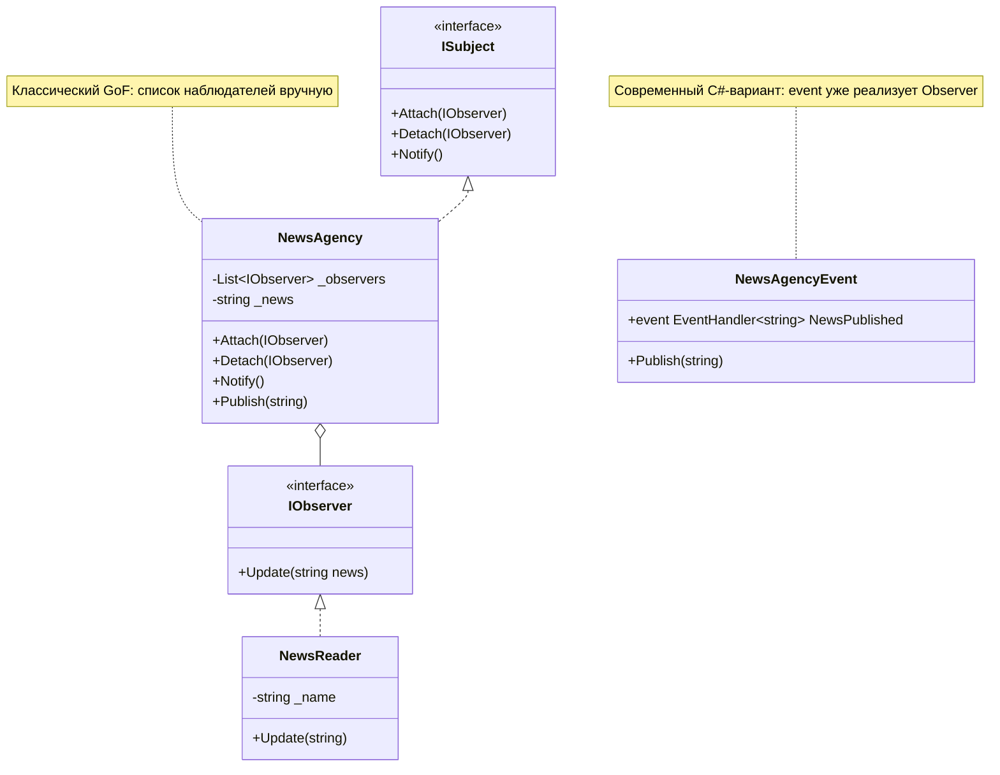
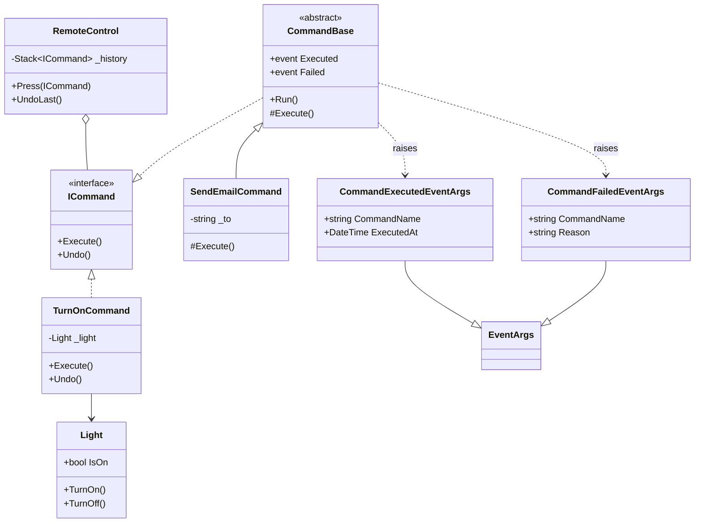
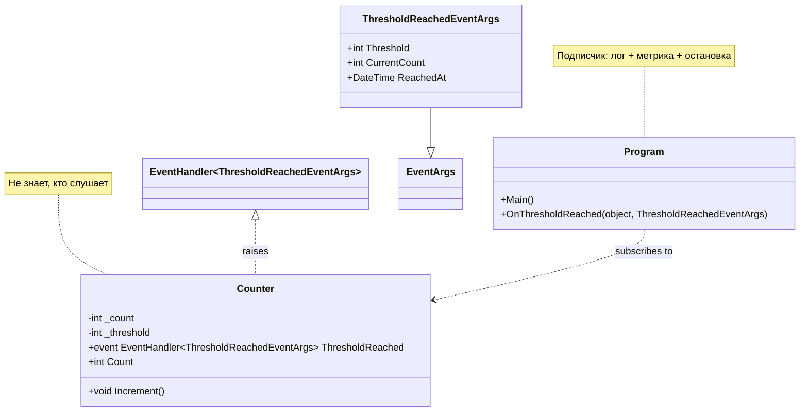
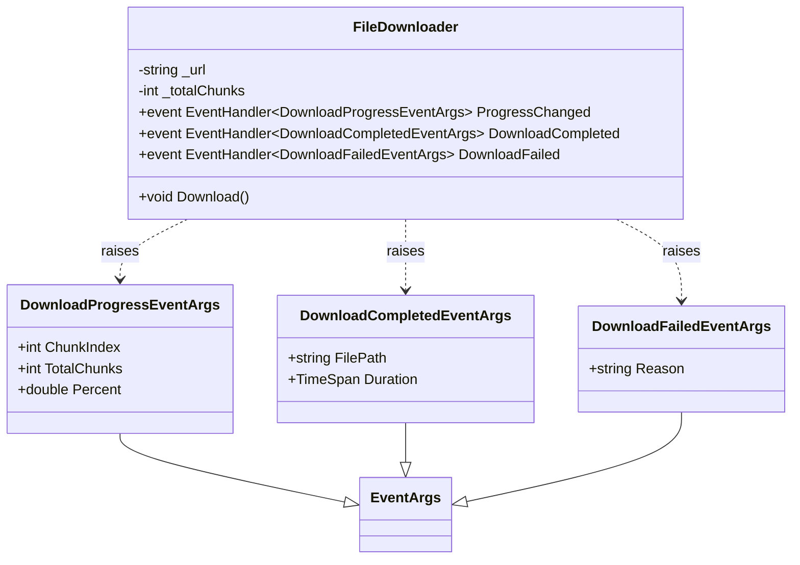
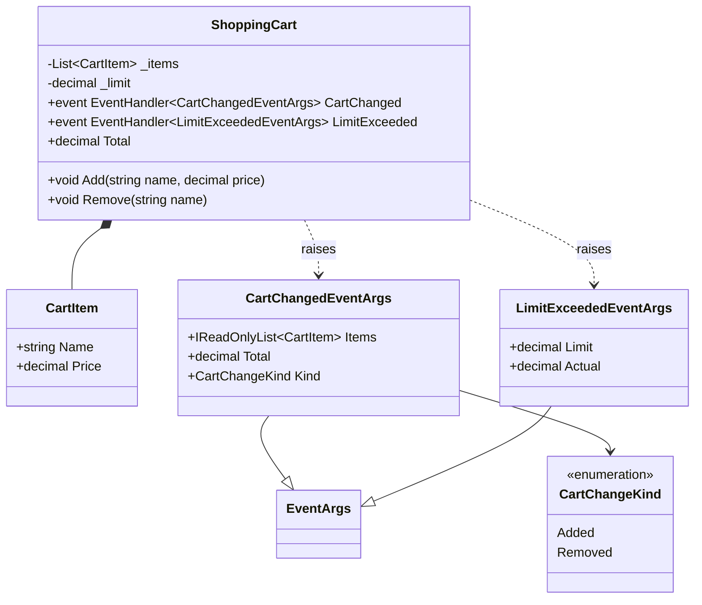
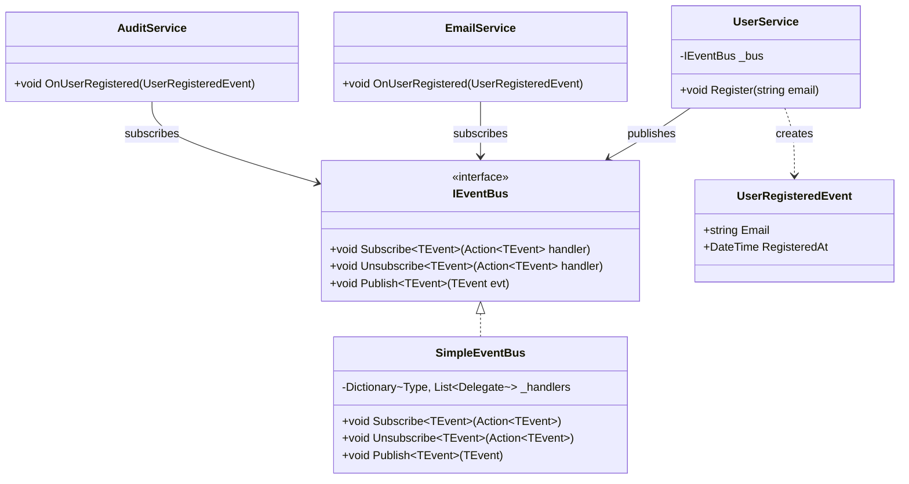

# Лекция. События в C#: синтаксис, паттерны и практика

**Длительность:** 120 минут
**Аудитория:** C#-разработчики уровня middle, знакомые с ООП и SOLID
**Формат:** живое кодирование, все примеры — самодостаточные консольные проекты, которые можно скопировать в `Program.cs` и запустить

---

## Содержание

1. **Синтаксис событий: что происходит под капотом** — 30 мин
   - 1.1. Делегаты — фундамент
   - 1.2. Ключевое слово `event`
   - 1.3. `EventHandler<T>` и `EventArgs`
   - 1.4. Мультикаст, порядок, `?.Invoke`
   - 1.5. Отписка: внешняя, изнутри обработчика, через `IDisposable`
2. **Как решать задачу «оповестить несколько компонентов»: три подхода** — 20 мин
3. **Два паттерна, построенных на событиях** — 30 мин
4. **Практика: 4 задачи, где без событий не справиться** — 35 мин
5. **Типичные ошибки** — 5 мин

---

## Определения и сигнатуры (шпаргалка)

Прежде чем идти дальше — фиксируем термины и сигнатуры, к которым будем возвращаться.

### Определения

| Термин | Определение |
|---|---|
| **Делегат** (`delegate`) | Тип, описывающий сигнатуру метода. Экземпляр делегата хранит ссылку на метод (или на список методов). |
| **Мультикаст-делегат** | Делегат, хранящий список методов. Наследник `MulticastDelegate`. Операторы `+=` / `-=` добавляют/удаляют методы в этот список. |
| **Событие** (`event`) | Обёртка над делегатом, которая снаружи класса-владельца разрешает **только** `+=` и `-=`, запрещает присваивание и прямой вызов. |
| **Издатель (publisher)** | Класс, который объявляет событие и поднимает его. |
| **Подписчик (subscriber)** | Класс (или метод), который подписан на событие через `+=` и получает вызов, когда издатель поднимает событие. |
| **Обработчик (handler)** | Метод, сигнатура которого совпадает с типом делегата события. Именно он вызывается при поднятии. |
| **`EventArgs`** | Базовый класс для контейнера данных, передаваемых событием. |
| **`sender`** | Ссылка на объект, который поднял событие (`object?`). Позволяет одному обработчику обслуживать несколько источников. |
| **Поднятие события (raise)** | Вызов делегата события изнутри класса-владельца. Стандартный паттерн — `EventName?.Invoke(this, e)` в приватном методе `OnEventName`. |

### Сигнатуры

```csharp
// 1. Объявление пользовательского делегата
public delegate void Notify(string message);

// 2. Объявление события на основе делегата
public event Notify? OrderCreated;

// 3. Рекомендуемый делегат от Microsoft
public delegate void EventHandler<TEventArgs>(object? sender, TEventArgs e)
    where TEventArgs : EventArgs;

// 4. Объявление события по рекомендованному паттерну
public event EventHandler<OrderCreatedEventArgs>? OrderCreated;

// 5. Поднятие события изнутри класса
private void OnOrderCreated(OrderCreatedEventArgs e)
    => OrderCreated?.Invoke(this, e);

// 6. Подписка и отписка
publisher.OrderCreated += HandleOrderCreated;
publisher.OrderCreated -= HandleOrderCreated;

// 7. Встроенные обобщённые делегаты
Action<string> log;                          // void, 0..16 аргументов
Func<int, int, int> add;                     // возвращает результат
Predicate<int> isEven;                       // bool на входе
```

**Правило:** для события используйте `EventHandler<TEventArgs>` — не `Action<T>` и не `Func<T>`. Об этом ниже в разделах A.4 и 1.3.

---

## 1. Синтаксис событий: что происходит под капотом

Прежде чем решать задачу, разберём **инструмент**. Что такое делегат, что такое `event`, как это устроено в IL и почему именно так.

### 1.1. Делегаты — фундамент

**Делегат** — это тип, описывающий сигнатуру метода. Переменная делегата хранит ссылку на метод (или на список методов).

#### Объявление и вызов

```csharp
using System;

namespace DelegatesDemo
{
    // Объявляем свой тип делегата
    public delegate void Notify(string message);

    public static class Program
    {
        public static void Main()
        {
            // Присваиваем метод переменной делегата
            Notify notifier = PrintToConsole;
            notifier("Привет");

            // Меняем цель
            notifier = PrintToUpper;
            notifier("Привет");
        }

        private static void PrintToConsole(string msg) => Console.WriteLine(msg);
        private static void PrintToUpper(string msg) => Console.WriteLine(msg.ToUpper());
    }
}
```

**Что здесь произошло:**
- `Notify` — это **класс** (наследник `MulticastDelegate`), генерируемый компилятором
- `notifier` — **экземпляр** этого класса, хранящий ссылку на метод
- вызов `notifier("Привет")` — это на самом деле `notifier.Invoke("Привет")`

#### Что под капотом

Компилятор для `delegate void Notify(string)` генерирует примерно такой класс:

```csharp
public sealed class Notify : MulticastDelegate
{
    public Notify(object target, IntPtr method);
    public void Invoke(string message);       // то, что мы зовём как notifier("...")
    public IAsyncResult BeginInvoke(...);
    public void EndInvoke(IAsyncResult result);
}
```

Ключевое слово `delegate` — синтаксический сахар для объявления такого класса.

#### Мультикаст-делегаты

`MulticastDelegate` умеет хранить **список** методов. Операторы `+=` и `-=` добавляют/удаляют ссылки в этот список.

```csharp
using System;

public delegate void Notify(string message);

public static class Program
{
    public static void Main()
    {
        Notify notifier = PrintToConsole;
        notifier += PrintToUpper;
        notifier += PrintWithPrefix;

        notifier("Привет");
        // Привет
        // ПРИВЕТ
        // [LOG] Привет

        Console.WriteLine("---");

        notifier -= PrintToUpper;
        notifier("Пока");
        // Пока
        // [LOG] Пока
    }

    private static void PrintToConsole(string msg) => Console.WriteLine(msg);
    private static void PrintToUpper(string msg) => Console.WriteLine(msg.ToUpper());
    private static void PrintWithPrefix(string msg) => Console.WriteLine($"[LOG] {msg}");
}
```

**Что важно знать:**
- порядок вызова = порядок добавления
- `+=` **создаёт новый** объект-делегат, а не мутирует существующий (делегаты неизменяемы)
- `-=` удаляет **последнее** вхождение указанного метода
- если один из методов бросит исключение — цепочка **прервётся**, остальные не вызовутся

#### Встроенные делегаты: `Action`, `Func`, `Predicate`

Свои делегаты объявляют редко — есть готовые обобщённые:

```csharp
using System;

public static class Program
{
    public static void Main()
    {
        Action<string> log = msg => Console.WriteLine(msg);         // void, до 16 аргументов
        Func<int, int, int> add = (a, b) => a + b;                  // возвращает результат
        Predicate<int> isEven = n => n % 2 == 0;                    // bool на входе

        log($"Сумма: {add(2, 3)}");
        log($"4 чётное? {isEven(4)}");
    }
}
```

**Правило:** для `event` рекомендуется всё же использовать не `Action<T>`, а `EventHandler<T>` — об этом ниже.

#### `Func` в мультикасте — можно ли и что с возвратом

`+=` работает и для `Func`. Но есть тонкость.

```csharp
using System;

public static class Program
{
    public static void Main()
    {
        Func<int, int> pipeline = x => x + 1;
        pipeline += x => x * 2;
        pipeline += x => x - 3;

        var result = pipeline(10);
        Console.WriteLine(result);   // 7
    }
}
```

**Что произойдёт:**
- все три метода вызовутся в порядке добавления
- но результат, который вернёт `pipeline(10)`, — **только от последнего метода**

**Пошагово:**

| Шаг | Что вызвано | Вход | Выход |
|---|---|---|---|
| 1 | `x => x + 1` | 10 | 11 (отбрасывается) |
| 2 | `x => x * 2` | 10 | 20 (отбрасывается) |
| 3 | `x => x - 3` | 10 | **7 — это и есть результат** |

**Вывод:** `7`

**Важное правило:**

| Делегат | Мультикаст | Возврат |
|---|---|---|
| `Action<T>` | ✅ | нет возврата — всё ок |
| `Func<T, TResult>` | ✅ работает | возвращается **только результат последнего** метода |
| `Predicate<T>` | ✅ работает | возвращается **только результат последнего** |

**Как получить все результаты:**

```csharp
using System;
using System.Linq;

public static class Program
{
    public static void Main()
    {
        Func<int, int> pipeline = x => x + 1;
        pipeline += x => x * 2;
        pipeline += x => x - 3;

        // Разбираем цепочку вручную через GetInvocationList
        var allResults = pipeline
            .GetInvocationList()
            .Cast<Func<int, int>>()
            .Select(f => f(10))
            .ToArray();

        Console.WriteLine(string.Join(", ", allResults));   // 11, 20, 7
    }
}
```

**Мораль:** `Func` в мультикасте работает, но это почти всегда ошибка проектирования. Если нужен результат — вызывайте методы по одному, а не через `+=`.

---

### 1.2. Ключевое слово `event`

Возьмём класс с публичным делегатом — и посмотрим, чем это опасно.

```csharp
public sealed class Order
{
    public Notify? OrderCreated;   // ПЛОХО: публичное поле-делегат
}
```

Снаружи можно сделать так:

```csharp
var order = new Order();

// 1. Стереть всех подписчиков
order.OrderCreated = PrintToConsole;   // перезапись!

// 2. Вызвать событие в обход владельца
order.OrderCreated?.Invoke("подделка");

// 3. Обнулить
order.OrderCreated = null;
```

**Класс теряет контроль** над своим состоянием.

**`event`** — это обёртка над делегатом, которая:
- снаружи разрешает **только** `+=` и `-=`
- запрещает присваивание и прямой вызов
- вызывает событие **только сам класс-владелец**

```csharp
public sealed class Order
{
    public event Notify? OrderCreated;   // ХОРОШО
}
```

Проверим ограничения компилятором:

```csharp
var order = new Order();

order.OrderCreated += PrintToConsole;      // ✅ ок
order.OrderCreated -= PrintToConsole;      // ✅ ок

order.OrderCreated = PrintToConsole;       // ❌ ошибка CS0070
order.OrderCreated?.Invoke("подделка");    // ❌ ошибка CS0070
```

**Что под капотом:** компилятор превращает `event` в приватное поле-делегат + два метода-аксессора `add_OrderCreated` и `remove_OrderCreated` (аналог свойств `get`/`set`). Изнутри класса событие доступно как обычное поле, снаружи — только через аксессоры.

#### Правильный паттерн «поднять событие»

Внутри класса делают **приватный метод-подниматель** с именем `On...`:

```csharp
public sealed class Order
{
    public event Notify? OrderCreated;

    public void Create()
    {
        // ... бизнес-логика ...
        OnOrderCreated("Заказ создан");
    }

    private void OnOrderCreated(string message)
        => OrderCreated?.Invoke(message);
}
```

Плюсы:
- единая точка поднятия
- легко добавить логирование/фильтрацию/`try/catch`
- наследники могут переопределить (если `virtual`)

---

### 1.3. `EventHandler<T>` и `EventArgs`

Microsoft рекомендует **не плодить свои делегаты**, а использовать шаблон:

```csharp
public delegate void EventHandler<TEventArgs>(object? sender, TEventArgs e);
```

где `TEventArgs : EventArgs`.

Сигнатура события — всегда две вещи:
- `sender` — **кто** прислал (`object?`)
- `e` — **что случилось** (`TEventArgs`)

**Зачем `sender`?** Один и тот же обработчик можно подписать на **несколько источников** — по `sender` понять, кто прислал.

**Зачем `EventArgs`?** Единый контейнер данных. Можно расширять, не меняя сигнатуру делегата.

#### Пример

```csharp
using System;

namespace EventHandlerDemo
{
    public sealed class OrderCreatedEventArgs : EventArgs
    {
        public Guid OrderId { get; }
        public decimal Amount { get; }
        public DateTime OccurredOn { get; } = DateTime.UtcNow;

        public OrderCreatedEventArgs(Guid orderId, decimal amount)
        {
            OrderId = orderId;
            Amount = amount;
        }
    }

    public sealed class Order
    {
        public Guid Id { get; } = Guid.NewGuid();
        public decimal Amount { get; }

        public event EventHandler<OrderCreatedEventArgs>? OrderCreated;

        public Order(decimal amount) => Amount = amount;

        public void Create()
            => OnOrderCreated(new OrderCreatedEventArgs(Id, Amount));

        private void OnOrderCreated(OrderCreatedEventArgs e)
            => OrderCreated?.Invoke(this, e);   // sender = this
    }

    public static class Program
    {
        public static void Main()
        {
            var order1 = new Order(500m);
            var order2 = new Order(1500m);

            // Один обработчик — на два источника
            order1.OrderCreated += HandleOrderCreated;
            order2.OrderCreated += HandleOrderCreated;

            order1.Create();
            order2.Create();
        }

        private static void HandleOrderCreated(object? sender, OrderCreatedEventArgs e)
        {
            var source = sender is Order o ? o.Id.ToString()[..8] : "?";
            Console.WriteLine($"Источник {source}: заказ {e.OrderId.ToString()[..8]}, сумма {e.Amount:C}");
        }
    }
}
```

**Почему для `event` рекомендуют `EventHandler<T>`, а не `Func<T>`:**
- `EventHandler<T>` возвращает `void` → семантика «уведомить», а не «спросить»
- нет соблазна использовать «возврат последнего» как осмысленный результат
- единый паттерн: `sender` + `e`

---

### 1.4. Мультикаст, порядок, `?.Invoke` — расширенно

Собираем всё вместе. Шесть подпунктов: что реально хранит делегат, порядок, `?.Invoke`, снимок, исключения, изоляция.

#### 1.4.1. Что реально хранит делегат

Мультикаст-делегат — это **иммутабельный связанный список** вызовов. Каждый `+=` возвращает **новый** делегат, старый не меняется.

```csharp
using System;

public static class Program
{
    public static void Main()
    {
        Action a = () => Console.WriteLine("A");
        var b = a;              // b ссылается на тот же делегат, что и a
        b += () => Console.WriteLine("B");

        Console.WriteLine("Вызов a:");
        a();  // A

        Console.WriteLine("Вызов b:");
        b();  // A, B

        Console.WriteLine($"ReferenceEquals(a, b): {ReferenceEquals(a, b)}");
    }
}
```

**Вывод:**
```
Вызов a:
A
Вызов b:
A
B
ReferenceEquals(a, b): False
```

**Мораль:** `+=` не мутирует делегат — а заменяет его новым. Тот, кто держал ссылку на старый, остаётся со старым набором.

#### 1.4.2. Порядок вызова

Порядок — **строго FIFO** (порядок добавления). `-=` удаляет **последнее** вхождение.

```csharp
using System;

public static class Program
{
    public static void Main()
    {
        Action handler = () => Console.WriteLine("First");
        handler += () => Console.WriteLine("Second");
        handler += () => Console.WriteLine("Third");

        Console.WriteLine("=== Первый вызов ===");
        handler();

        Console.WriteLine("=== Убрали Second ===");
        // Внимание: -= работает по ссылке на метод.
        // Лямбды каждый раз создают новый делегат — нужно хранить ссылку.
        Action second = () => Console.WriteLine("Second");
        handler -= second;   // НЕ сработает — другая лямбда
        handler();

        Console.WriteLine("=== Убрали по сохранённой ссылке ===");
        handler = () => Console.WriteLine("First");
        Action realSecond = () => Console.WriteLine("Second");
        handler += realSecond;
        handler += () => Console.WriteLine("Third");
        handler -= realSecond;   // сработает — та же ссылка
        handler();
    }
}
```

**Вывод:**
```
=== Первый вызов ===
First
Second
Third
=== Убрали Second ===
First
Second
Third
=== Убрали по сохранённой ссылке ===
First
Third
```

**Правило:** храните делегат в переменной, если планируете отписываться. Две одинаковые лямбды — это разные делегаты.

#### 1.4.3. `?.Invoke` — три проблемы, которые он решает

**Проблема 1. Null.**

```csharp
EventHandler<string>? handler = null;
handler?.Invoke(null, "x");    // ничего не падает
handler.Invoke(null, "x");     // NullReferenceException
```

**Проблема 2. Гонка потоков.**

```csharp
// ПЛОХО: между if и вызовом другой поток может обнулить делегат
if (Something != null)
    Something(this, "x");      // возможен NullReferenceException

// ХОРОШО: ?. делает атомарный снимок
Something?.Invoke(this, "x");
```

**Почему это работает.** Компилятор превращает `?.Invoke` в:

```csharp
var snapshot = Something;      // один раз прочитали поле
if (snapshot != null)
    snapshot.Invoke(this, "x");
```

Если после снимка другой поток сделает `-=` или `= null`, у нас всё равно уже есть валидный снимок.

**Проблема 3. Модификация списка подписчиков во время обхода.**

Если подписчик внутри своего обработчика отпишется от события — навигация по связанному списку может сломаться. Решение — **снимок через локальную переменную**:

```csharp
private void RaiseSafely(string message)
{
    var handlers = Something;   // снимок
    if (handlers is null) return;

    // handlers уже не изменится, даже если подписчики будут отписываться
    handlers.Invoke(this, message);
}
```

#### 1.4.4. Исключение в подписчике прерывает цепочку

```csharp
using System;

public static class Program
{
    public static void Main()
    {
        Action handler = () => Console.WriteLine("First");
        handler += () => throw new Exception("Бум!");
        handler += () => Console.WriteLine("Third");   // НЕ вызовется

        try { handler(); }
        catch (Exception ex) { Console.WriteLine($"Поймали: {ex.Message}"); }
    }
}
```

**Вывод:**
```
First
Поймали: Бум!
```

`Third` **не выполнится**. Мультикаст — это просто последовательные вызовы.

#### 1.4.5. Безопасный мультикаст с изоляцией

Если подписчики **не должны** влиять друг на друга — вызывайте вручную:

```csharp
using System;
using System.Linq;

public sealed class Publisher
{
    public event Action<string>? Something;

    public void Raise(string msg)
    {
        var handlers = Something;
        if (handlers is null) return;

        foreach (var h in handlers.GetInvocationList().Cast<Action<string>>())
        {
            try { h(msg); }
            catch (Exception ex)
            {
                Console.WriteLine($"  [ERROR] {ex.Message}");
            }
        }
    }
}

public static class Program
{
    public static void Main()
    {
        var publisher = new Publisher();
        publisher.Something += m => Console.WriteLine($"First: {m}");
        publisher.Something += m => throw new Exception("Бум!");
        publisher.Something += m => Console.WriteLine($"Third: {m}");

        publisher.Raise("ping");
    }
}
```

**Вывод:**
```
First: ping
  [ERROR] Бум!
Third: ping
```

**Цена:** производительность чуть ниже + каждый раз аллокация массива `GetInvocationList`. Применять только когда изоляция действительно нужна (например, EventBus).

#### 1.4.6. Итоговая схема мультикаста

```
event
  │
  ├── handler1  ──┐
  ├── handler2    │   порядок = порядок +=
  └── handler3  ──┘
       │
       ▼
   ?.Invoke(...)
       │
       ├─► handler1  (если бросит — цепочка прервётся)
       ├─► handler2
       └─► handler3

Для изоляции: GetInvocationList() + try/catch в цикле
```

---

### 1.5. Отписка: внешняя, изнутри обработчика, через `IDisposable`

Важный момент: **сам подписчик узнаёт о событии в момент, когда его метод вызывается.** Издатель вызывает подписчиков — те и есть «узнавание». Отписаться можно тремя способами.

#### 1.5.1. Внешняя отписка (обычный случай)

Тот, кто подписал, тот и отписывает — держит ссылку на издателя.

```csharp
using System;

public sealed class Publisher
{
    public event EventHandler<string>? Something;
    public void Raise() => Something?.Invoke(this, "ping");
}

public sealed class Subscriber
{
    private Publisher? _publisher;

    public void Start(Publisher publisher)
    {
        _publisher = publisher;
        _publisher.Something += OnSomething;
    }

    public void Stop()
    {
        if (_publisher is null) return;
        _publisher.Something -= OnSomething;
        _publisher = null;
    }

    private void OnSomething(object? sender, string msg)
        => Console.WriteLine($"Получено: {msg}");
}

public static class Program
{
    public static void Main()
    {
        var publisher = new Publisher();
        var subscriber = new Subscriber();

        subscriber.Start(publisher);
        publisher.Raise();

        Console.WriteLine("--- Отписываемся ---");
        subscriber.Stop();
        publisher.Raise();  // никто не слушает
    }
}
```

**Вывод:**
```
Получено: ping
--- Отписываемся ---
```

#### 1.5.2. Отписка внутри собственного обработчика (паттерн «одноразовый подписчик»)

Метод знает, что он сам сейчас выполняется — и может отписаться через `sender`.

```csharp
using System;

public sealed class Publisher
{
    public event EventHandler<string>? Something;
    public void Raise() => Something?.Invoke(this, "ping");
}

public static class Program
{
    public static void Main()
    {
        var publisher = new Publisher();

        // Локальная функция — знает себя по имени
        void HandleOnce(object? sender, string msg)
        {
            Console.WriteLine($"Обработано один раз: {msg}");

            // Отписываемся от того, кто прислал
            if (sender is Publisher p)
                p.Something -= HandleOnce;
        }

        publisher.Something += HandleOnce;

        publisher.Raise();  // сработает
        publisher.Raise();  // уже не сработает
        publisher.Raise();
    }
}
```

**Вывод:**
```
Обработано один раз: ping
```

**Как это работает:**
- `sender` — это `Publisher`, который поднял событие
- зная `sender`, метод отписывает себя через `-=`
- дальше издатель его больше не вызовет

#### 1.5.3. Отписка через `Dispose` (IDisposable-паттерн)

Самый чистый способ, если подписчик живёт в `using`:

```csharp
using System;

public sealed class Publisher
{
    public event EventHandler<string>? Something;
    public void Raise() => Something?.Invoke(this, "ping");
}

// Обёртка-токен подписки
public sealed class Subscription : IDisposable
{
    private Action? _unsubscribe;
    public Subscription(Action unsubscribe) => _unsubscribe = unsubscribe;

    public void Dispose()
    {
        _unsubscribe?.Invoke();
        _unsubscribe = null;
    }
}

public static class Program
{
    public static void Main()
    {
        var publisher = new Publisher();

        void OnSomething(object? s, string m) => Console.WriteLine($"Услышал: {m}");

        publisher.Something += OnSomething;

        var token = new Subscription(() => publisher.Something -= OnSomething);

        publisher.Raise();

        using (token)
        {
            // что-то делаем
        }
        // здесь уже отписались

        Console.WriteLine("--- После Dispose ---");
        publisher.Raise();
    }
}
```

**Вывод:**
```
Услышал: ping
--- После Dispose ---
```

#### 1.5.4. Шпаргалка: кто «знает» о событии

| Кто | Что знает |
|---|---|
| **Издатель** | что у него есть событие и что он его поднял |
| **Подписчик** | что его метод вызвали; получает `sender` и `e` |
| **Сторонний код** | что кто-то подписан — нет; в C# нет публичного списка подписчиков |

**Важно:** подписчик **не может** узнать «снаружи», что событие произошло — только в момент вызова обработчика.

---

## 2. Как решать задачу «оповестить несколько компонентов»: три подхода

Теперь, когда мы знаем синтаксис, посмотрим **где** его применять. Разберём один и тот же сценарий тремя способами.

### Сценарий

Есть заказ `Order`. Когда он создаётся, нужно:
- записать в лог
- отправить email клиенту
- уведомить склад

### 2.1. Вариант A: «в лоб» — жёсткая связность

```csharp
using System;

namespace ApproachA_Hardcoded
{
    public sealed class Logger
    {
        public void Write(string message) => Console.WriteLine($"  [LOG] {message}");
    }

    public sealed class EmailService
    {
        public void Send(string to, string body) => Console.WriteLine($"  [EMAIL] -> {to}: {body}");
    }

    public sealed class WarehouseService
    {
        public void Notify(Guid orderId) => Console.WriteLine($"  [WAREHOUSE] Заказ {orderId} принят");
    }

    public sealed class Order
    {
        public Guid Id { get; } = Guid.NewGuid();
        public decimal Amount { get; }

        public Order(decimal amount) => Amount = amount;

        public void Create()
        {
            Console.WriteLine($"  Заказ {Id} создан на {Amount:C}");

            // Order сам создаёт и сам вызывает всех
            new Logger().Write($"Создан заказ {Id}");
            new EmailService().Send("client@example.com", $"Заказ {Id} создан");
            new WarehouseService().Notify(Id);
        }
    }

    public static class Program
    {
        public static void Main()
        {
            new Order(1000m).Create();
        }
    }
}
```

**Что не так:**
- `Order` знает про три конкретных класса
- нельзя подменить логгер/почту/склад
- нельзя написать unit-тест без «живой» почты
- добавить аналитику = править `Order` → нарушение Open/Closed

❌ Годится только для одноразовых скриптов.

---

### 2.2. Вариант B: интерфейсы в конструкторе (DI)

Инвертируем зависимости: `Order` не создаёт сервисы, а получает через абстракции.

```csharp
using System;

namespace ApproachB_DependencyInjection
{
    public interface ILogger { void Write(string message); }
    public interface IEmailService { void Send(string to, string body); }
    public interface IWarehouseNotifier { void Notify(Guid orderId); }

    public sealed class ConsoleLogger : ILogger
    {
        public void Write(string message) => Console.WriteLine($"  [LOG] {message}");
    }

    public sealed class SmtpEmailService : IEmailService
    {
        public void Send(string to, string body) => Console.WriteLine($"  [EMAIL] -> {to}: {body}");
    }

    public sealed class WarehouseNotifier : IWarehouseNotifier
    {
        public void Notify(Guid orderId) => Console.WriteLine($"  [WAREHOUSE] Заказ {orderId} принят");
    }

    public sealed class Order
    {
        private readonly ILogger _logger;
        private readonly IEmailService _email;
        private readonly IWarehouseNotifier _warehouse;

        public Guid Id { get; } = Guid.NewGuid();
        public decimal Amount { get; }

        public Order(decimal amount, ILogger logger, IEmailService email, IWarehouseNotifier warehouse)
        {
            Amount = amount;
            _logger = logger;
            _email = email;
            _warehouse = warehouse;
        }

        public void Create()
        {
            Console.WriteLine($"  Заказ {Id} создан на {Amount:C}");
            _logger.Write($"Создан заказ {Id}");
            _email.Send("client@example.com", $"Заказ {Id} создан");
            _warehouse.Notify(Id);
        }
    }

    public static class Program
    {
        public static void Main()
        {
            var order = new Order(
                1000m,
                new ConsoleLogger(),
                new SmtpEmailService(),
                new WarehouseNotifier());

            order.Create();
        }
    }
}
```

**Что стало лучше:**
- зависимости — абстракции, подменяемы в тестах
- DI-контейнер соберёт граф в реальном проекте

**Что осталось плохим:**
- `Order` всё ещё **знает**, какие побочные эффекты нужны
- добавить аналитику = снова править конструктор `Order`
- тест на расчёт суммы вынужден мокать три интерфейса
- доменная сущность тянет инфраструктурные абстракции → слоистость ломается

**Когда DI-в-конструктор — правильно:**

| Ситуация | Пример |
|---|---|
| Класс **не может** выполнить работу без сервиса | `PriceService` нужен `ICurrencyConverter` |
| Результат сервиса **влияет на логику** | `Order` нужен `IDiscountStrategy` для расчёта |
| Это **сервис**, а не доменная сущность | use case, репозиторий, контроллер |
| Потребитель **один** и известен заранее | `ReportGenerator` зависит от `IPdfWriter` |

---

### 2.3. Вариант C: событие

Теперь `Order` **только сообщает**, что он создан. Кто реагирует — не его дело.

```csharp
using System;

namespace ApproachC_Events
{
    public sealed class OrderCreatedEventArgs : EventArgs
    {
        public Guid OrderId { get; }
        public decimal Amount { get; }
        public OrderCreatedEventArgs(Guid orderId, decimal amount)
        {
            OrderId = orderId;
            Amount = amount;
        }
    }

    public sealed class Order
    {
        public Guid Id { get; } = Guid.NewGuid();
        public decimal Amount { get; }

        // Order объявляет: «я умею сообщать о своём создании»
        public event EventHandler<OrderCreatedEventArgs>? OrderCreated;

        public Order(decimal amount) => Amount = amount;

        public void Create()
        {
            Console.WriteLine($"  Заказ {Id} создан на {Amount:C}");
            OnOrderCreated(new OrderCreatedEventArgs(Id, Amount));
        }

        private void OnOrderCreated(OrderCreatedEventArgs e)
            => OrderCreated?.Invoke(this, e);
    }

    // Подписчики живут ОТДЕЛЬНО
    public sealed class LoggerSubscriber
    {
        public void On(object? sender, OrderCreatedEventArgs e)
            => Console.WriteLine($"  [LOG] Создан заказ {e.OrderId}");
    }

    public sealed class EmailSubscriber
    {
        public void On(object? sender, OrderCreatedEventArgs e)
            => Console.WriteLine($"  [EMAIL] -> client: Заказ {e.OrderId} создан");
    }

    public sealed class WarehouseSubscriber
    {
        public void On(object? sender, OrderCreatedEventArgs e)
            => Console.WriteLine($"  [WAREHOUSE] Заказ {e.OrderId} принят");
    }

    public static class Program
    {
        public static void Main()
        {
            var order = new Order(1000m);

            var logger = new LoggerSubscriber();
            var email = new EmailSubscriber();
            var warehouse = new WarehouseSubscriber();

            order.OrderCreated += logger.On;
            order.OrderCreated += email.On;
            order.OrderCreated += warehouse.On;

            order.Create();

            Console.WriteLine("--- Добавляем аналитику, Order не трогаем ---");
            order.OrderCreated += (_, e) => Console.WriteLine($"  [ANALYTICS] +1 заказ на {e.Amount:C}");
            order.Create();
        }
    }
}
```

**Что стало лучше:**
- `Order` **не знает никого**
- добавить аналитику = **одна строка**, класс `Order` не меняется
- unit-тест `Order` — без моков
- слоистость сохраняется

**Компромиссы:**
- нет возврата результата
- сложнее отладка
- порядок вызова = порядок подписки
- исключение в подписчике ломает остальных

---

### 2.4. Сравнение трёх подходов

| Критерий | A. «В лоб» | B. DI в конструктор | C. Событие |
|---|---|---|---|
| `Order` знает о получателе | Да, конкретно | Да, через интерфейс | Нет |
| Добавить получателя | Правим `Order` | Правим конструктор + DI | `+=` в одном месте |
| Тестируемость `Order` | Плохо | Мокать N интерфейсов | Пустой `event` — и всё |
| Возврат результата | Возможен | Возможен | Невозможен |
| Влияет на логику `Order` | Да | Да | Не должен |
| Слоистость Domain | Ломается | Ломается | Сохраняется |
| Отладка | Просто | Просто | Сложнее |
| Когда применять | Скрипт | Сервисы, зависимости с логикой | Уведомления, побочные эффекты |

---

### 2.5. Ключевое правило выбора

> **DI в конструктор — когда зависимость является *частью работы* класса.**
> **Событие — когда класс лишь *сообщает* о том, что произошло, а реакция — *побочный эффект*.**
>
> Эти подходы **не конкуренты**. Их часто **комбинируют**.

### 2.6. Гибридный пример (как в реальности)

```csharp
public sealed class Order
{
    // Зависимость влияет на логику → конструктор
    private readonly IDiscountStrategy _discount;

    // О создании только сообщаем → событие
    public event EventHandler<OrderCreatedEventArgs>? OrderCreated;

    public decimal FinalAmount { get; private set; }

    public Order(decimal amount, IDiscountStrategy discount)
    {
        _discount = discount;
        FinalAmount = discount.Apply(amount);
    }

    public void Create()
        => OrderCreated?.Invoke(this, new OrderCreatedEventArgs(Id, FinalAmount));
}
```

`Order` про почту и склад не знает — только про скидку, без которой не посчитать сумму. Дальше Application-слой подпишется на событие и разошлёт уведомления.

---

## 3. Два паттерна, построенных на событиях

Мы разобрали синтаксис (`delegate`, `event`, `EventHandler<T>`) и увидели, где он уместнее DI. Теперь — **два классических паттерна**, вокруг которых крутится вся событийная архитектура.

---

### 3.1. Observer (Наблюдатель)

**Идея.** Есть **издатель** (Subject) и **подписчики** (Observers). Издатель не знает о подписчиках конкретно; подписчики получают уведомления, когда что-то происходит.

**В C# `event` — это встроенная реализация Observer.** Писать руками Subject/Observer почти не нужно. Но классический GoF-вариант всё ещё жив там, где нужна гибкость: приоритеты, слабые ссылки, динамическая регистрация типов.

#### Классический GoF-вариант

```csharp
using System;
using System.Collections.Generic;

namespace Observer_GoF
{
    public interface IObserver { void Update(string news); }
    public interface ISubject
    {
        void Attach(IObserver observer);
        void Detach(IObserver observer);
        void Notify();
    }

    public sealed class NewsAgency : ISubject
    {
        private readonly List<IObserver> _observers = new();
        private string _news = string.Empty;

        public void Attach(IObserver observer) => _observers.Add(observer);
        public void Detach(IObserver observer) => _observers.Remove(observer);

        public void Notify()
        {
            // ToArray — защита от модификации коллекции во время обхода
            foreach (var o in _observers.ToArray())
                o.Update(_news);
        }

        public void Publish(string news)
        {
            _news = news;
            Notify();
        }
    }

    public sealed class NewsReader : IObserver
    {
        private readonly string _name;
        public NewsReader(string name) => _name = name;
        public void Update(string news) => Console.WriteLine($"{_name}: {news}");
    }

    public static class Program
    {
        public static void Main()
        {
            var agency = new NewsAgency();
            var alice = new NewsReader("Алиса");
            var bob = new NewsReader("Боб");

            agency.Attach(alice);
            agency.Attach(bob);
            agency.Publish("C# 13 вышел!");

            agency.Detach(alice);
            agency.Publish("Observer жив");
        }
    }
}
```

#### Тот же пример через `event`

```csharp
using System;

namespace Observer_Event
{
    public sealed class NewsAgency
    {
        // event — встроенный Observer
        public event EventHandler<string>? NewsPublished;

        public void Publish(string news)
            => NewsPublished?.Invoke(this, news);
    }

    public static class Program
    {
        public static void Main()
        {
            var agency = new NewsAgency();
            EventHandler<string> alice = (_, n) => Console.WriteLine($"Алиса: {n}");
            EventHandler<string> bob   = (_, n) => Console.WriteLine($"Боб: {n}");

            agency.NewsPublished += alice;
            agency.NewsPublished += bob;
            agency.Publish("C# 13 вышел!");

            agency.NewsPublished -= alice;
            agency.Publish("Observer жив");
        }
    }
}
```

#### Диаграмма классов

Рендерится на [mermaid.live](https://mermaid.live).



#### Когда `event`, а когда классический Observer

| Задача | Выбор |
|---|---|
| Просто уведомить подписчиков | `event` |
| Приоритеты, фильтры, слабые ссылки | Классический Observer |
| Типы наблюдателей известны в рантайме | Классический Observer |
| Нужен кастомный порядок вызова | Классический Observer |

---

### 3.2. Command (Команда)

**Идея.** Инкапсулировать **действие** как объект. Даёт: отмену (Undo/Redo), очередь, логирование, транзакции.

**Где тут события?** В двух местах:
1. **Издатель команды** может поднимать событие «команда выполнена/не выполнена» — и на это подписываются другие компоненты.
2. **Очередь команд** часто реализуется как событийный поток: продюсер публикует команду, обработчик её берёт.

#### Простой пример: пульт с Undo

```csharp
using System;
using System.Collections.Generic;

namespace Command_Demo
{
    public interface ICommand
    {
        void Execute();
        void Undo();
    }

    public sealed class Light
    {
        public bool IsOn { get; private set; }
        public void TurnOn()  { IsOn = true;  Console.WriteLine("  Свет включён"); }
        public void TurnOff() { IsOn = false; Console.WriteLine("  Свет выключен"); }
    }

    public sealed class TurnOnCommand : ICommand
    {
        private readonly Light _light;
        public TurnOnCommand(Light light) => _light = light;
        public void Execute() => _light.TurnOn();
        public void Undo()    => _light.TurnOff();
    }

    public sealed class TurnOffCommand : ICommand
    {
        private readonly Light _light;
        public TurnOffCommand(Light light) => _light = light;
        public void Execute() => _light.TurnOff();
        public void Undo()    => _light.TurnOn();
    }

    public sealed class RemoteControl
    {
        private readonly Stack<ICommand> _history = new();

        public void Press(ICommand command)
        {
            command.Execute();
            _history.Push(command);
        }

        public void UndoLast()
        {
            if (_history.Count == 0) return;
            _history.Pop().Undo();
        }
    }

    public static class Program
    {
        public static void Main()
        {
            var light = new Light();
            var remote = new RemoteControl();

            remote.Press(new TurnOnCommand(light));
            remote.Press(new TurnOffCommand(light));
            remote.UndoLast();
        }
    }
}
```

#### Command + события: команда уведомляет о своём выполнении

```csharp
using System;

namespace Command_WithEvents
{
    public sealed class CommandExecutedEventArgs : EventArgs
    {
        public string CommandName { get; }
        public DateTime ExecutedAt { get; } = DateTime.UtcNow;
        public CommandExecutedEventArgs(string name) => CommandName = name;
    }

    public sealed class CommandFailedEventArgs : EventArgs
    {
        public string CommandName { get; }
        public string Reason { get; }
        public CommandFailedEventArgs(string name, string reason)
        {
            CommandName = name;
            Reason = reason;
        }
    }

    public abstract class CommandBase
    {
        public event EventHandler<CommandExecutedEventArgs>? Executed;
        public event EventHandler<CommandFailedEventArgs>? Failed;

        public void Run()
        {
            try
            {
                Execute();
                Executed?.Invoke(this, new CommandExecutedEventArgs(GetType().Name));
            }
            catch (Exception ex)
            {
                Failed?.Invoke(this, new CommandFailedEventArgs(GetType().Name, ex.Message));
                throw;
            }
        }

        protected abstract void Execute();
    }

    public sealed class SendEmailCommand : CommandBase
    {
        private readonly string _to;
        public SendEmailCommand(string to) => _to = to;

        protected override void Execute()
            => Console.WriteLine($"  Отправка письма на {_to}");
    }

    public static class Program
    {
        public static void Main()
        {
            var cmd = new SendEmailCommand("alice@example.com");
            cmd.Executed += (_, e) => Console.WriteLine($"  [AUDIT] {e.CommandName} в {e.ExecutedAt:HH:mm:ss}");
            cmd.Failed   += (_, e) => Console.WriteLine($"  [ERROR] {e.CommandName}: {e.Reason}");

            cmd.Run();
        }
    }
}
```

#### Диаграмма классов



#### Где в реальности

- `ICommand` в WPF (MVVM)
- `ICommandHandler<T>` в CQRS-подходе
- Очереди команд в брокерах (RabbitMQ, Kafka)
- EF Migrations, откаты транзакций

---

### 3.3. Сводная таблица двух паттернов

| Паттерн | Роль событий | Что инкапсулирует | Ключевой инструмент C# |
|---|---|---|---|
| **Observer** | Ядро паттерна | «Кто слушает и что получает» | `event` / `IObserver<T>` |
| **Command** | Расширение | «Что сделать» как объект | `ICommand`, `event` для аудита |

**Как они соединяются в реальной системе:**

```
[Событие] → [Command]              (событие запускает команду)
[Command] → [Событие]              (команда уведомляет о результате)
```

Именно из этой связки вырастает **Domain Events**, которую разберём в следующей лекции.

---

## 4. Практика: 4 задачи, где без событий не справиться

**Запустите, сверьте вывод с приведённым ниже; расхождения — повод для отладки.**

### Задача 1. Счётчик с порогом

**Условие.** Есть `Counter`, который считает нажатия. Когда достигает порога — надо:
- вывести предупреждение
- отправить метрику
- остановить приём

**Почему событие?** Класс `Counter` не должен знать, что именно происходит при достижении порога. Сегодня — лог, завтра — отправка в Prometheus.

**Диаграмма классов:**



**Полная реализация:**

```csharp
using System;

namespace Task1_Counter
{
    public sealed class ThresholdReachedEventArgs : EventArgs
    {
        public int Threshold { get; }
        public int CurrentCount { get; }
        public DateTime ReachedAt { get; } = DateTime.UtcNow;

        public ThresholdReachedEventArgs(int threshold, int currentCount)
        {
            Threshold = threshold;
            CurrentCount = currentCount;
        }
    }

    public sealed class Counter
    {
        private int _count;
        private readonly int _threshold;
        private bool _stopped;

        public event EventHandler<ThresholdReachedEventArgs>? ThresholdReached;

        public Counter(int threshold) => _threshold = threshold;

        public int Count => _count;

        public void Increment()
        {
            if (_stopped) return;

            _count++;
            Console.WriteLine($"  Счётчик: {_count}");

            if (_count >= _threshold)
            {
                var args = new ThresholdReachedEventArgs(_threshold, _count);
                ThresholdReached?.Invoke(this, args);

                // Класс сам решает остановиться — это его внутренняя логика
                _stopped = true;
            }
        }
    }

    public static class Program
    {
        public static void Main()
        {
            var counter = new Counter(threshold: 3);

            counter.ThresholdReached += LogWarning;
            counter.ThresholdReached += SendMetric;
            counter.ThresholdReached += StopProcessing;

            for (var i = 0; i < 5; i++)
                counter.Increment();

            Console.WriteLine($"Итог: {counter.Count}");
        }

        private static void LogWarning(object? sender, ThresholdReachedEventArgs e)
            => Console.WriteLine($"  [WARN] Порог {e.Threshold} достигнут в {e.ReachedAt:HH:mm:ss}");

        private static void SendMetric(object? sender, ThresholdReachedEventArgs e)
            => Console.WriteLine($"  [METRIC] counter.threshold_reached={e.CurrentCount}");

        private static void StopProcessing(object? sender, ThresholdReachedEventArgs e)
            => Console.WriteLine("  [STOP] Дальнейшие нажатия игнорируются");
    }
}
```

**Ожидаемый вывод:**

```
  Счётчик: 1
  Счётчик: 2
  Счётчик: 3
  [WARN] Порог 3 достигнут в 14:23:07
  [METRIC] counter.threshold_reached=3
  [STOP] Дальнейшие нажатия игнорируются
Итог: 3
```

**Что происходит по шагам:**
- шаги 1–2: счётчик увеличивается, порог не достигнут — событие молчит
- шаг 3: `_count >= _threshold` → поднимаем `ThresholdReached` → три подписчика в порядке подписки
- шаг 3 после `Raise`: `_stopped = true`
- шаги 4–5: `Increment` выходит сразу по `if (_stopped) return;`
- финал: `Count = 3`

**Разбор.** `Counter` **не знает** ни про WARN, ни про METRIC. Добавление нового подписчика = одна строка в `Main`, класс `Counter` не меняется. Порядок вывода — порядок подписки.

---

### Задача 2. Загрузчик файлов с прогрессом

**Условие.** Класс `FileDownloader` качает условный файл по частям. Снаружи надо:
- показывать прогресс-бар
- писать лог
- по завершении — открыть файл

**Почему события?** Прогресс нужен разным потребителям (UI, лог, телеметрия). При этом сам загрузчик — про сеть, а не про UI.

**Диаграмма классов:**



**Полная реализация:**

```csharp
using System;
using System.Diagnostics;
using System.Threading;

namespace Task2_Downloader
{
    public sealed class DownloadProgressEventArgs : EventArgs
    {
        public int ChunkIndex { get; }
        public int TotalChunks { get; }
        public double Percent => TotalChunks == 0 ? 0 : (double)ChunkIndex / TotalChunks * 100;

        public DownloadProgressEventArgs(int chunk, int total)
        {
            ChunkIndex = chunk;
            TotalChunks = total;
        }
    }

    public sealed class DownloadCompletedEventArgs : EventArgs
    {
        public string FilePath { get; }
        public TimeSpan Duration { get; }
        public DownloadCompletedEventArgs(string path, TimeSpan duration)
        {
            FilePath = path;
            Duration = duration;
        }
    }

    public sealed class DownloadFailedEventArgs : EventArgs
    {
        public string Reason { get; }
        public DownloadFailedEventArgs(string reason) => Reason = reason;
    }

    public sealed class FileDownloader
    {
        private readonly string _url;

        public event EventHandler<DownloadProgressEventArgs>? ProgressChanged;
        public event EventHandler<DownloadCompletedEventArgs>? DownloadCompleted;
        public event EventHandler<DownloadFailedEventArgs>? DownloadFailed;

        public FileDownloader(string url) => _url = url;

        public void Download()
        {
            var sw = Stopwatch.StartNew();
            const int totalChunks = 5;

            Console.WriteLine($"  Начинаем загрузку {_url}");

            for (var i = 1; i <= totalChunks; i++)
            {
                Thread.Sleep(200); // имитация сети
                ProgressChanged?.Invoke(this, new DownloadProgressEventArgs(i, totalChunks));
            }

            sw.Stop();
            DownloadCompleted?.Invoke(this, new DownloadCompletedEventArgs("/tmp/file.zip", sw.Elapsed));
        }

        // Ручной "провал" для демонстрации
        public void Fail(string reason)
            => DownloadFailed?.Invoke(this, new DownloadFailedEventArgs(reason));
    }

    public static class Program
    {
        public static void Main()
        {
            var downloader = new FileDownloader("https://example.com/file.zip");

            downloader.ProgressChanged += ShowProgress;
            downloader.ProgressChanged += LogProgress;
            downloader.DownloadCompleted += OnCompleted;
            downloader.DownloadFailed += OnFailed;

            downloader.Download();

            Console.WriteLine("--- Демонстрация ошибки ---");
            downloader.Fail("Соединение разорвано");
        }

        private static void ShowProgress(object? sender, DownloadProgressEventArgs e)
        {
            var filled = (int)(e.Percent / 5);
            var bar = new string('█', filled) + new string('░', 20 - filled);
            Console.WriteLine($"  [{bar}] {e.Percent:F0}%");
        }

        private static void LogProgress(object? sender, DownloadProgressEventArgs e)
            => Console.WriteLine($"  [LOG] Чанк {e.ChunkIndex}/{e.TotalChunks}");

        private static void OnCompleted(object? sender, DownloadCompletedEventArgs e)
            => Console.WriteLine($"  [DONE] {e.FilePath} за {e.Duration.TotalSeconds:F2}с");

        private static void OnFailed(object? sender, DownloadFailedEventArgs e)
            => Console.WriteLine($"  [ERROR] {e.Reason}");
    }
}
```

**Ожидаемый вывод:**

```
  Начинаем загрузку https://example.com/file.zip
  [███░░░░░░░░░░░░░░░░░] 20%
  [LOG] Чанк 1/5
  [███████░░░░░░░░░░░░░] 40%
  [LOG] Чанк 2/5
  [███████████░░░░░░░░░] 60%
  [LOG] Чанк 3/5
  [███████████████░░░░░] 80%
  [LOG] Чанк 4/5
  [████████████████████] 100%
  [LOG] Чанк 5/5
  [DONE] /tmp/file.zip за 1.01с
--- Демонстрация ошибки ---
  [ERROR] Соединение разорвано
```

**Разбор.** Три разных события на один класс. Каждое — своя сигнатура. Обратите внимание, что **порядок** `ShowProgress` и `LogProgress` определяет порядок вывода: сначала бар, потом лог.

---

### Задача 3. Корзина покупок с пересчётом

**Условие.** Есть `ShoppingCart`. При добавлении/удалении товара:
- пересчитывается итог
- UI обновляется
- если сумма превышает лимит — срабатывает предупреждение

**Почему события?** UI, аналитика и «сторож лимита» — разные потребители. Корзина не должна знать, что рисуется в консоли.

**Диаграмма классов:**



**Полная реализация:**

```csharp
using System;
using System.Collections.Generic;
using System.Linq;

namespace Task3_ShoppingCart
{
    public enum CartChangeKind { Added, Removed }

    public sealed record CartItem(string Name, decimal Price);

    public sealed class CartChangedEventArgs : EventArgs
    {
        public IReadOnlyList<CartItem> Items { get; }
        public decimal Total { get; }
        public CartChangeKind Kind { get; }

        public CartChangedEventArgs(IReadOnlyList<CartItem> items, decimal total, CartChangeKind kind)
        {
            Items = items;
            Total = total;
            Kind = kind;
        }
    }

    public sealed class LimitExceededEventArgs : EventArgs
    {
        public decimal Limit { get; }
        public decimal Actual { get; }
        public LimitExceededEventArgs(decimal limit, decimal actual)
        {
            Limit = limit;
            Actual = actual;
        }
    }

    public sealed class ShoppingCart
    {
        private readonly List<CartItem> _items = new();
        private readonly decimal _limit;
        private bool _limitAlreadyReported;

        public event EventHandler<CartChangedEventArgs>? CartChanged;
        public event EventHandler<LimitExceededEventArgs>? LimitExceeded;

        public ShoppingCart(decimal limit) => _limit = limit;

        public decimal Total => _items.Sum(i => i.Price);

        public void Add(string name, decimal price)
        {
            _items.Add(new CartItem(name, price));
            AfterChange(CartChangeKind.Added);
        }

        public void Remove(string name)
        {
            var item = _items.FirstOrDefault(i => i.Name == name);
            if (item is null) return;

            _items.Remove(item);
            _limitAlreadyReported = false; // сбросили флаг — можно снова предупредить
            AfterChange(CartChangeKind.Removed);
        }

        private void AfterChange(CartChangeKind kind)
        {
            CartChanged?.Invoke(this, new CartChangedEventArgs(_items.ToList(), Total, kind));

            if (Total > _limit && !_limitAlreadyReported)
            {
                _limitAlreadyReported = true;
                LimitExceeded?.Invoke(this, new LimitExceededEventArgs(_limit, Total));
            }
        }
    }

    public static class Program
    {
        public static void Main()
        {
            var cart = new ShoppingCart(limit: 1000m);

            cart.CartChanged += UpdateUi;
            cart.CartChanged += WriteAuditLog;
            cart.LimitExceeded += WarnAboutLimit;

            cart.Add("Книга", 450m);
            cart.Add("Ручка", 50m);
            cart.Add("Монитор", 800m);   // превышаем лимит
            cart.Remove("Монитор");
            cart.Add("Клавиатура", 900m); // снова превышаем
        }

        private static void UpdateUi(object? sender, CartChangedEventArgs e)
        {
            var action = e.Kind == CartChangeKind.Added ? "+" : "-";
            Console.WriteLine($"  [UI] {action} Итого: {e.Total:C} ({e.Items.Count} поз.)");
        }

        private static void WriteAuditLog(object? sender, CartChangedEventArgs e)
            => Console.WriteLine($"  [AUDIT] {e.Kind}, позиций: {e.Items.Count}");

        private static void WarnAboutLimit(object? sender, LimitExceededEventArgs e)
            => Console.WriteLine($"  [ALERT] Лимит {e.Limit:C} превышен! Сейчас: {e.Actual:C}");
    }
}
```

**Ожидаемый вывод:**

```
  [UI] + Итого: 450,00 ₽ (1 поз.)
  [AUDIT] Added, позиций: 1
  [UI] + Итого: 500,00 ₽ (2 поз.)
  [AUDIT] Added, позиций: 2
  [UI] + Итого: 1 300,00 ₽ (3 поз.)
  [AUDIT] Added, позиций: 3
  [ALERT] Лимит 1 000,00 ₽ превышен! Сейчас: 1 300,00 ₽
  [UI] - Итого: 500,00 ₽ (2 поз.)
  [AUDIT] Removed, позиций: 2
  [UI] + Итого: 1 400,00 ₽ (3 поз.)
  [AUDIT] Added, позиций: 3
  [ALERT] Лимит 1 000,00 ₽ превышен! Сейчас: 1 400,00 ₽
```

**Разбор.** Флаг `_limitAlreadyReported` — маленькая деталь, показывающая: событие не обязано стрелять на каждое изменение. **Логика «когда поднимать» живёт в издателе, а не в подписчиках.**

**Что важно:**
- `[UI]` идёт до `[AUDIT]` — порядок подписки
- `[ALERT]` срабатывает **после** `CartChanged` — потому что это два разных события, и `AfterChange` сначала поднимает `CartChanged`, потом `LimitExceeded`
- при `Remove("Монитор")` лимит снова в норме → `_limitAlreadyReported = false`
- третье `Add` снова превышает лимит → `[ALERT]` стреляет

**Если убрать сброс флага `_limitAlreadyReported`** — второй `[ALERT]` не сработает.

---

### Задача 4. Простая шина событий (мини-EventBus)

**Условие.** Есть несколько независимых компонентов: `UserService`, `EmailService`, `AuditService`. Нужно, чтобы `UserService` публиковал «пользователь зарегистрирован», а остальные — реагировали, но **не знали друг о друге**.

**Почему событие?** Напрямую `UserService` не должен держать ссылки на почту и аудит. Ему нужен посредник — **шина**.

**Диаграмма классов:**



**Полная реализация:**

```csharp
using System;
using System.Collections.Generic;
using System.Linq;

namespace Task4_EventBus
{
    // 1. Событие — простой record
    public sealed record UserRegisteredEvent(string Email, DateTime RegisteredAt);

    // 2. Интерфейс шины
    public interface IEventBus
    {
        void Subscribe<TEvent>(Action<TEvent> handler);
        void Unsubscribe<TEvent>(Action<TEvent> handler);
        void Publish<TEvent>(TEvent evt);
    }

    // 3. Реализация
    public sealed class SimpleEventBus : IEventBus
    {
        private readonly Dictionary<Type, List<Delegate>> _handlers = new();

        public void Subscribe<TEvent>(Action<TEvent> handler)
        {
            var type = typeof(TEvent);
            if (!_handlers.TryGetValue(type, out var list))
                _handlers[type] = list = new List<Delegate>();

            list.Add(handler);
        }

        public void Unsubscribe<TEvent>(Action<TEvent> handler)
        {
            if (_handlers.TryGetValue(typeof(TEvent), out var list))
                list.Remove(handler);
        }

        public void Publish<TEvent>(TEvent evt)
        {
            if (!_handlers.TryGetValue(typeof(TEvent), out var list)) return;

            // Копия — на случай, если подписчик отпишется во время обхода
            foreach (var handler in list.ToArray())
                ((Action<TEvent>)handler).Invoke(evt);
        }
    }

    // 4. Издатель — не знает ни про email, ни про аудит
    public sealed class UserService
    {
        private readonly IEventBus _bus;
        public UserService(IEventBus bus) => _bus = bus;

        public void Register(string email)
        {
            // ... бизнес-логика регистрации ...
            Console.WriteLine($"  [USER] Зарегистрирован {email}");

            _bus.Publish(new UserRegisteredEvent(email, DateTime.UtcNow));
        }
    }

    // 5. Подписчики
    public sealed class EmailService
    {
        public void OnUserRegistered(UserRegisteredEvent e)
            => Console.WriteLine($"  [EMAIL] Приветственное письмо на {e.Email}");
    }

    public sealed class AuditService
    {
        public void OnUserRegistered(UserRegisteredEvent e)
            => Console.WriteLine($"  [AUDIT] Запись: {e.Email} в {e.RegisteredAt:HH:mm:ss}");
    }

    // 6. Сборка
    public static class Program
    {
        public static void Main()
        {
            var bus = new SimpleEventBus();

            var email = new EmailService();
            var audit = new AuditService();

            bus.Subscribe<UserRegisteredEvent>(email.OnUserRegistered);
            bus.Subscribe<UserRegisteredEvent>(audit.OnUserRegistered);

            var users = new UserService(bus);
            users.Register("alice@example.com");
            users.Register("bob@example.com");

            Console.WriteLine("--- Отписали email ---");
            bus.Unsubscribe<UserRegisteredEvent>(email.OnUserRegistered);
            users.Register("carol@example.com");
        }
    }
}
```

**Ожидаемый вывод:**

```
  [USER] Зарегистрирован alice@example.com
  [EMAIL] Приветственное письмо на alice@example.com
  [AUDIT] Запись: alice@example.com в 14:25:33
  [USER] Зарегистрирован bob@example.com
  [EMAIL] Приветственное письмо на bob@example.com
  [AUDIT] Запись: bob@example.com в 14:25:33
--- Отписали email ---
  [USER] Зарегистрирован carol@example.com
  [AUDIT] Запись: carol@example.com в 14:25:33
```

**Разбор.** Здесь мы поднялись на уровень выше «одного класса со событием»:
- `IEventBus` — типизированная шина (Dictionary по типу события)
- `UserService` не держит ссылок ни на `EmailService`, ни на `AuditService`
- В `Main` — Composition Root: в одном месте видно, кто на что подписан

Обратите внимание: на этом уровне **событие уже не `event`, а просто `Action<T>` внутри шины**. Это нормально — паттерн Observer реализован вручную.

**Что важно:**
- порядок `[EMAIL]` → `[AUDIT]` = порядок `Subscribe`
- `[USER]` печатается **до** событий — это работа `UserService` до `Publish`
- после `Unsubscribe` для `carol` письма нет, но аудит есть
- `UserService` не знает ни про email, ни про audit — вся связь через `IEventBus`

---

## 5. Типичные ошибки

| # | Ошибка | Как правильно |
|---|---|---|
| 1 | Публичное поле-делегат вместо `event` | `public event EventHandler<T>? Name;` |
| 2 | `if (X != null) X(...)` | `X?.Invoke(...)` |
| 3 | Поднять событие **до** изменения состояния | Сначала меняем состояние, потом `Raise` |
| 4 | `async void` в обработчике | `async Task` + явная обработка исключений |
| 5 | Не отписались `-=` от долгоживущего издателя | Отписываться в `Dispose` / `Unloaded` |
| 6 | Тяжёлая логика внутри `Raise` | Событие — только уведомление |
| 7 | Исключение в подписчике ломает остальных | `try/catch` в издателе или в шине |
| 8 | Изменение коллекции подписчиков во время обхода | Итерироваться по копии (`ToArray()`) |
| 9 | Бизнес-правило «когда поднимать» в подписчике | Решение принимает издатель |
| 10 | Один `EventArgs` на все события | Свои `EventArgs` под каждое событие |
| 11 | Классический Observer там, где хватит `event` | Начинать с `event`, усложнять по необходимости |
| 12 | Command без `Executed`/`Failed` — не отладить | Всегда поднимать события результата |
| 13 | Событие как команда («сделай X») | Событие — в прошедшем времени: «X сделан» |
| 14 | `Func<T>` для события, возврат «последнего» как результат | `EventHandler<T>` — возвращает `void` |

---

## Итоги лекции

- **Определения и сигнатуры:** делегат — тип-описание сигнатуры; `event` — обёртка над делегатом, разрешающая снаружи только `+=`/`-=`; `EventHandler<T>` + `EventArgs` — рекомендованный паттерн Microsoft.
- **Синтаксис:** `delegate` → `event` → `EventHandler<T>` + `EventArgs`; `?.Invoke` обязателен.
- **Мультикаст:** иммутабельный связанный список, порядок FIFO, `-=` удаляет последнее вхождение, исключение прерывает цепочку, для изоляции — `GetInvocationList()` + `try/catch`.
- **Отписка:** внешняя (держать ссылку на издателя), изнутри обработчика (через `sender`), через `IDisposable`-токен.
- **Три подхода** к оповещению: жёсткая связность → DI в конструктор → событие.
- **Ключевое правило:** DI — когда зависимость влияет на логику класса; событие — когда класс лишь уведомляет о факте.
- **Observer** — ядро событийной архитектуры; `event` в C# — это готовая реализация.
- **Command** — инкапсуляция действия; события добавляют аудит, undo, очереди.
- **Практика:** счётчик с порогом, загрузчик с прогрессом, корзина, EventBus.
- Дальше (Лекция 2) — как всё это собирается в **Domain Events** и **Clean Architecture**.

---

## Домашнее задание

1. Дописать в задачу 1 возможность **сброса** счётчика (`Reset`), чтобы событие `ThresholdReached` снова могло стрелять.
2. В задаче 2 добавить отмену загрузки через `CancellationToken` + событие `DownloadCancelled`.
3. В задаче 3 добавить событие `CartCleared` и подписчика, который шлёт «спасибо за покупку».
4. В задаче 4 добавить `Unsubscribe` внутри обработчика и убедиться, что шина не падает (проверить `ToArray()`).
5. Реализовать `WeakEventBus`, который не держит сильных ссылок на подписчиков (подсказка: `WeakReference<Delegate>`).
6. В задаче 1 попробовать поменять местами подписки `LogWarning` и `SendMetric` и убедиться, что порядок вывода изменился.
